如果你每天和 Kubernetes 打交道，containerd 就是你绕不开的一块。它不是 K8s 中最炫的部分，但却承载着最底层的真实工作 —— 每当你 `kubectl run` 一个 Pod，containerd 都在背后做着一系列你平时看不到的事。

这篇文章记录我读完《containerd原理剖析与实战》的核心收获，按一条数据链路串起来：**一个 Pod 从创建到运行，containerd 到底做了什么。**

---

## 一、全局视角：一个 Pod 从无到有

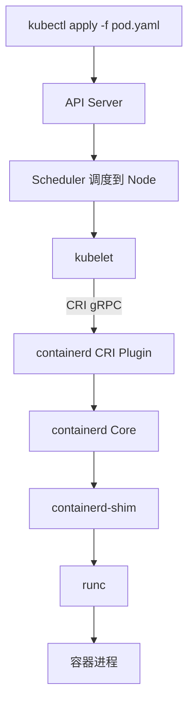

Step by step：

1. `kubectl` 提交 Pod spec 到 API Server
2. Scheduler 选好 Node，kubelet 收到 Pod 事件
3. kubelet 通过 **CRI**（基于 gRPC）调用 containerd CRI Plugin
4. containerd 拉取镜像、准备 rootfs、创建网络 namespace
5. containerd 启动 **containerd-shim**，shim 再调 **runc** 启动容器
6. 容器起来了

这串看起来简单，但每一步都涉及你日常会踩坑的细节，我逐个展开。

---

## 二、容器到底是什么？—— 重新理解 Namespace & Cgroup

如果你的第一反应是"容器是轻量级虚拟机"，读完这本书会彻底纠正。

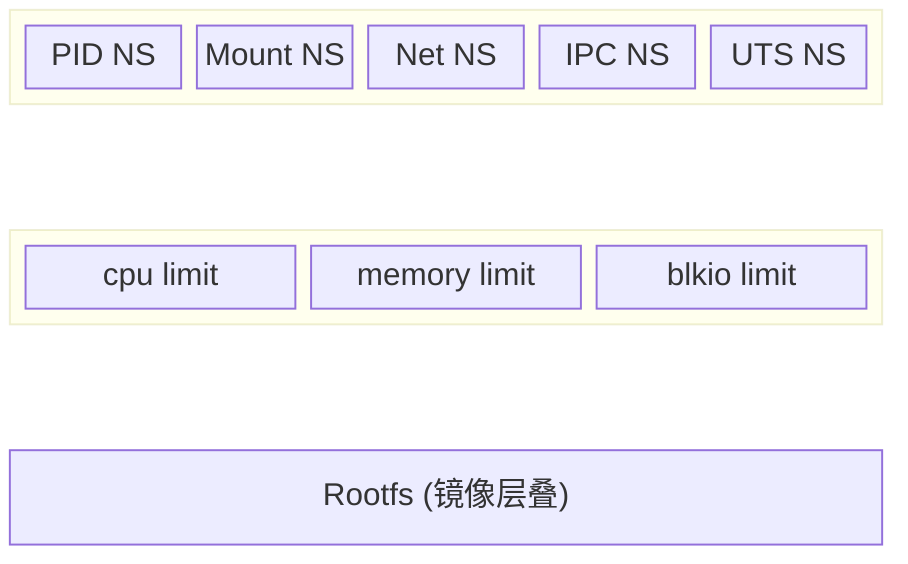

**容器的本质 = 一组被隔离的进程 + 资源限制 + 文件系统。** 没有虚拟化层，宿主机 `ps aux` 直接能看到容器进程 —— 你甚至可以用 `kill` 直接干掉它。

### 六大 Namespace（书中讲的是 7 种，带上刚出的 Time namespace）

| Namespace | 隔离什么 | 没有它会怎样 |
|-----------|----------|-------------|
| PID | 进程号 | 容器 `ps` 看到宿主机所有进程 |
| Mount | 文件系统挂载点 | 容器能看到宿主机 `/proc`、`/sys` |
| Network | 网卡、IP、路由表、防火墙 | 容器网络和宿主机完全共享 |
| UTS | 主机名 | `hostname` 返回宿主机名 |
| IPC | 信号量、消息队列、共享内存 | 容器间可以互相干扰 IPC 资源 |
| Cgroup | cgroup 视图 | 容器能读写其他容器的 cgroup 配置 |

### Cgroup v1 vs v2：一个绕不开的配置坑

> 这里插一个你装 K8s 集群几乎必定遇到的问题。

cgroup v1 设计上有个硬伤：每个子系统各自一棵树。也就是说同一个进程，CPU 限制可能在 `/sys/fs/cgroup/cpu/groupA/`，内存限制可能在 `/sys/fs/cgroup/memory/groupB/` —— 两棵树互相不知道对方的存在。

v2 用单一层级解决了这个问题：

```
cgroup v1:                           cgroup v2:
/sys/fs/cgroup/                      /sys/fs/cgroup/
├── cpu/                             └── system.slice/
│   └── kubepods/                          └── kubepods/
├── memory/                                    ├── cpu.max
│   └── kubepods/                              ├── memory.max
├── blkio/                                     └── ...
```

**那为什么 K8s 推荐用 systemd 做 cgroup 驱动？**

因为 systemd 本身就是 cgroup 的管理者 —— 它会给每个 systemd 单元分配对应的 cgroup。如果 kubelet 再启用 **cgroupfs 驱动**，就会出现两个管理者往同一棵 cgroup 树上写入：

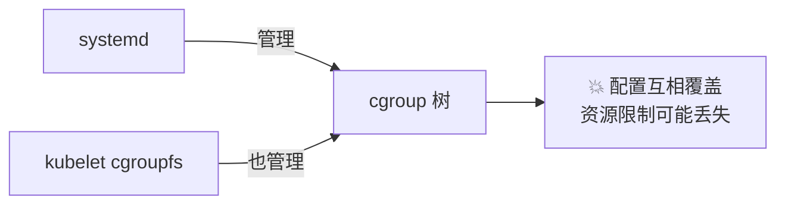

统一用 **systemd 驱动** 后，kubelet 通过 systemd 接口来操作 cgroup，单一写者，不会冲突。`kubeadm 1.22+` 已经默认 `systemd` 驱动了，但你手动装的节点或老集群检查一下 `/var/lib/kubelet/config.yaml`：

```yaml
cgroupDriver: systemd  # 不是 cgroupfs
```

---

## 三、Mount Propagation：Pod 挂载的那些暗坑

Mount namespace 隔离了文件系统的挂载点视图，但有个问题：**如果我想在宿主机和容器间共享挂载事件怎么办？** 比如 FlexVolume 或 CSI 插件需要在宿主机格式化磁盘后，容器内立即可见。

三种模式，我用一个图就能讲清楚：

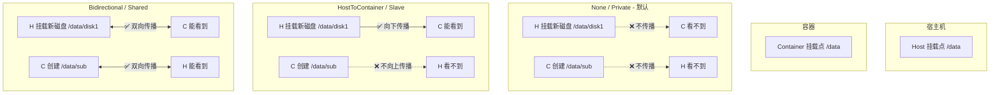

| 模式 | K8s YAML | 宿主机→容器 | 容器→宿主机 | 典型场景 |
|------|----------|-----------|-----------|------|
| None | 默认 | ❌ | ❌ | 普通应用 Pod |
| HostToContainer | `mountPropagation: HostToContainer` | ✅ | ❌ | CSI 插件需要看到宿主机新挂载 |
| Bidirectional | `mountPropagation: Bidirectional` | ✅ | ✅ | FlexVolume DaemonSet 格式化磁盘后通知容器 |

注意 Bidirectional 比较危险 —— 容器内的一次 mount 会传播到所有使用相同卷的 Pod，一般只给特权 DaemonSet 开。

---

## 四、容器运行时分层：谁是老大谁是小弟

```
Kubernetes
    │  CRI (gRPC)
    ▼
高级运行时: containerd / cri-o
    │  OCI Spec
    ▼
低级运行时: runc / kata / gVisor
    │
    ▼
Linux Kernel (namespace + cgroup)
```

**为什么分两层？**

低级运行时（runc）只做一件事：**照着 OCI Spec 启动一个进程**。它不管镜像从哪来、怎么下载、怎么解压、怎么配置网络 —— 这些活都是高级运行时（containerd）干的。

所以 containerd 的定位是：**镜像传输 + 配置编排 + 进程管理**。runc 的定位是：**执行一次 `clone()` + 配置 namespace/cgroup**。做完就退出，不常驻。

### 关键的 shim 层

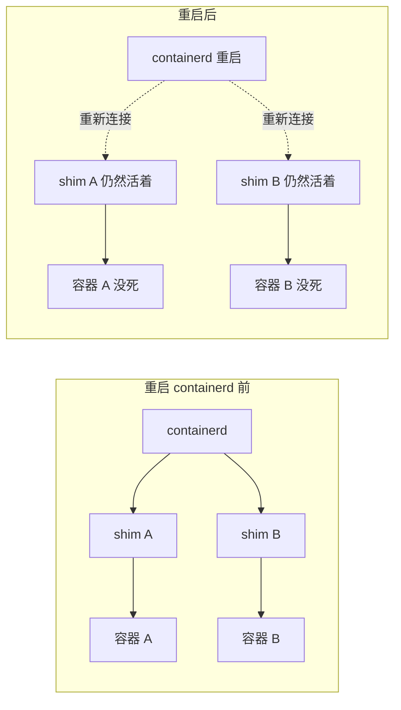

shim 的三个作用：

1. **进程隔离**：shim 是独立进程，containerd 重启了 shim 不跟着死，所以**容器不受影响**
2. **状态中继**：runc 启动完就退出了，谁帮 containerd 收尸（exit code）？shim 代管。shim 与容器间走 **ttrpc**（去掉 HTTP 堆栈的 gRPC，省内存），containerd 重启后扫描存活 shim 恢复状态
3. **运行时适配**：不同运行时的 shim 不同（containerd-shim-runc-v2、containerd-shim-kata-v2），containerd 通过 shim 抽象屏蔽底层差异

---

## 五、镜像怎么变成 rootfs：Snapshot 和 GC

这是我在问答中被问到 *"完全不知道"* 的一块，也是书中最容易被跳过的部分。但它解释了为什么你的 node 磁盘总是满。

### 从镜像层到可写容器

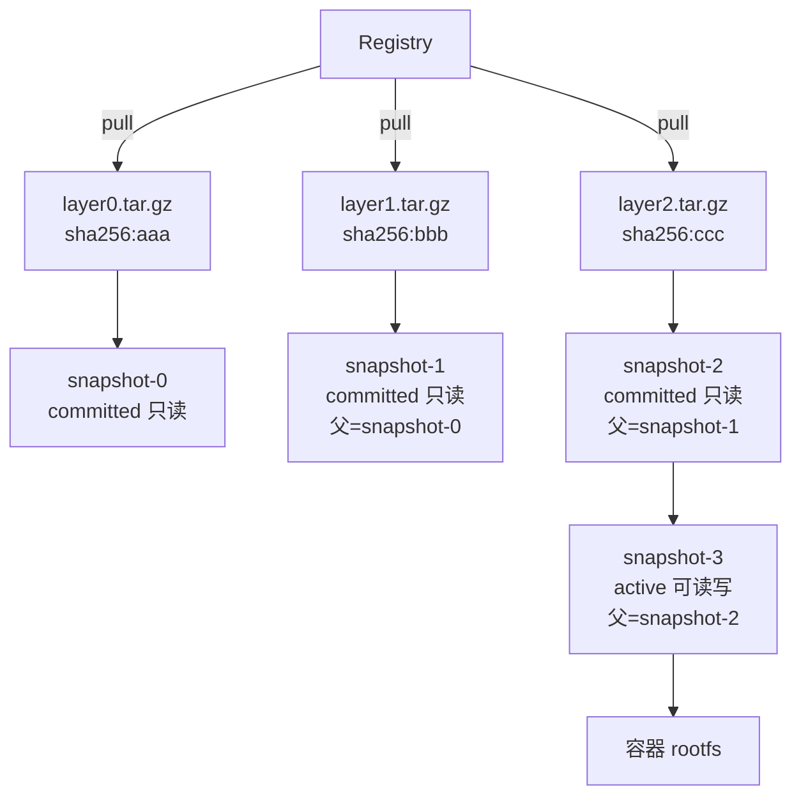

过程：
1. 拉取镜像 → 每个层存为 Content（`/var/lib/containerd/io.containerd.content.v1.content/blobs/sha256/`，文件名为内容 sha256）
2. 准备 rootfs → 每个 Content 层解压为一个 **snapshot**，层层叠加父子关系
3. 启动容器 → 在只读链最上方加一层 **active snapshot**，容器所有的写操作都在这一层

### 为什么删除容器后 rootfs 能秒级重建？

因为底下三层 committed snapshot 没动！只需要删除 active snapshot、新建一个新的 active，整个过程不需要重新拉镜像。这也是 COW（Copy-on-Write）文件系统最核心的优势。

### Leases 和垃圾收集：为什么可以放心删容器

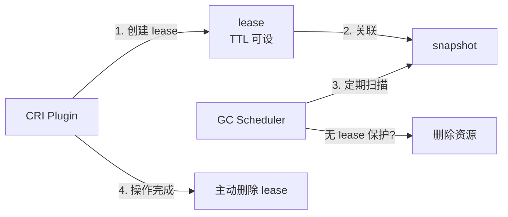

- **为什么要 leases**：snapshot 只是磁盘上的文件，操作系统不知道"谁在用"，containerd 需要自己记住。leases 就是这个引用计数工具
- **GC 怎么工作**：后台守护进程定期扫描，没有活跃 lease 保护的 snapshot/content 自动清理
- **客户端挂了怎么办**：lease 可设 TTL，到期自动释放，资源照样回收

这就是你划线那句话的完整上下文：*"leases 过期的资源将被垃圾收集调度器自动清理"*。

---

## 六、CRI：kubelet 怎么和 containerd 说话

### 两个 gRPC 服务

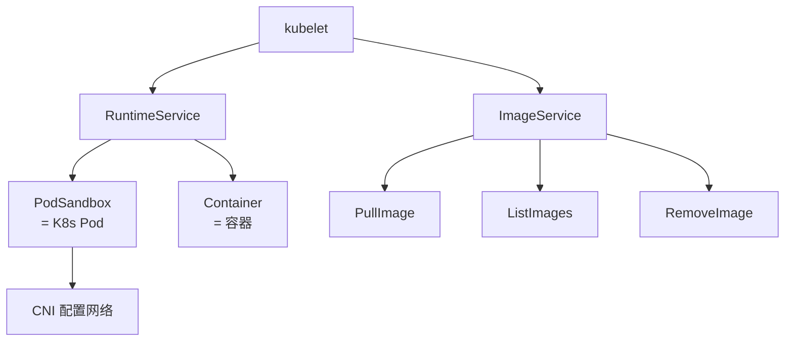

CRI 就是 kubelet 和容器运行时之间的标准接口。定义了两大服务：

- **RuntimeService**：PodSandbox（创建隔离环境+网络）、容器增删改查
- **ImageService**：镜像拉取、列表、删除

**PodSandbox 是什么？** 它跟 Pod 一一对应，负责两件事：创建网络 namespace、配置 CNI 网络。之后在这个 sandbox 内创建的容器共享同一个网络 namespace。

### Exec/Attach 是怎么工作的

`kubectl exec` 需要复用同一个连接传输 stdin/stdout/stderr 三种数据流。Kubernetes 怎么做的？

```
kubectl exec -- ls
    │
    ▼
kube-apiserver (反向代理，鉴权)
    │  HTTP Upgrade → SPDY 或 WebSocket
    ▼
kubelet → Streaming Server → containerd-shim → 容器
    │
    └── 单个连接上开 3 个独立 stream:
        stream-1: stdin
        stream-2: stdout
        stream-3: stderr
```

关键点：
- API Server 在这里扮演**反向代理**角色，不是直接让客户端连容器
- 早期用 SPDY（HTTP/2 的前身，Google 2010 年提出），支持在单个 TCP 连接上多路复用
- K8s 1.25+ 改用 WebSocket 替代 SPDY，1.27 完全移除 SPDY

**exec 和 attach 的区别：**

| | exec | attach |
|---|------|--------|
| 新建进程？ | 是，新起一个进程 | 否，连到容器 PID 1 |
| 退出影响？ | 不影响容器 | `Ctrl+C` 会杀死容器 |
| 典型用途 | `kubectl exec -it pod -- bash` | `kubectl attach pod` 看实时日志 |

---

## 七、工具三件套：ctr / nerdctl / crictl

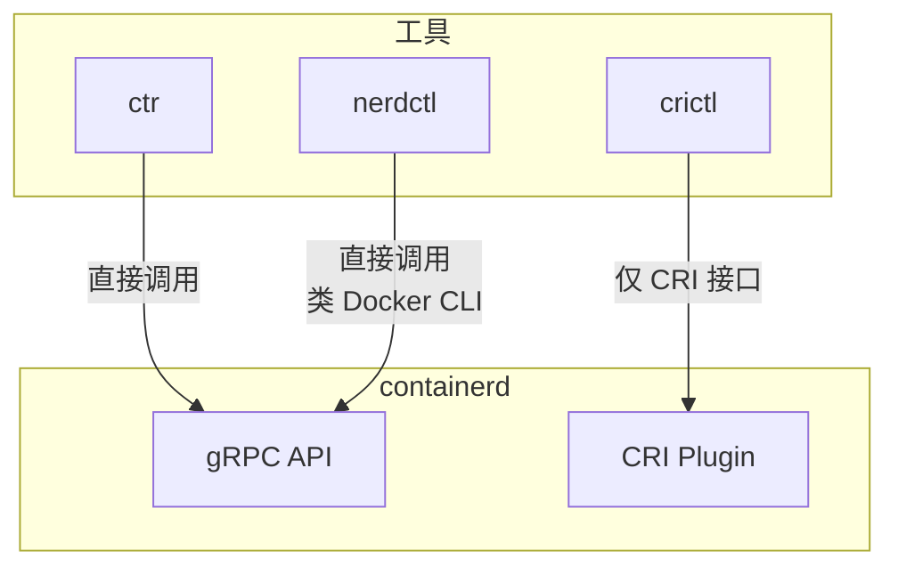

| 工具 | 来源 | 用法 | 能管理镜像？ | 能管理容器？ |
|------|------|------|-----------|-----------|
| **ctr** | containerd 自带 | 底层调试 | 拉取/推送/删除 | 创建/启动/删除 |
| **crictl** | K8s 社区 | 走 CRI 标准 | 拉取/列表（**不能推送**） | 必须经 PodSandbox |
| **nerdctl** | containerd 社区 | 类 Docker CLI | 全部 | 全部 + Docker Compose 支持 |

一个实用判断：**日常调试用 nerdctl（命令名和 docker 几乎一样），只在确认 CRI 兼容性时才用 crictl。**

crictl 有个限制容易踩坑：它不能直接创建容器，必须先创建 PodSandbox：

```bash
# crictl 必须先跑一个 sandbox（相当于 pod）
crictl runp pod-config.json
crictl create <sandbox-id> container-config.json pod-config.json
```

---

## 八、容器网络：Overlay 还是 Underlay？

### 三类方案

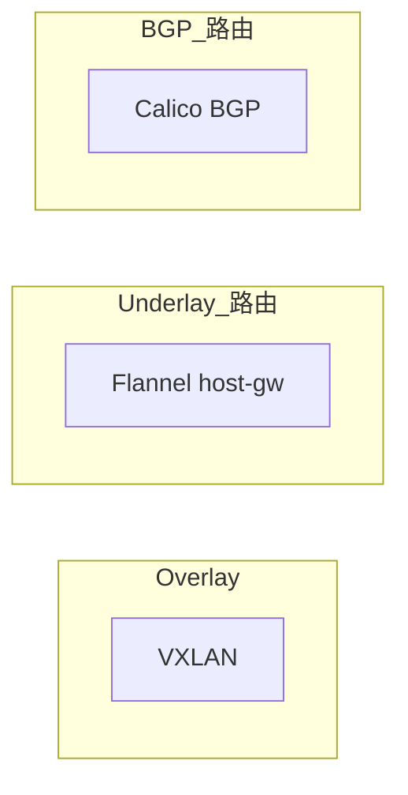

| 方案 | 原理 | 协议栈次数 | 跨子网 | 性能 |
|------|------|-----------|--------|------|
| VXLAN | L2 over UDP 隧道封装 | 2 次 | ✅ 可以 | 中 |
| host-gw | 纯路由，查 Node 路由表直接转发 | 1 次 | ❌ 要求同一二层 | 高 |
| Calico BGP | BGP 协议交换路由，直接路由到 veth | 1 次 | ✅ 可以 | 高 |

### 选型建议

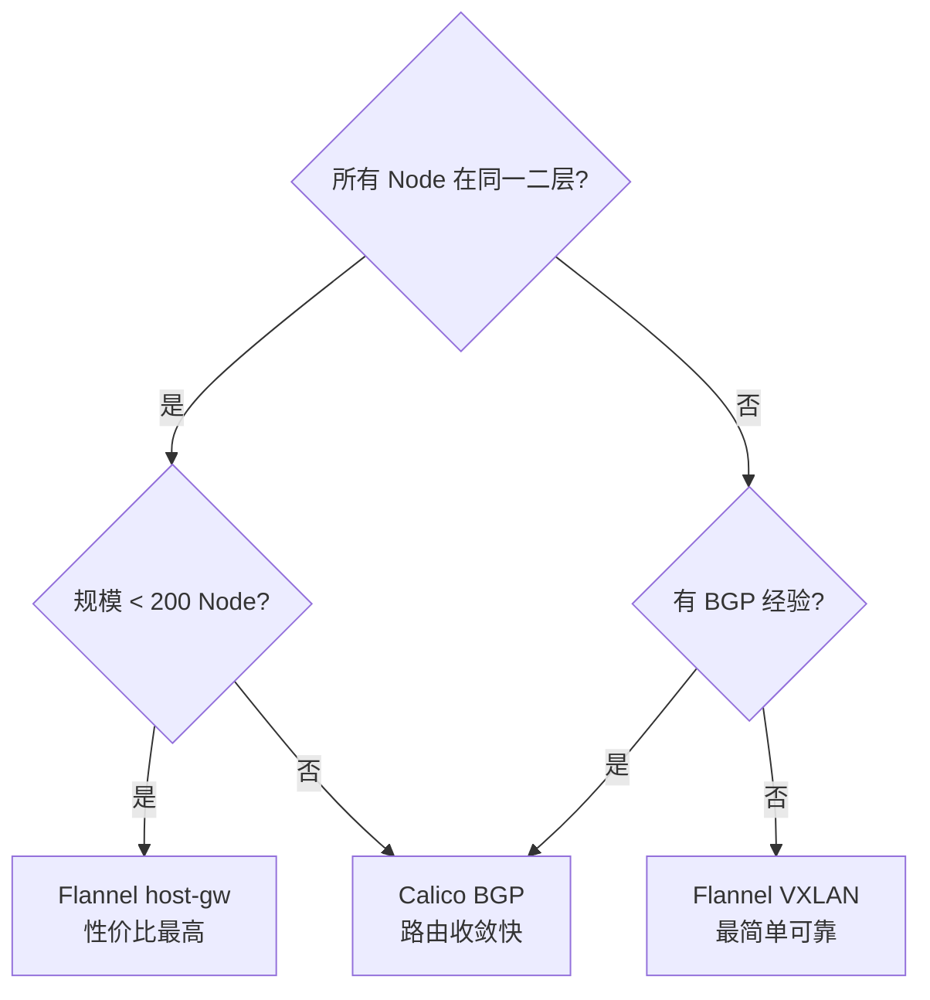

**host-gw 为什么要求同一二层？** Node 路由表是 `Pod网段B → next hop = NodeB_IP`，这个"下一跳"必须能通过 ARP 直接解析到 MAC 地址。跨了路由器/VLAN，ARP 请求广播不过去，路由就废了。

VXLAN 没有这个限制 —— 原始报文被封装在 UDP 里，只要 Node 之间 IP 可达就行，不依赖二层广播。

### 一个小细节：Calico 和 Flannel host-gw 的区别

两者都走路由，但 Calico **不创建网桥设备**，直接路由到 veth pair。Flannel host-gw 要经过 `cni0` 网桥中转。所以相同场景下 Calico 的延迟更低。

---

## 九、NRI：在容器启动前偷偷做点什么

NRI（Node Resource Interface）是我读书时画了很多线但完全没写笔记的一章，也是后续问答中暴露出来的薄弱点。

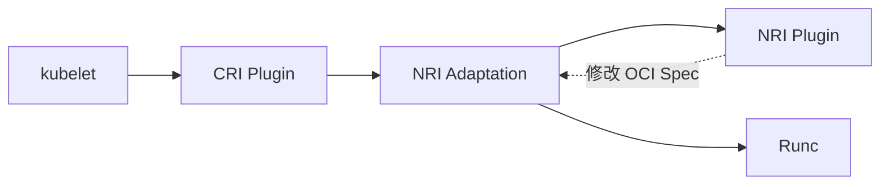

**NRI 和 Hook 的区别：** Hook 是"执行完了通知你"，NRI 是"执行前让我改一下参数"。

**能介入的四个时机：**

1. 创建容器时（修改 OCI Spec，注入 cgroup 配置、设备挂载等）
2. 更新容器时
3. 任意容器停止时
4. 运行时主动对某容器发起更新时

**真实场景：** K8s 原生不支持 NUMA 拓扑感知调度 + 独占 CPU/内存绑定。写一个 NRI 插件，在容器创建前检测 Pod 的 NUMA 需求，自动向 OCI Spec 注入 `cpuset.cpus` 和 `memory_migrate` 配置。

默认 NRI 是禁用的，在 `/etc/containerd/config.toml` 中：

```toml
[plugins."io.containerd.nri.v1.nri"]
  disable = false  # 改这里
```

---

## 十、监控：containerd 没有 Pod 怎么办

Prometheus Operator 靠 ServiceMonitor / PodMonitor 自动发现。但 containerd 是个系统守护进程，没有 Service，没法直接用这两个。

两种方案：

**方案 1：配置 Prometheus AdditionalScrapeConfigs**

```yaml
# prometheus-additional.yaml
- job_name: containerd
  static_configs:
    - targets: ['node1:1338', 'node2:1338']
```

简单直接，但静态配置，Node 增删需要手动维护。

**方案 2：创建一个代理 Pod**

在每台 Node 上跑一个 sidecar-less Pod，监听宿主机 containerd 的 1338 端口（metrics endpoint），把流量代理出来。这样 Pod 就有了 Service，可以正常用 ServiceMonitor 接入。

选哪个取决于你的 Prometheus 部署方式：托管 Prometheus（如 VictoriaMetrics）走方案 1 最简单；Prometheus Operator 管理场景走方案 2 生态更好。

---

## 十一、DevOps 实用速查

### containerd 关键配置 (`/etc/containerd/config.toml`)

```toml
# 数据目录
root = "/var/lib/containerd"
state = "/run/containerd"

# cgroup 驱动（kubeadm 初始化后自动设为 systemd）
[plugins."io.containerd.grpc.v1.cri".containerd.runtimes.runc.options]
  SystemdCgroup = true

# NRI（默认禁用）
[plugins."io.containerd.nri.v1.nri"]
  disable = true

# 镜像仓库镜像加速
[plugins."io.containerd.grpc.v1.cri".registry.mirrors."docker.io"]
  endpoint = ["https://mirror.gcr.io"]
```

### 常用命令

```bash
# 查看 containerd 版本和状态
ctr version
systemctl status containerd

# 拉镜像
ctr image pull docker.io/library/nginx:alpine

# 查看本地镜像
ctr image ls

# 查看运行中的任务（容器）
ctr task ls

# 查看 containerd 指标
curl http://localhost:1338/v1/metrics

# 升级 containerd（确保 KillMode=process）
systemctl daemon-reload && systemctl restart containerd
# 运行中的容器不受影响
```

### 常见排障

| 现象 | 可能原因 | 定位方式 |
|------|----------|----------|
| Pod 一直 ContainerCreating | CNI 插件未安装、镜像拉不下来 | `crictl pull <image>`、`journalctl -u containerd` |
| Node 磁盘满 | snapshot 泄漏 / GC 不工作 | `du -sh /var/lib/containerd/`、检查 lease |
| `kubectl exec` 超时 | Streaming Server 不可达 | 检查 kubelet 到 containerd 的 socket 连接 |
| cgroup 相关报错 | cgroupfs 和 systemd 冲突 | `/proc/<pid>/cgroup` 确认驱动一致性 |

---

## 总结

这本书的心脏是一条链路 ——

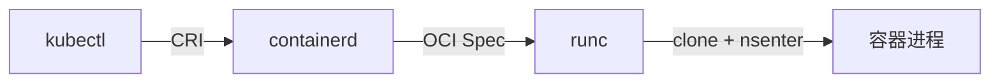

围绕这条链路，能展开的点都在上面了。对我而言，读完最大的收获不是记住了 containerd 的七个 API 或 snapshot 三态，而是理清了**"一个 Pod 到底怎么在操作系统层面被创建出来的"** —— 从 namespace/cgroup 隔离，到镜像分层存储，到网络配置和 GC 回收，每一步都有清晰的技术因果。
