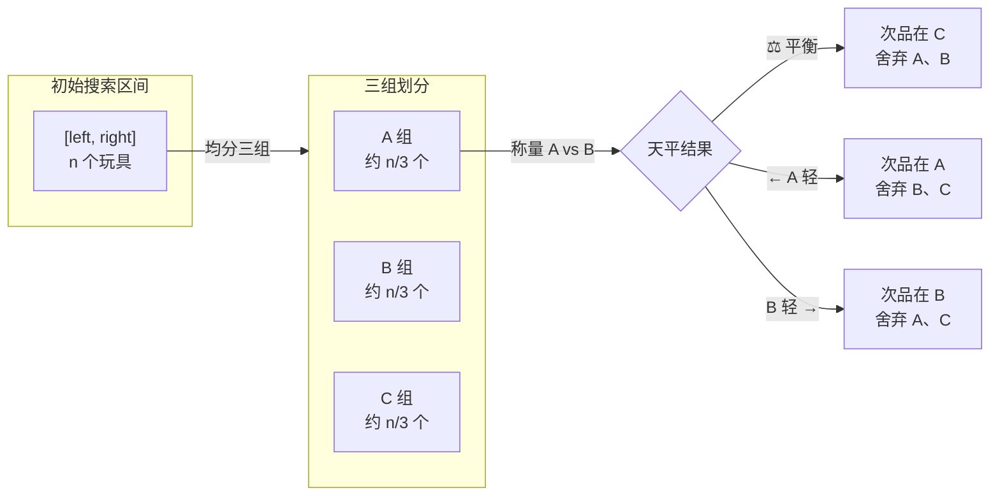
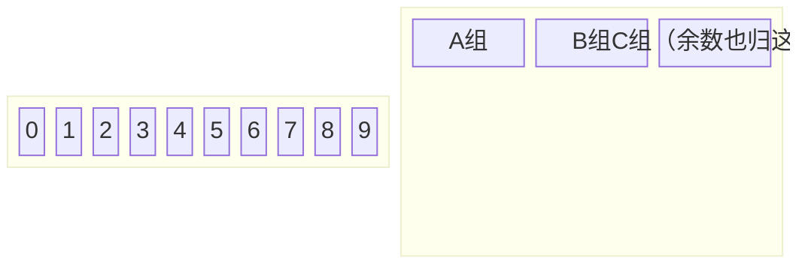
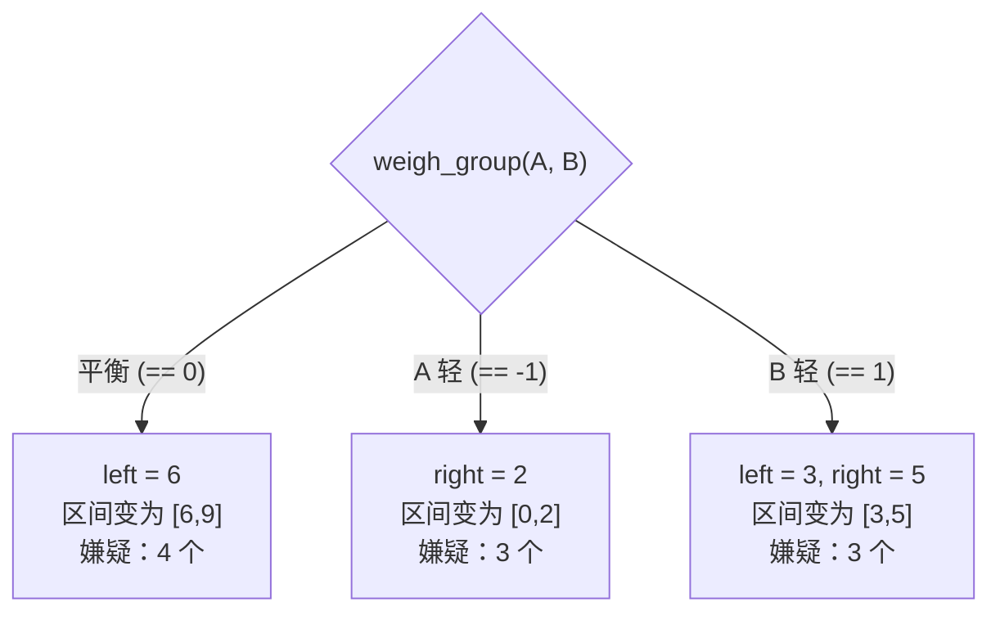
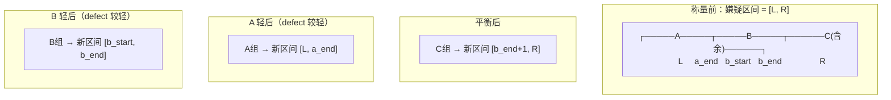

## 题目简述

给定 `n` 个外观完全相同的玩具，其中**有且仅有 1 个次品**（重量与正品不同，假设次品**较轻**）。你拥有一台天平，每次可以比较任意两堆玩具的重量。

请设计一个高效算法，找出这个次品玩具的索引。

---

## 核心思想：三分法

### 为什么要三分？

天平一次称量有三种结果：**左重、右重、平衡**。这天然契合"三等分"的分治策略——每称一次，搜索范围缩小到原来的 1/3。



每轮称量后，**无论哪种结果，搜索区间都缩减到原来的约 1/3**。

### 复杂度对比

| 方案 | 时间复杂度 | N = 10^9 时 |
|------|-----------|------------|
| 遍历求和 / Counter | O(N) | 10 亿次 |
| 三分法 | O(log₃ N) | ~19 次 |

这就是分治的威力——问题的规模不是减 1，而是除以 3。

---

## 图解算法过程

以 `n = 10` 为例，演示一轮称量中**指针如何移动**：



`total = 10`，`group_size = 10 // 3 = 3`。

- **A 组**: 索引 `[0, 1, 2]`
- **B 组**: 索引 `[3, 4, 5]`
- **C 组**: 索引 `[6, 7, 8, 9]`（余数 1 自动并入 C 组）

称量 A vs B：



**关键洞察**：我们不需要真的删掉元素。只移动 `left` / `right` 指针，假装被舍弃的区间不存在，这就是**原地收缩区间**的技巧。

---

## 完整 Python 代码实现

```python
from typing import List, Callable

class Solution:
    """
    通用玩具称重求解器。

    通过传入不同的 weigh 函数，适配不同算法平台的 API 风格。

    使用方式：
        # 方式1：题目提供 weigh(a: int, b: int) -> int，比较两个元素
        sol = Solution(weigh_elem=题目给的weigh函数)
        sol.findFakeToy(n)

        # 方式2：题目提供 weigh_list(indices: List[int]) -> int，求一堆的重量
        sol = Solution(weigh_list=题目给的weigh_list函数)
        sol.findFakeToy(n)
    """

    def __init__(
        self,
        weigh_elem: Callable[[int, int], int] | None = None,
        weigh_list: Callable[[List[int]], int] | None = None,
        lighter: bool = True,
    ):
        """
        :param weigh_elem:  题目提供的 weigh(i, j)，返回 -1/0/1（左轻/平衡/右轻）
        :param weigh_list:  题目提供的 weigh_list(indices)，返回总重量
        :param lighter:     次品较轻则为 True，较重则为 False
        """
        self.weigh_elem = weigh_elem
        self.weigh_list = weigh_list
        self.lighter = lighter

    # ================================================================
    #  核心算法：三分法区间收缩
    # ================================================================
    def findFakeToy(self, n: int) -> int:
        """
        在 [0, n-1] 范围内找到次品玩具的索引。
        """
        left, right = 0, n - 1

        while left < right:
            total = right - left + 1

            # ---- 终止条件：区间太小，无法三分为止 ----
            group_size = total // 3
            if group_size == 0:
                # 剩余 1~2 个玩具，无法再分，直接二选一
                return self._resolve_two(left, right)

            # ---- 三组边界 ----
            a_start = left
            a_end   = left + group_size - 1
            b_start = left + group_size
            b_end   = left + 2 * group_size - 1
            # C 组：b_end + 1 到 right（自动包含余数）

            # ---- 称量 A vs B ----
            cmp = self.weigh_group(a_start, a_end, b_start, b_end)

            # ---- 根据结果收缩区间 ----
            if cmp == 0:
                # 平衡 → 次品在 C 组（含余数）
                left = b_end + 1
                # right 不变
            elif cmp == -1:
                # A 比 B 轻
                # 已知 defect 较轻 → 次品在 A
                # 已知 defect 较重 → 次品在 B
                if self.lighter:
                    right = a_end
                else:
                    left = b_start
                    right = b_end
            else:  # cmp == 1
                # B 比 A 轻
                if self.lighter:
                    left = b_start
                    right = b_end
                else:
                    right = a_end

        # left == right，区间收缩到唯一一个嫌疑玩具
        return left

    # ================================================================
    #  weigh_group：天平比较两堆玩具的核心实现
    # ================================================================
    def weigh_group(self, a_start: int, a_end: int,
                    b_start: int, b_end: int) -> int:
        """
        比较两组玩具 [a_start, a_end] 与 [b_start, b_end] 的重量。

        返回值：
            -1：A 组更轻
             1：A 组更重（即 B 组更轻）
             0：两组等重

        内部策略：依据题目提供的 API 选择不同的比较方式。
        """

        # --- 策略 1：题目提供了 weigh_list(indices) 取总重 ---
        if self.weigh_list is not None:
            weight_a = self.weigh_list(list(range(a_start, a_end + 1)))
            weight_b = self.weigh_list(list(range(b_start, b_end + 1)))
            if weight_a < weight_b:
                return -1
            elif weight_a > weight_b:
                return 1
            else:
                return 0

        # --- 策略 2：题目只提供了 weigh(i, j)，逐个比较 ---
        if self.weigh_elem is not None:
            i, j = a_start, b_start
            while i <= a_end and j <= b_end:
                res = self.weigh_elem(i, j)
                if res != 0:
                    # 找到差异 → 较轻的那组含次品
                    return res
                i += 1
                j += 1
            # 能走到这里说明所有对应元素都相等
            # 因为两组大小相同，所以意味着两组完全等重
            return 0

        raise NotImplementedError(
            "请至少提供 weigh_elem 或 weigh_list 中的一个"
        )

    # ================================================================
    #  辅助函数：处理剩余 2 个玩具的最终判定
    # ================================================================
    def _resolve_two(self, left: int, right: int) -> int:
        """区间只剩 [left, right]，right - left <= 1。"""
        if left == right:
            return left

        # 两个玩具：选一个已知正品（first_good）做参照
        # 如果题干没给已知正品位置，则取区间外的任意元素。
        # 这里假设 [left, right] 区间外都是正品。
        known_good = left - 1 if left > 0 else right + 1

        if self.weigh_elem is not None:
            cmp = self.weigh_elem(left, known_good)
            if cmp != 0:
                return left
            else:
                return right

        if self.weigh_list is not None:
            w_left = self.weigh_list([left])
            w_good = self.weigh_list([known_good])
            if w_left != w_good:
                return left
            else:
                return right

        raise NotImplementedError
```

---

## 逐行精读

### 1. 区间初始化和循环不变式

```python
left, right = 0, n - 1
while left < right:
```

**循环不变式**：任何时候，次品玩具的索引一定在 `[left, right]` 内。

这是理解整个算法的钥匙。每次循环，我们做完一次称量后，**只移动指针，不修改数组**，确保不变式始终成立。当 `left == right` 时，区间收缩到一个元素，它就是答案。

### 2. 三等分边界计算

```python
group_size = total // 3    # 整数除法，忽略余数
a_end = left + group_size - 1
b_start = left + group_size
b_end = left + 2 * group_size - 1
```

| total | group_size | A 组 | B 组 | C 组（含余数） |
|-------|-----------|------|------|-------------|
| 10 | 3 | 3 个 | 3 个 | 4 个 |
| 8 | 2 | 2 个 | 2 个 | 4 个 |
| 5 | 1 | 1 个 | 1 个 | 3 个 |
| 2 | 0 | — | — | 走 `_resolve_two` 分支 |

C 组天然包含了不被 3 整除的余数玩具。如果天平平衡，这些余数中的一个就是次品——**完美**。

### 3. 称量结果的三种处理



每次区间收缩，本质上是将指针"跳过"已知正品——既不分配新数组，也不复制元素，O(1) 空间。

### 4. weigh_group 的两种策略

`weigh_group` 是连接算法逻辑和题目 API 的桥梁。这里展示的两种策略覆盖了大多数算法平台的称重接口：

| 策略 | 适用场景 | 每次比较的成本 |
|------|---------|------------|
| `weigh_list` 取总重 | 题目提供批量称重 API | 2 次 API 调用 |
| `weigh_elem` 逐对比较 | 题目只提供两两比较 API | 最多 `group_size` 次调用 |

如果是 `weigh_elem` 模式，逐对比较的**早期退出机制**（`if res != 0: return res`）是性能关键——一旦发现差异，立即返回，不比较剩余元素。

### 5. 剩余 2 个玩具的处理

`_resolve_two` 的精髓是"参照物"策略：

- 区间外任意一个元素都是**已知正品**
- 拿其中一个嫌疑玩具和已知正品比较
- 不等重 → 它就是次品；等重 → 另一个是次品

这避免了调用 `weigh(left, right)` 后还需要额外逻辑判断的尴尬（因为两两比较只能告诉你谁轻谁重，但如果两个都是嫌疑品，你不知道谁有问题）。

---

## 编程技巧与踩坑清单

### 技巧 1：循环不变式是分治算法的导航

每次写二分 / 三分 / 分治，先写下你的循环不变式（这里是"次品一定在 [left, right] 内"），然后**每一步移动指针时，都验证这个条件仍然成立**。这比凭感觉写要可靠得多。

### 技巧 2：余数自动归入 C 组

```
total = 10, group_size = 3
A: [0, 1, 2]          (3 个)
B: [3, 4, 5]          (3 个)
C: [6, 7, 8, 9]       (4 个，多出的 1 个是余数)
```

不需要专门判断余数有多少、归到哪里。`b_end + 1` 作为新区间左边界，恰好包含了余数。这是"让数学为你工作"的优雅写法。

### 技巧 3：`weigh_group` 的 API 适配层

不要在核心算法函数里夹杂平台特定的 `weigh` 调用。封装一个 `weigh_group` 方法，让核心逻辑只依赖一个干净的接口。这样当题目 API 风格变化时，你只需改一个地方。

### 踩坑 1：混淆 A 轻 / B 轻 与 defect 的轻重关系

```python
# 易错写法：
if cmp == -1:
    right = a_end  # 这默认了 defect 较轻，但万一是较重呢？

# 正确写法：
if cmp == -1:
    if self.lighter:
        right = a_end      # defect 较轻 → 在 A
    else:
        left = b_start     # defect 较重 → 在 B
        right = b_end
```

### 踩坑 2：忽略余数

如果你的代码在处理 `total % 3 != 0` 时，手动把余数分到某个组并引发边界计算错误，那别人也无法拯救你。**余数就是 C 组的天然一部分**，不要特殊处理。

### 踩坑 3：`_resolve_two` 中不正确的参照物选择

拿来当参照的玩具必须是**100% 确认的正品**。比如：

```python
# 错误：两个都是嫌疑品，比较结果无法解读
res = weigh(left, right)  # 谁轻不知道，谁重不知道
```

### 踩坑 4：`weigh_elem` 模式下顺序比对忽略了不同组长度

```python
# 错误：A 组比 B 组多 1 个（因为余数）
i, j = a_start, b_start
while i <= a_end:
    res = weigh(i, j)   # j 可能超出 b_end！
    i += 1; j += 1
```

而我们对 A、B 取相同的 `group_size`，余数自动跳过了这个问题——C 组接受了多余的元素。

---

## 进阶：未知次品轻重的解法

如果题目不告诉你次品是轻还是重，逻辑上推进一步：

**当 A vs B 平衡时**：次品在 C 组，C 组任取一个与 A（正品）比较 → 知道次品是轻还是重，然后回到标准三分流程。

**当 A vs B 不平衡时**：你只知道"A 和 B 不一样"，但不知道哪一方有问题。此时 C 组全是正品，拿 A 组（或 B 组）与等量的 C 组比较：

```python
# A vs B 不平衡时
cmp2 = self.weigh_group(a_start, a_start + group_size - 1,
                         b_end + 1, b_end + group_size)  # A vs C 的等量部分
if cmp2 == 0:
    # A == C → 次品在 B，且轻重由第一个 cmp 推得
    ...
else:
    # A != C → 次品在 A，且轻重由 cmp2 推得
    ...
```

核心思路：**用已知正品组（C 组）做"标准砝码"**，逐一排除。

---

## 总结

> 三分法是"问题规模 / 3"的分治架构，与天平的三态输出天然匹配。核心技巧只有三个：**指针维护区间不变式**、**余数融入 C 组**、**API 适配层解耦**。掌握这三条，你就能在任何称重变体题中快速推导出 O(log₃N) 的解法。
