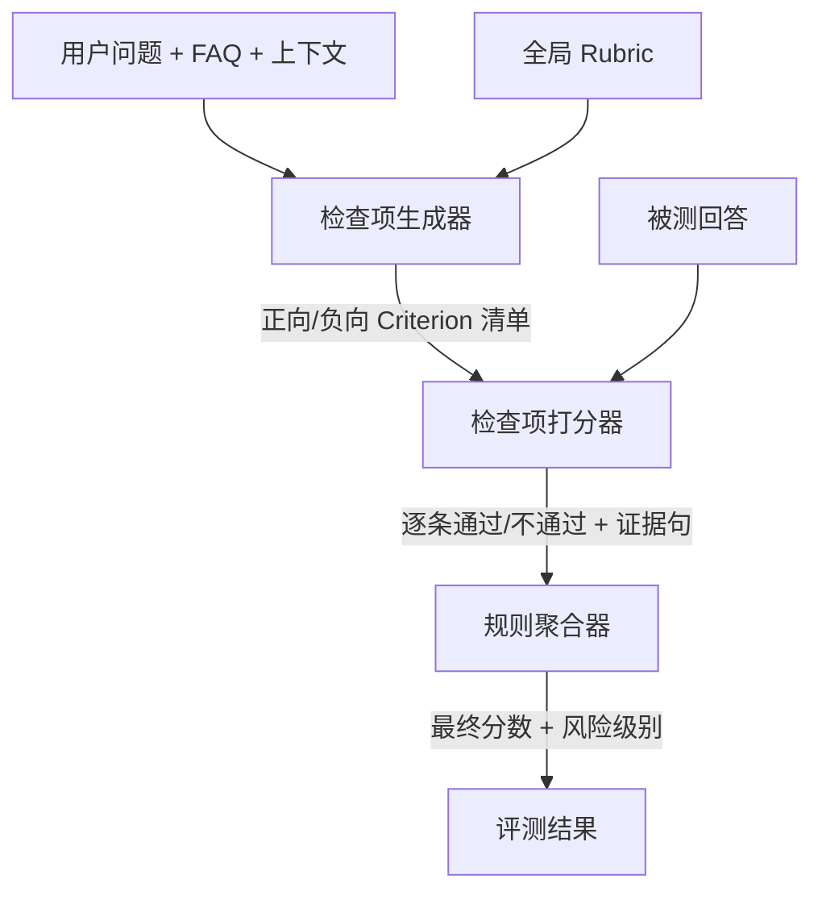
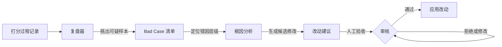

> 本文整理自微信公众号文章《LLM-as-a-Judge 实战：自我迭代的打分器怎么做》，聚焦其中的自我迭代机制和工程落地思路，并结合代码评审场景做延伸思考。

## 核心观点：别让 LLM 直接打总分

用 LLM 做评测最常见的错误：给它一个问题和一个回答，让它打一个总分（比如 1-5 分）。这有两个问题：

1. **分数说不清原因**。3 分和 4 分的差距到底在哪？是漏了关键信息，还是说错了规则？
2. **无法迭代改进**。只有一个分数，你不知道问题出在哪个环节，也就不知道该改什么。

正确做法是把评判拆成两层：**全局 Rubric 定方向**，**逐题 Criterion 定具体检查点**。

## 三层架构：把「打分」工程化

文章提出了一套清晰的工分工：

### 1. 检查项生成器（Criterion Generator）

- **输入**：用户问题、FAQ/知识库、商品/订单上下文、全局 rubric
- **输出**：这道题的正向和负向 criterion 清单
- **关键约束**：生成时**不能看被测答案**，避免「看答案编标准」

文章举了一个例子。用户问「冲牙器用了 5 天水压小，能退吗？」，检查项生成器会产出：

| 类型 | 检查项 |
|------|--------|
| 正向 | 是否说明「7 天内只是条件之一，不等于一定能退」 |
| 正向 | 是否提到「已使用可能影响二次销售」 |
| 正向 | 是否区分「主观不满意」和「质量问题」 |
| 负向 | 不得承诺「一定能退」 |
| 负向 | 不得直接把「水压小」说成质量问题 |

### 2. 检查项打分器（Criterion Scorer）

- 不做综合评价，只逐条判断
- 每条 criterion 回答三个问题：答案有没有覆盖？有没有踩雷？证据是哪句？

### 3. 规则聚合器（Rule Aggregator）

- 不再调用 LLM，纯规则处理
- 输出最终分 + 风险级别

三层拆开的好处是**可定位**：坏答案被放过 → 生成器漏了风险点；好答案被误杀 → criterion 写太死；中间都对但分怪 → 聚合规则太狠。

---

## 自我迭代：让打分器先提改法

这是文章最有价值的部分。

### 前提：打分过程全程留痕

每次打分都记录：
- 生成了哪些检查项
- 每条是否通过
- 证据是哪句话
- 最终为什么给这个分

有了过程记录，迭代才有入口。没有过程，打分器只有一个分数；有了过程，它才能回头看自己**为什么这么判**。

### 复盘器的工作流

具体来说，复盘器做三件事：

**Step 1：挑出可疑样本。** 比如打分器放过了「用了 5 天还在 7 天内，肯定能无理由退」这个回答。复盘器分析打分过程，发现不是打分环节看错了，而是**检查项生成器一开始就漏了风险点**——原来的 criterion 只关注「是否在 7 天内」，没有覆盖「已使用是否影响二次销售」，也没有把「一定能退」列为负向检查项。

**Step 2：定位错因层级。** 三层架构的价值在这里体现。不同现象对应不同根因，针对性修改才不会瞎调。

**Step 3：生成候选修改。** 复盘器不只会说「这里有问题」，而是提出**具体改动**：

> 新增一条负向 criterion：答案不得承诺已使用商品一定可无理由退货。
> 附带：为什么改、预期修什么问题、可能影响哪些旧样本。

人的角色从「判卷」变成「审核改法」——只需看改动摘要、失败样本、新旧版本差异。

---

## 防止退化：训练集 + 测试集 + 版本快照

自我迭代不能闭门自嗨。文章借用了 ML 里最朴素的分工：

| 数据集 | 用途 | 约束 |
|--------|------|------|
| 训练集 | 暴露 bad case，复盘 + 生成改法 | 可反复看、反复调 |
| 测试集 | 验收新版本是否真的更好 | **固定不动**，不边测边改 |

关键原则：**不要拿训练集上的提升说事，测试集上的表现才是真指标。**

测试集里应该保留两类样本：
- **稳定样本**：无论怎么改都应该判对（防止把好答案误杀）
- **困难样本**：曾经过往踩过的坑（防止同类错误反复出现）

另外需要**版本快照**，每轮记录：用哪批数据、各模块版本、用哪个模型、哪些 bad case 修好了、测试集表现有没有变化。

---

## 落地思考：怎么用到代码/PR 评审里？

这套方法论完全可以迁移到 LLM 驱动的代码评审中。对照三层架构来看：

### 检查项生成器 → 按 PR 类型生成评审清单

不同 PR 关注点不同：

| PR 类型 | 可能检查项 |
|---------|-----------|
| 策略回测代码 | 参数是否可配置？手续费是否正确计入？是否有未来函数？止损逻辑是否完整？ |
| 数据管道 | 异常值处理？空值兜底？时区处理？增量/全量逻辑？ |
| 配置文件修改 | 是否改对路径？是否保留注释？是否有拼写错误？ |

### 检查项打分器 → 逐条审查代码

不用 LLM 给 PR 打一个「整体质量分」，而是拿着 checklist 逐条对照：
- 类型注解是否完整？
- 边界条件是否覆盖？
- 是否有未处理异常？

### 复盘器 → 从漏检的 Bug 中学习

每次线上出 bug 后，回头分析评审时为什么没抓到：
- PR 评审 checklist 漏了这类风险？
- 打分器看漏了？
- 聚合规则不够严？

然后自动生成一条新的检查项。这和你在 Hermes 里做代码 review 的流程天然匹配。

### 训练集/测试集 → PR Review 样本库

- **训练集**：历史 PR，包含已知 bug 的案例，用来校准评审规则
- **测试集**：一批有明确质量标签的 PR，固定不动，验证新版本评审器是否退化

---

## 总结

| 核心思想 | 怎么做 |
|----------|--------|
| 不直接打总分 | 拆成 Rubric + Criterion 两层 |
| 三层架构 | 生成器 → 打分器 → 聚合器 |
| 自我迭代 | 过程留痕 → 复盘器定位错因 → 生成候选改法 |
| 防止退化 | 训练集改、测试集验、版本快照 |
| 人的角色 | 从判卷变成校准尺子 |

这篇文章的底层哲学其实很简单：**让 LLM 把 bad case 变成具体的改法，而不是让它自己宣布「我变好了」**。人没有被拿掉，只是从重复判断变成了做更重要的决策——哪些标准不能变，哪些边界不能越。
