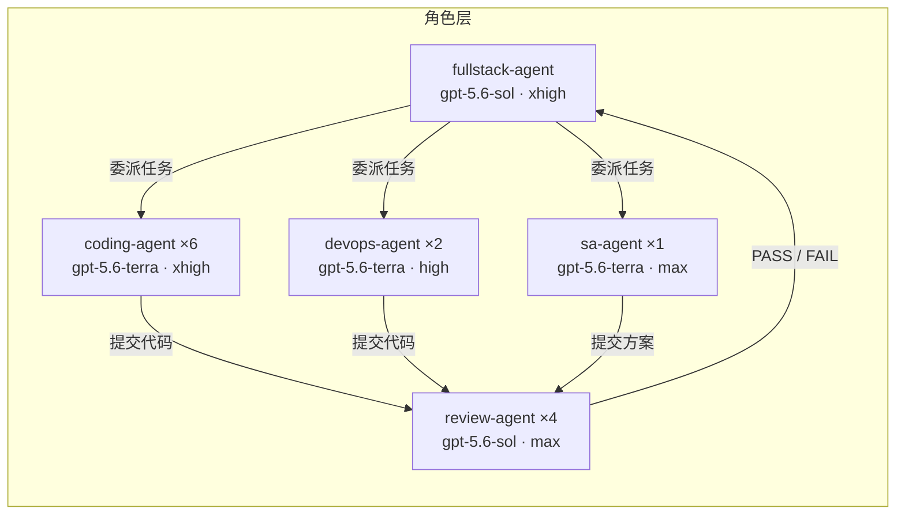
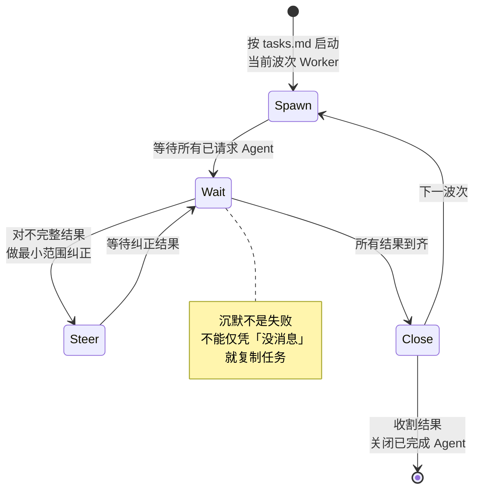
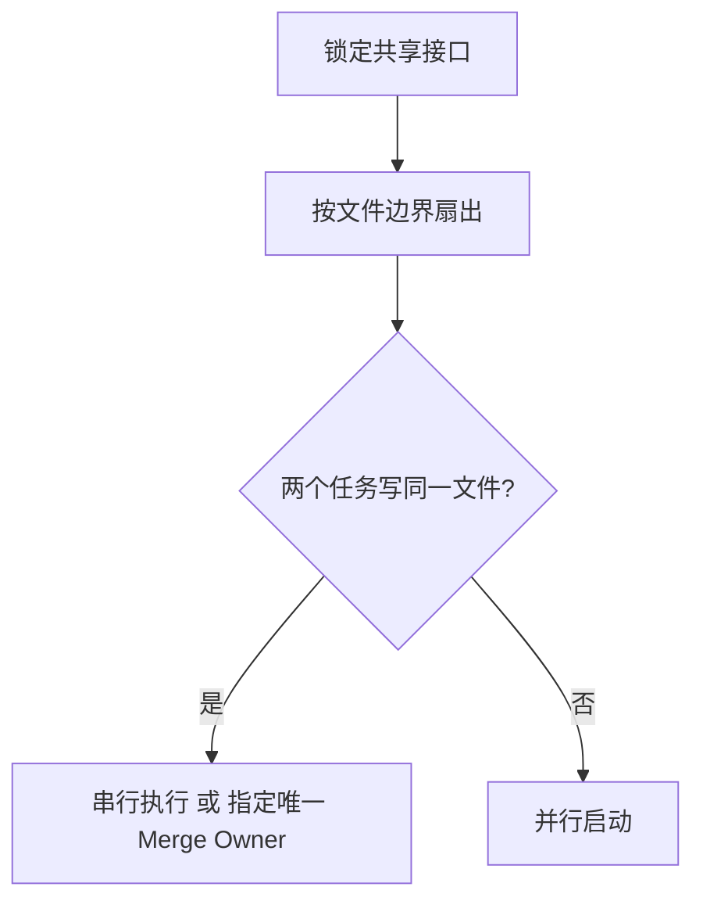
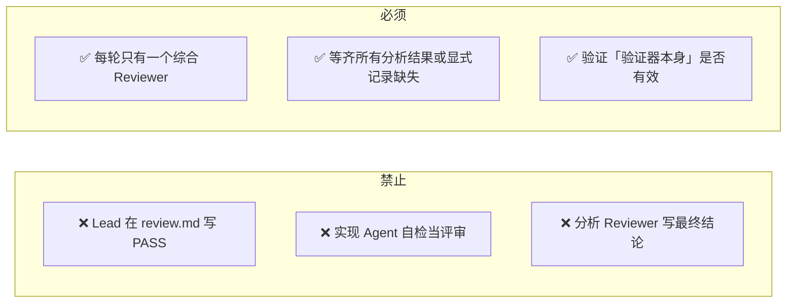
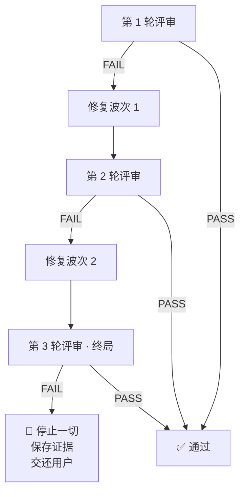
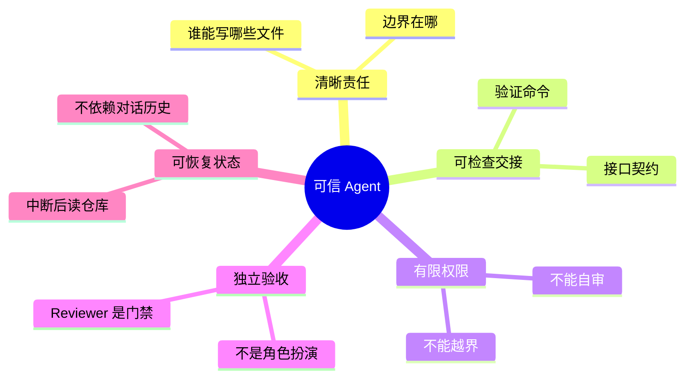

> **原文**：[AWS 开源 Codex Agent Team：多 Agent 如何真正协作](https://mp.weixin.qq.com/s/0OJyP_Cm7Es6raWbCcbzJw)  
> **项目**：[github.com/aws-samples/sample-codex-agent-team](https://github.com/aws-samples/sample-codex-agent-team)（53 个文件，零 API 服务器，零任务数据库）

---

## 一、先打破幻觉：这不是框架

很多人以为多 Agent 系统长这样：调度服务器 + 任务队列 + 状态数据库 + 可视化面板。但这个项目**什么都没有**。它的全部资产只有四样东西：


核心理念：**不是再造一个「AI 版 Jira」，而是把真实软件团队的合作习惯——分工、交接、评审、止损——显式化成 Agent 可反复读取的系统。**

---

## 二、全局架构：Spec 驱动的控制链


**读这张图要抓住三点：**

1. **默认协调者是 Codex 主线程**，fullstack-agent 只在用户明确要求 Lead Profile 或 Spawn Plan 时才启动
2. **Agent 之间没有共享任务数据库**，通过 `.codex/specs/<slug>/` 下的 Markdown 交换长期状态
3. **Review 不是随手一条命令**，而是一道有独立所有者、有次数上限、有终止条件的工程门禁

---

## 三、五个 Agent：五种工程责任



| Agent | 模型 | 强度 | 你该让它干什么 | 禁止让它干的 |
|-------|------|------|---------------|-------------|
| **fullstack-agent** | gpt-5.6-sol | xhigh | 定需求、画接口、分波次、委派、整合结果 | 写生产代码、写测试、写 IaC |
| **coding-agent** | gpt-5.6-terra | xhigh | 限定文件范围内的产品代码 + 测试 + 修复 | 越界写文件、自审自评 |
| **devops-agent** | gpt-5.6-terra | high | CI/CD、容器、IaC、Runbook | 改业务逻辑 |
| **review-agent** | gpt-5.6-sol | max | 独立审查正确性/安全性/验证证据 | 改代码、被 Lead 越权 PASS |
| **sa-agent** | gpt-5.6-terra | max | AWS 架构、安全、可靠性、成本 | 改代码、跨出 AWS 范围 |

> **max_threads = 14 是上限不是配额**。并发数由「互不重叠的文件所有权范围」决定——两个可独立写入的模块，就只启动两个 Agent。

---

## 四、协作流程：主线程的四步循环


### Spawn → Wait → Steer → Close



### 并行规则：文件所有权互斥

并行不是「同时开始」，而是**保证两个 Agent 不会修改同一个文件**。一个合格的任务必须写明：

```text
[coding-2]
Scope:  ONLY src/orders/handler.ts, src/orders/handler.test.ts
Contract: 匹配 spec.md#interfaces
Verify:  npm test -- orders/handler
禁止:  编辑 scope 外的任何文件
提醒:  coding-3 正在并行编辑 src/orders/validate.ts
```

按「前端 / 后端 / 测试 / 文档」拆角色会翻车——前端和测试都要改同一份测试夹具。正确做法：



---

## 五、独立评审：权限边界，不是角色扮演


### 三条铁律



### 三轮评审预算



预算在 Reviewer **被启动**时就消耗——不是返回结论时。模型路由故障、基础设施抖动**同样消耗预算**。真实团队应该分离「工程失败」和「平台失败」。

---

## 六、共享记忆：`.codex/specs/` 是团队大脑

对话负责沟通，**仓库文件负责记忆**。一次会话中断后，不是重放旧对话，而是重新读取这些文件：

| 文件 | 回答的核心问题 |
|------|---------------|
| `requirements.md` | 用户真正需要什么，什么不做 |
| `spec.md` | 接口、错误、边界、验收标准 |
| `design.md` | 组件怎样连接，为什么选这个方案 |
| `tasks.md` | 谁能写哪些文件，用什么命令验证 |
| `decisions.md` | 中途改了什么，谁批准，怎样回滚 |
| `review.md` | 第几轮、发现什么、是否 PASS |
| `sa-review.md` | 安全、可靠性、成本、残余风险 |

**事实优先级**：`文件 + Diff > .codex/specs > 命令输出 > Agent 消息 > 旧摘要 > 沉默`

---

## 七、护栏层：Hook + Rules

| 机制 | 做什么 | **不做什么** |
|------|--------|-------------|
| Hook（3 个生命周期） | 记录 Agent 启动/停止到 `~/.codex/team-logs`，Fail-open 策略 | 不阻止文件冲突，不验证 tasks.md，不强制关闭遗留 Agent |
| Rules（高风险命令） | 确认 `git push`、禁止 `push --force` / `reset --hard`、拦住 `terraform apply` / `s3 rm` / `kubectl delete` | 不拦 `git -C /path push`、`aws s3api delete-object`、`helm uninstall` |

> 提示词是组织制度，Hook 是审计日志，Rules 是局部门禁。三样加一起 ≠ 强制调度控制平面。

---

## 八、实际使用：三步入坑指南

### 第一步：最小可信闭环（别一上来就 14 线程）

```bash
git clone https://github.com/aws-samples/sample-codex-agent-team.git
cd sample-codex-agent-team

# 预检
python3 scripts/test_prompt_invariants.py -v
python3 .codex/hooks/test_subagent_lifecycle.py -v

# 用一个小任务验证整条链（只规划，不部署）
# Prompt: plan a small local CLI feature, no deploy, no cloud
```

**判断成功不是「启动了几个 Agent」**，而是：
- [ ] specs 目录生成了需求、规格、任务
- [ ] 每个 Worker 有明确且不重叠的文件
- [ ] 返回结果包含真实验证命令和输出
- [ ] review.md 由独立 Reviewer 写出
- [ ] 任务结束后没有遗留 Agent

### 第二步：补机器护栏

1. **加 `.gitignore`**（原文仓库竟然没有！）
   ```
   .codex/specs/
   .codex/team-logs/
   *.sqlite
   .env
   .env.*
   ```
2. 固定 MCP 版本（不要 `@latest`）
3. 关闭默认远程集成
4. 任务范围写成可解析结构（不是 Markdown 自由文本）
5. Spawn 前做文件重叠检查

### 第三步：才扩大角色池

从 2~4 个 Worker 开始，按真实文件互斥宽度增加并发。AWS 涉及 IAM/KMS/EKS 再引入 sa-agent。

---

## 九、自己重写一套必须知道的 6 个坑

| # | 坑 | 严重程度 |
|---|-----|---------|
| 1 | **没有 `.gitignore`**——一次 `git add .` 可能把需求、决策、安全风险一起提交 | 🔴 数据泄漏 |
| 2 | **协作约束只是提示词级别**——没有调度器验证文件重叠，没有租约服务，没有状态机阻止第四轮 Reviewer | 🔴 静默失效 |
| 3 | **MCP 用 `@latest`**——同一份仓库不同日期启动可能下载不同代码 | 🟡 不可复现 |
| 4 | **默认 AWS Profile `default`**——可能指向未知账户 | 🟡 安全风险 |
| 5 | **Hook 硬编码 Unix**——`fcntl` 不跨平台，Windows 不可用 | 🟡 平台绑定 |
| 6 | **回归测试只保护提示词词面**——关键词存在 ≠ Agent 正确执行。提示词合计 ~19,400 单词且持续增长 | 🟡 测试虚假安全感 |

---

## 十、真正值得抄走的

> 很多多 Agent Demo 把注意力放在角色数量、并发动画和「几个模型一起讨论」。这个项目反过来，把最多篇幅花在**文件所有权、事实来源、验证证据、恢复条件、独立评审和停止规则**上。

Agent 能不能成为工程同事，不取决于名字像不像人，而取决于有没有这五样东西：



**核心顺序**：先证明闭环 → 再扩展吞吐；先增加可验证性 → 再增加自治。

当这些协议逐渐从提示词走向机器可验证的状态、租约和门禁，多 Agent 软件工程才会真正从「几个模型一起工作」走向「一个可以被信任的生产系统」。
