> **原文**：[对 Loop Engineering 的思考](https://mp.weixin.qq.com/s/g3HtSeJfKfjtqDG4rPTpiw)（腾讯云开发者）  
> **核心参考**：[Loop Engineering](https://addyosmani.com/blog/loop-engineering/) — Addy Osmani  
> **三层 Loop**：[Three Key Loops for Building Great Software](https://www.deeplearning.ai/the-batch/three-key-loops-for-building-great-software) — 吴恩达

---

## 一、范式迁移：不是换工具，是换「谁在干活」

OpenClaw 创始人凌晨发推："*You shouldn't be prompting coding agents anymore. You should be designing loops that prompt your agents.*"——我们不应该再手动 Prompt Agent 了，应该**设计一个循环去代替不停地 Prompt**，把人从流程中拔出来。

这不是造新词。这是一次从「**我指挥 AI 干活**」到「**我设计系统，系统指挥 AI 干活**」的范式迁移：


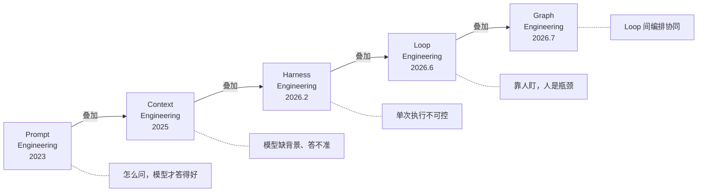

每一代都不是替代，而是**建立在上一代之上**：

| 阶段 | 解决的问题 | 存在的天花板 |
|------|-----------|-------------|
| **Prompt Engineering** | 怎么问，模型才答得好 | 答错无法自动纠偏，只能人工重来 |
| **Context Engineering** | 模型缺背景、信息不充分 | 只有信息没有手脚，缺验证闭环 |
| **Harness Engineering** | 单次执行不可控、不可信 | 仍然要人触发、人盯，人是瓶颈 |
| **Loop Engineering** | 靠人盯 → 自动化调度、无人值守 | 成本可能失控 |
| **Graph Engineering** | Loop 间编排、协同、调度 | 工程级任务系统的终局形态 |

**Harness 是地基，Loop 是上层调度，没有 Harness 就没有 Loop。**

---

## 二、为什么需要 Loop？—— 概率累乘的噩梦

LLM 本质是概率模型，核心动作就一个：**猜**。

单次正确率 90%，听起来不错。但软件工程用分治法：一个复杂任务 = N 个子任务叠加。于是：

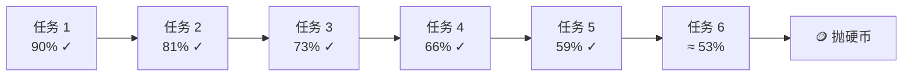

**仅 6 次叠加，正确率就从 90% 跌到 53%。** 复杂任务 20 个步骤？0.9²⁰ ≈ 12%。

所以必须有一种机制来**修正累积的概率损失**。这种机制早就有了——**控制论（Cybernetics）**。

---

## 三、控制论：Loop Engineering 的理论根

> 控制论的本质一句话：**通过负反馈机制去收敛目标函数。** Loop Engineering 就是控制论在 AI 领域的一次落地。

### 3.1 从「红旗法案」讲起

160 年前，英国《红旗法案》要求机动车前必须有人持红旗引导。160 年后，在 AI 编程领域，人就站在 AI 前头时时刻刻盯着。**一个字：累。**

我们每天 Vibe Coding 的过程，其实就是一个人 + AI 的原始 Loop：

```
我写 Prompt → AI 生成代码 → 我检查 → 不满意 → 我改 Prompt → ...
```

这个系统里，**人是负反馈的提供者**。Loop Engineering 要做的就是——把「人提供负反馈」换成「系统自动提供负反馈」。

### 3.2 控制论四大公理 → Loop 工程映射


| 控制论公理 | 含义 | Loop 工程中的对应 |
|-----------|------|------------------|
| **构建负反馈闭环** | 输出必须能反向影响输入，形成收敛 | 测试失败 → 修复 → 再测试 → 直到通过 |
| **可观测性** | 系统状态必须能被感知 | 日志、测试报告、类型检查、Lint 输出 |
| **可控性约束** | 只能在一定范围内干预系统 | 文件所有权边界、沙箱环境、权限规则 |
| **离散迭代纠偏** | 分步修正，每步检查是否偏航 | `Red → Green → Refactor`，每轮评审后修复波次 |

**这四个公理不是学术概念——它们直接决定 Loop 能不能收敛。**

构建一个 Loop 时，最核心要想清楚四个问题：

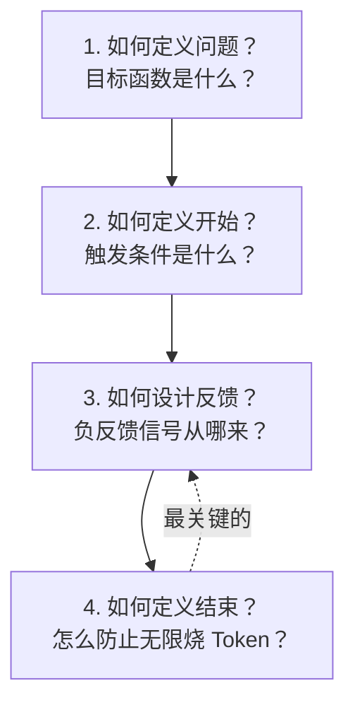

---

## 四、五大组件：Loop 的骨架


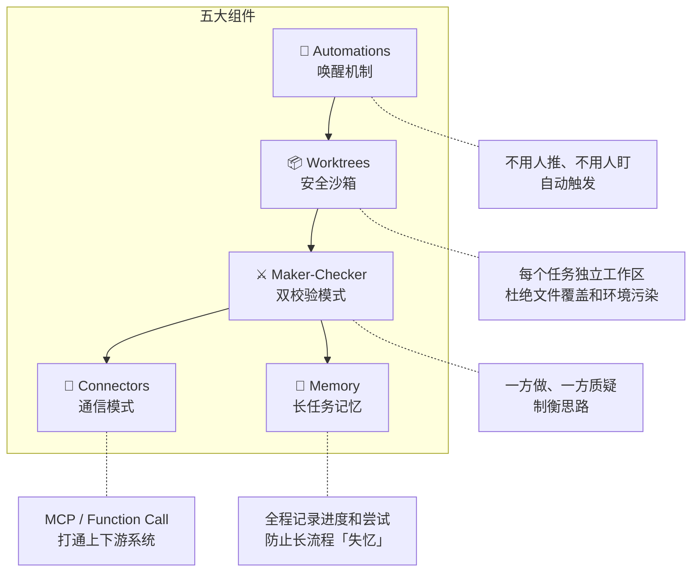

### 组件详解

| 组件 | 为什么必须有 | 缺了会怎样 |
|------|-------------|-----------|
| **Automations（唤醒）** | 人是流程中最慢的节点。AI 推一下动一下 = 累且低效 | 回到「人在前头持红旗」 |
| **Worktrees（沙箱）** | 多 Agent 并行，共享文件系统 = 覆盖、污染、竞争 | Agent A 写文件被 Agent B 覆盖 |
| **Maker-Checker（双校验）** | 不让模型自说自话。Checker 必须有硬证据才能否定 Maker | 同一个人规划 + 编码 + PASS = 三顶帽子 |
| **Connectors（通信）** | Loop 不能是孤岛，要能收发包、读日志、发通知 | Loop 收敛了，但不知道外部发生了什么 |
| **Memory（记忆）** | 长流程塞不进有限上下文。多轮迭代后必须记得目标和历史 | 第 5 轮迭代时忘了第 1 轮的需求 |

---

## 五、核心实践：先跑通一个小闭环

> **不要一上来就做一个全自动万能循环。先把最小可收敛闭环跑通，再逐步放大自治边界。大循环是长在小循环上的。**

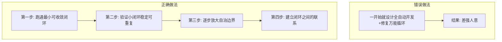

**不管大小闭环，核心都在四个问题：如何定义问题、如何定义开始、如何设计反馈、如何定义结束。**

其中「设计反馈」最关键——你需要设计一种让模型**真的会说「不」**的机制。这种「不」不是提示词里的拒绝话术，而是**基于不可否认的硬事实**的否定。从这种否定，就天然形成了负反馈链路。

---

## 六、让模型说「不」的三种方法

### 6.1 方法一：TDD，把需求翻译成反馈信号

> **TDD 的价值不是多写几个测试用例，而是把需求翻译成反馈信号。**


**TDD 的本质：先定标准 → 后做开发 → 以结果反向驱动过程。**

```
🔴 RED:   先写失败测试，定义「对/错」的终态标准
🟢 GREEN: 迭代写代码，直到全部测试通过
🔵 REFACTOR: 在测试兜底下优化代码，质量不退化
```

这个 `Red → Green → Refactor` 就是最小的 Loop。以往转不起来，因为**控制者是人**；现在控制权交给 Agent，结构没变，**人变轻松了**。

#### TDD 左移：三个测试环

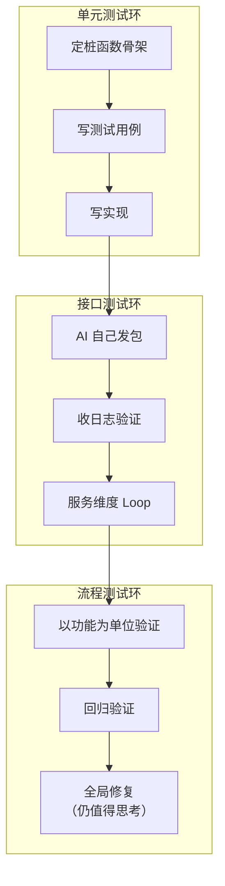

#### TDD 不是万能药——明确边界

| ✅ 适合 TDD | ❌ 不适合 TDD |
|------------|-------------|
| 明确的业务规则 | 纯体验问题 |
| API 输入/输出行为 | 架构品味 |
| 数据转换和边界条件 | 产品决策 |
| 回归 Bug 修复 | — |
| 编译 / Lint / 类型检查 | — |

**实践中问自己：这个功能是否可以被测试表达？这部分如何变成 Loop？**

#### 设计测试用例：以规则为核心

测试用例设计错了，所有 AI 生成的代码都是在错误基础上改动——**怎么改都是错**。解决思路：**以需求为出发点，构建规则集合**，然后基于规则生成测试用例。

---

### 6.2 方法二：证据链追溯 —— Checker 凭什么说不行？

Maker-Checker 双校验架构解决了「不自说自话」的问题，但引出一个新问题：**Checker 凭什么否决 Maker？靠猜不行，靠感觉也不行。**

答案是——**证据链**。

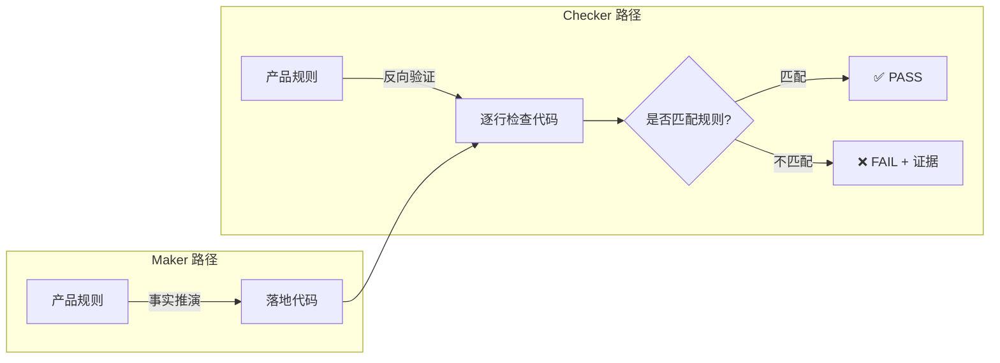

#### 证据链追溯的具体做法

Checker 不是笼统地说「代码有问题」，而是**逐条举证**：

```
1. 提取需求规则（从 spec.md / requirements.md）
   ↓
2. 对每条规则，在代码中找对应实现
   ↓
3. 对每条规则，在测试中找到对应验证
   ↓
4. 形成「规则 → 代码证据 → 测试证据」三元组
   ↓
5. 三元组断裂的地方 = FAIL，附上断裂点
```

**举例：**

| 规则 | 代码证据 | 测试证据 | 判断 |
|------|---------|---------|------|
| "下单金额必须 > 0" | `if amount <= 0: throw` | `test_negative_amount()` | ✅ |
| "库存不足时返回错误码 409" | `return 400` | `test_out_of_stock()` 断言 400 | ❌ **代码返回 400，规则要求 409** |

Checker 的输出不是「代码写得不好」，而是**「规则 R3 要求返回 409，但 `orders/handler.ts:42` 返回 400，测试 `test_out_of_stock:18` 断言了错误值」**——精确到行号。

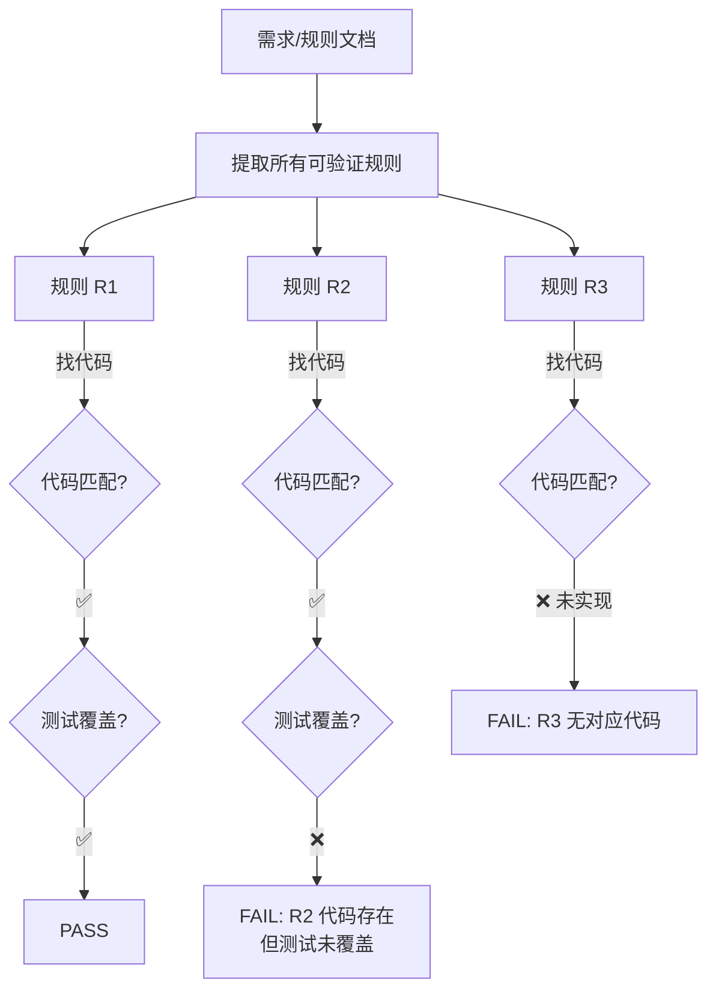

**这种追溯的价值在于：**
- **可定位**：不是「代码质量差」，而是「第 X 条规则在第 Y 行未实现」
- **可仲裁**：人类看一眼就知道 Checker 判得对不对
- **可度量**：通过率 = 匹配的三元组数 / 总规则数
- **防作弊**：Maker 不能靠写一堆注释蒙混过关，必须有可执行证据

---

### 6.3 方法三：预算思维 —— 防止 Token 烧穿

设计 Loop 不能只看技术，还要算账。

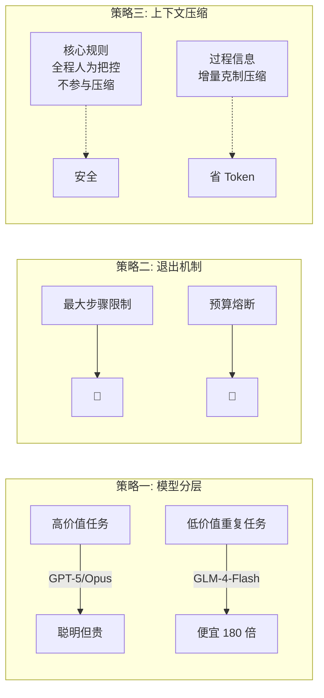

**关键教训**：用廉价模型对全量上下文反复重压缩，会导致核心规则持续稀释、过程噪音不断累积，最终全链路已投入的 Token 全部作废。**核心规则全程人为把控，只压缩可损耗的过程信息。**

---

## 七、跳出技术：三层 Loop 的全局视角

吴恩达给出了更高维度的思考——技术 Loop 之上还有产品 Loop 和用户 Loop：

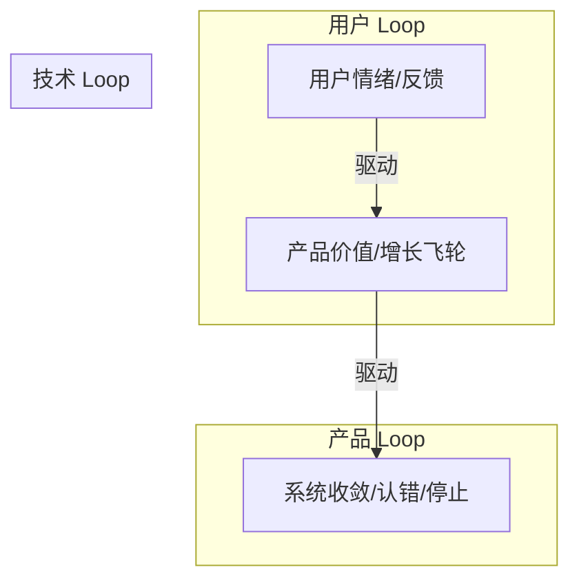

| Loop 层 | 回答的问题 |
|---------|-----------|
| **技术 Loop** | 系统会不会收敛、会不会停、会不会认错？ |
| **产品 Loop** | 闭环是否持续创造用户价值？是否值得继续放大？ |
| **用户 Loop** | 用户情绪会以什么形式回到产品中？ |

Loop Engineering 解决的是技术 Loop 层的问题；但一个好的系统必须三层都通。

---

## 八、总结

Loop 不是一个技术框架，而是一种**思维模式**。它让我们重新思考：人和 AI 如何协作完成一个闭环？如何把人从 Loop 中更多环节拔出来，把注意力真正还给人？

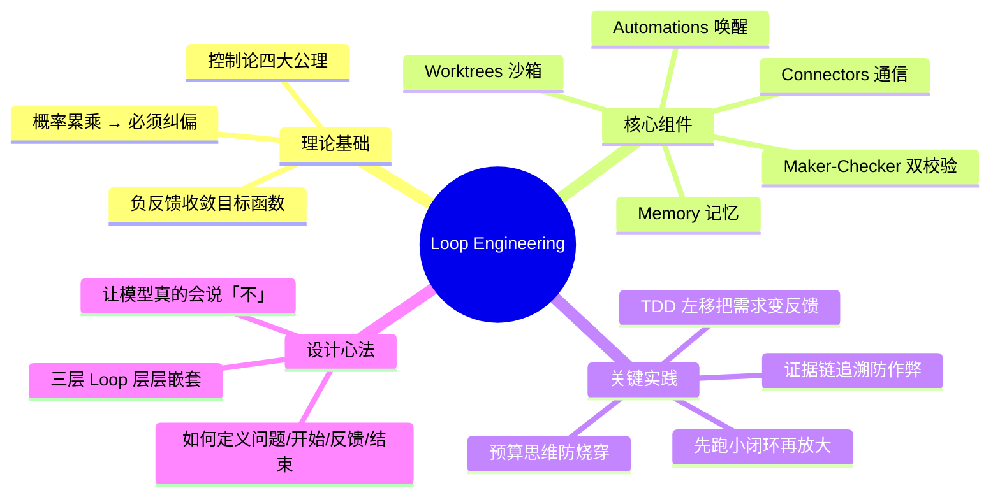

**记住三句话：**

1. **你不是在 Prompt Agent，你是在设计一个 Loop 去 Prompt Agent。**
2. **TDD 的价值不是多写测试，而是把需求翻译成反馈信号。**
3. **Checker 说「不」靠的不是感觉，是逐条规则 → 代码 → 测试三元组的证据链。**
