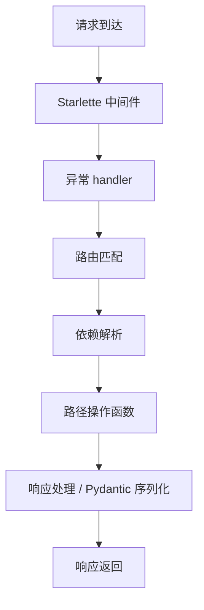
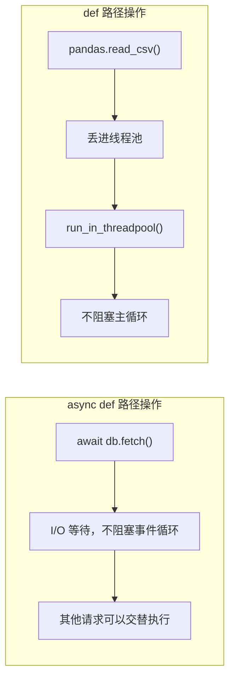

FastAPI 现在是 Python 后端的主流选择。但它不止是"写 API 很快"——它的类型系统、依赖注入、异步模型背后有一套精妙的设计。这篇文章按从浅入深的顺序，把 FastAPI 的核心知识串一遍。

---

## 一、定位：FastAPI 解决什么问题

在 FastAPI 之前，Python 后端框架的痛点很明确：

| 痛点 | Flask | Django | FastAPI |
|------|-------|--------|---------|
| 请求校验 | 手动 / marshmallow | DRF Serializer | Pydantic（类型即校验） |
| API 文档 | 手写 / flasgger | drf-spectacular | 自动生成（OpenAPI） |
| 异步支持 | 3.x 才补 | 4.x 追加 | 原生 async（Starlette） |
| 性能 | WSGI | WSGI/ASGI | ASGI |

FastAPI 的本质 = **Starlette（高性能 ASGI 框架）+ Pydantic（数据校验）+ 类型标注驱动的自动文档**。

但 FastAPI 不是 Flask 的直接替代品。如果你只需要几个简单的 REST endpoint，不需要异步不需要文档，Flask 更轻量。选型要拿场景和数据说话。

---

## 二、核心机制：类型标注即一切

FastAPI 最核心的理念：**你写的 Python 类型标注，既是校验、也是文档、也是编辑器提示**。

```python
from fastapi import FastAPI
from pydantic import BaseModel

app = FastAPI()

class Item(BaseModel):
    name: str
    price: float
    is_offer: bool | None = None

@app.post("/items/")
async def create_item(item: Item) -> dict:
    return {"item_name": item.name, "price": item.price}
```

这段代码写完后，FastAPI 自动做了三件事：
1. 检查类型标注（parameter types, return type）
2. 用 Pydantic 生成 JSON Schema
3. 自动生成 OpenAPI 规范 → Swagger UI (`/docs`) 和 ReDoc (`/redoc`)

### 如何区分路径参数、查询参数、请求体？

FastAPI 的判断规则只有一条：

- 在路径模板 `{}` 中出现过 → **路径参数**
- 是 Pydantic BaseModel 类型 → **请求体**
- 其余简单类型（str, int, float, bool...）→ **查询参数**

```python
@app.put("/items/{item_id}")
async def update_item(
    item_id: int,       # 路径参数（出现在 URL 模板中）
    item: Item,         # 请求体（Pydantic model）
    force: bool = False, # 查询参数（简单类型）
):
    ...
```

### `response_model` 的隐藏价值

`response_model` 不仅是文档生成器，更是**数据过滤器**。你从数据库查出什么都可以直接 return，FastAPI 只序列化 response_model 定义的字段：

```python
class UserOut(BaseModel):
    id: int
    name: str
    email: str

@app.get("/users/{user_id}", response_model=UserOut)
async def get_user(user_id: int, db=Depends(get_db)):
    user = await db.get_user(user_id)  # 包含 password_hash 的 ORM 对象
    return user  # FastAPI 只输出 id, name, email —— password_hash 永远不会泄露
```

---

## 三、依赖注入：FastAPI 真正的灵魂

FastAPI 的 DI 系统不是简单的"注入数据库连接"，它是一个**可组合的请求处理管道**。

### 基本形式

```python
from fastapi import Depends

async def get_db():
    db = SomeDatabase()
    try:
        yield db
    finally:
        await db.close()

@app.get("/items/")
async def list_items(db=Depends(get_db)):
    return await db.fetch_all("SELECT * FROM items")
```

### 依赖链：依赖可以依赖其他依赖

这才是真正强大的地方。FastAPI 会解析依赖图，按拓扑顺序执行：

```python
async def get_token(authorization: str = Header(...)) -> str:
    return authorization.split(" ")[1]

async def get_current_user(
    token: str = Depends(get_token),
    db=Depends(get_db),
) -> User:
    payload = jwt.decode(token, SECRET_KEY, algorithms=["HS256"])
    user = await db.get_user(payload["sub"])
    if not user:
        raise HTTPException(status_code=401, detail="用户不存在")
    return user

@app.get("/me")
async def read_me(user: User = Depends(get_current_user)):
    return user
```

`get_current_user` 需要 `get_token` 和 `get_db` 的返回值 → FastAPI 先执行这两个，再把结果注入。而且**同一个请求内，同一个依赖只执行一次**，结果被缓存。

### 把依赖当守卫用

`dependencies=[...]` 只执行依赖、不使用其返回值，适合做权限检查：

```python
async def require_admin(user: User = Depends(get_current_user)):
    if user.role != "admin":
        raise HTTPException(status_code=403, detail="需要管理员权限")

@app.get("/admin/", dependencies=[Depends(require_admin)])
async def admin_panel():
    return {"message": "welcome, admin"}

# 对整个路由组统一加认证
router = APIRouter(dependencies=[Depends(get_current_user)])
```

---

## 四、请求生命周期全景图

理解请求从进入到离开的完整路径：



### 自定义中间件

有两种写法：

```python
# 方式一：纯 ASGI（性能更好）
@app.middleware("http")
async def add_timing(request: Request, call_next):
    start = time.perf_counter()
    response = await call_next(request)
    response.headers["X-Process-Time"] = str(time.perf_counter() - start)
    return response

# 方式二：BaseHTTPMiddleware（功能更强，但有轻微性能开销）
from starlette.middleware.base import BaseHTTPMiddleware

class TimingMiddleware(BaseHTTPMiddleware):
    async def dispatch(self, request, call_next):
        start = time.perf_counter()
        response = await call_next(request)
        response.headers["X-Process-Time"] = str(time.perf_counter() - start)
        return response
```

**什么时候用中间件、什么时候用依赖？**

- 中间件：跨所有路由的逻辑，如请求计时、CORS、日志追踪
- 依赖：按路由/路由组隔离的逻辑，如认证、权限、数据库连接

一个生产级的请求追踪中间件：

```python
import uuid

@app.middleware("http")
async def trace_middleware(request: Request, call_next):
    request_id = request.headers.get("X-Request-ID", str(uuid.uuid4()))
    # 注入到日志上下文，实现全链路追踪
    with logger.contextualize(request_id=request_id):
        response = await call_next(request)
        response.headers["X-Request-ID"] = request_id
        return response
```

---

## 五、异步深入：`async def` 还是 `def`？

FastAPI 的并发模型是理解它性能的关键：



**决策规则**：

| 场景 | 用 `async def` | 用 `def` |
|------|:---:|:---:|
| 异步 I/O（httpx, asyncpg, aioredis） | ✅ | ❌ |
| 同步 I/O / CPU 密集（pandas, PIL, requests） | ❌ | ✅ |

**注意**：在 `async def` 里调用同步阻塞函数（如 `time.sleep(10)`）会阻塞整个事件循环，所有请求都在等这一个操作完成——这是生产环境最常见的性能杀手。

### BackgroundTasks 的真相

```python
from fastapi import BackgroundTasks

@app.post("/send-email/")
async def send_email(background_tasks: BackgroundTasks, email: EmailSchema):
    background_tasks.add_task(send_email_sync, email.to, email.body)
    return {"message": "email queued"}
```

`BackgroundTasks` **不是在另一个线程中并行执行**——它是在**响应返回后、Starlette 关闭连接前**，在同一个进程内顺序执行。适合发邮件、写日志这类轻量操作。

如果你需要真正的异步后台处理（如生成报表 30 秒，不能等），用 Celery / ARQ，走独立 worker 进程 + 消息队列。

---

## 六、生产级架构分层

一个可扩展的目录结构：

```
project/
├── app/
│   ├── main.py              # FastAPI() 实例创建
│   ├── config.py            # pydantic-settings BaseSettings
│   ├── api/
│   │   ├── router.py        # APIRouter 汇总
│   │   └── v1/
│   │       ├── users.py
│   │       └── items.py
│   ├── models/              # SQLAlchemy / SQLModel 模型
│   ├── schemas/             # Pydantic 请求/响应模型
│   ├── services/            # 业务逻辑层
│   ├── dependencies/        # 可复用的 Depends
│   └── core/
│       ├── security.py
│       └── exceptions.py
├── tests/
├── alembic/                 # 数据库迁移
└── pyproject.toml
```

### 分层原则

```
Router（路由层）
  ↓ 只做：参数提取、调用 service、返回响应
Service（业务层）
  ↓ 只做：业务逻辑、事务管理、权限校验
Repository / Model（数据层）
  ↓ 只做：SQL 查询、数据持久化
```

每一层只知道自己下面那一层。Router 不知道 SQL，Service 不知道 HTTP。

### 自定义异常体系

```python
# core/exceptions.py
class AppException(Exception):
    def __init__(self, status_code: int, detail: str, error_code: str):
        self.status_code = status_code
        self.detail = detail
        self.error_code = error_code

class NotFoundException(AppException):
    def __init__(self, entity: str, entity_id: int):
        super().__init__(
            status_code=404,
            detail=f"{entity} with id {entity_id} not found",
            error_code=f"{entity.upper()}_NOT_FOUND",
        )

# main.py
@app.exception_handler(AppException)
async def app_exception_handler(request, exc: AppException):
    return JSONResponse(
        status_code=exc.status_code,
        content={"error_code": exc.error_code, "detail": exc.detail},
    )
```

这样 Service 层可以 `raise NotFoundException("Item", 42)`，框架自动返回规范的 JSON 错误响应，Service 层完全不需要知道 HTTP。

---

## 七、性能优化四板斧

### 1. `response_model` 自动过滤敏感字段

上文已经展示过——这是零成本的字段过滤方案。

### 2. `orjson` 替换标准 JSON

```bash
pip install orjson
```

```python
from fastapi.responses import ORJSONResponse

app = FastAPI(default_response_class=ORJSONResponse)
```

`orjson` 比标准 `json` 快 2-5 倍，原生支持 `datetime`、`UUID`、`Decimal` 等类型的序列化。

### 3. 异步数据库连接池

```python
from sqlalchemy.ext.asyncio import create_async_engine, async_sessionmaker

engine = create_async_engine(
    DATABASE_URL,
    pool_size=20,         # 连接池大小
    max_overflow=10,      # 最大溢出连接
    pool_pre_ping=True,   # 连接前测试连通性
    pool_recycle=3600,    # 每小时回收连接
)

async_session = async_sessionmaker(engine, expire_on_commit=False)
```

### 4. 响应压缩

```python
from fastapi.middleware.gzip import GZipMiddleware

app.add_middleware(GZipMiddleware, minimum_size=1000)  # 大于 1KB 才压缩
```

---

## 八、测试策略

### 单元测试 Service 层（不启动 FastAPI）

```python
async def test_user_service():
    service = UserService(mock_db)
    user = await service.create_user("alice", "alice@example.com")
    assert user.name == "alice"
```

### TestClient 集成测试

```python
from fastapi.testclient import TestClient

client = TestClient(app)

def test_create_user():
    response = client.post("/users/", json={"name": "alice", "email": "alice@example.com"})
    assert response.status_code == 201
    assert response.json()["name"] == "alice"
```

**TestClient 的优势**：不启动真实服务器，不绑定端口，直接用 ASGI 协议走内存通道。完整测试套件几百个用例可以在几秒内跑完。

### 依赖覆写

```python
# 测试时替换真实的数据库依赖
async def override_get_db():
    async with test_engine.begin() as conn:
        yield conn

app.dependency_overrides[get_db] = override_get_db

# 测试结束后清理
app.dependency_overrides.clear()
```

---

## 九、OpenAPI 定制

```python
app = FastAPI(
    title="My API",
    version="1.0.0",
    docs_url="/api/docs",        # Swagger UI 地址
    redoc_url="/api/redoc",      # ReDoc，可设为 None 禁用
    openapi_url="/api/openapi.json",
)

# 给路径打标签分组
@app.get("/users/", tags=["users"])
@app.get("/items/", tags=["items"])

# 更丰富的文档
@app.post(
    "/users/",
    response_model=UserOut,
    summary="创建用户",
    description="创建一个新用户，邮箱必须唯一",
    response_description="创建成功的用户信息",
    responses={
        409: {"description": "邮箱已被注册"},
        422: {"description": "请求参数校验失败"},
    },
)
```

---

## 十、SQLAlchemy async 踩坑录

### 懒加载陷阱

Async 下不支持 `relationship` 的懒加载——会报 `MissingGreenlet` 错误。必须用 `selectinload()` / `joinedload()` 显式预加载：

```python
# ❌ 异步下直接访问 relationship 会炸
user = await session.get(User, user_id)
print(user.orders)  # MissingGreenlet!

# ✅ 必须显式预加载
from sqlalchemy.orm import selectinload

stmt = select(User).where(User.id == user_id).options(selectinload(User.orders))
user = (await session.execute(stmt)).scalar_one()
print(user.orders)  # ✅
```

### `expire_on_commit=False`

```python
async_session = async_sessionmaker(engine, expire_on_commit=False)
```

commit 后如果不设这个，访问对象属性会触发过期刷新，async 下直接炸。

---

## 十一、面试高频题精选

### Q1：FastAPI 和 Flask/Django 的区别？

**标准答案**：类型驱动（Pydantic 校验 + OpenAPI 文档）、原生异步（Starlette ASGI）、自动文档。

**加分项**：能说出"不是替代关系，不同场景选不同工具"。

### Q2：路径操作用 `async def` 还是 `def`？怎么选？

**标准答案**：异步 I/O 库用 `async def`，同步/CPU 密集用 `def`（Starlette 放线程池）。

**加分项**：能说出"`async def` 里调 `time.sleep()` 会阻塞事件循环"。

### Q3：怎么给已有 API 加认证但不改路径操作代码？

```python
@app.get("/admin/", dependencies=[Depends(require_admin)])
async def admin_panel():
    ...
```

**加分项**：用 `APIRouter(dependencies=[...])` 统一整组路由加认证。

### Q4：`BackgroundTasks` 和 Celery 的区别？

**标准答案**：`BackgroundTasks` 是响应返回后、同一进程内执行，适合轻量操作（发邮件、写日志）。Celery 独立 worker + 消息队列，支持重试和持久化。

**加分项**：能说出"`BackgroundTasks` 在响应发送给客户端之后、Starlette 关闭连接之前执行"。

### Q5：请求怎么追踪完整调用链？

**标准答案**：中间件注入 `X-Request-ID` + 结构化日志（structlog / python-json-logger）+ OpenTelemetry + Jaeger/Grafana Tempo。

### Q6：你在项目里用过哪些 FastAPI 特性最让你觉得"值"？

考察实战经验。一个不错的回答方向：
- **依赖注入**让代码解耦，测试时 `dependency_overrides` 替换依赖
- **`response_model`** 自动过滤敏感字段，零成本防数据泄露
- **TestClient** 极速测试，几百个用例秒级跑完

---

## 总结

FastAPI 不只是"写 API 快"。它的核心价值在于：

1. **类型系统**——代码即文档，校验零成本
2. **依赖注入**——可组合的请求处理管道，不是简单的"注入数据库连接"
3. **异步模型**——理解 `async def` vs `def` 的区别才能写出真正高性能的代码
4. **分层架构**——Router → Service → Repository，每层只做一件事

把这些吃透，面试和干活都够用。
