# OpenCodeReview 源码拆解：LLM 只负责一半

> 源码：github.com/alibaba/open-code-review (Go) · 基于本地 v1.9.x 主线 + 官方 README + 公众号拆解交叉验证

## 一句话

**把 LLM 容易失控的部分，全部搬回确定性工程；LLM 只保留「判断题」这一件事。**

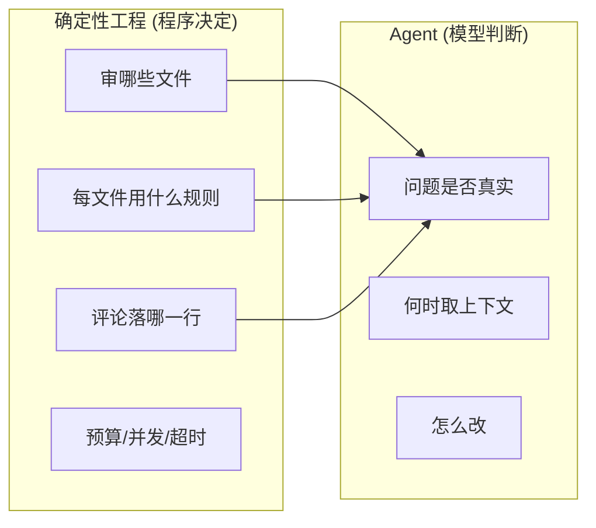

**结果**：同模型下 Precision/F1 更高、token 约 1/9、更快；代价 Recall 更低（刻意取舍：低误报 > 高召回）。

## 为什么不能把整个 PR 扔给 Agent

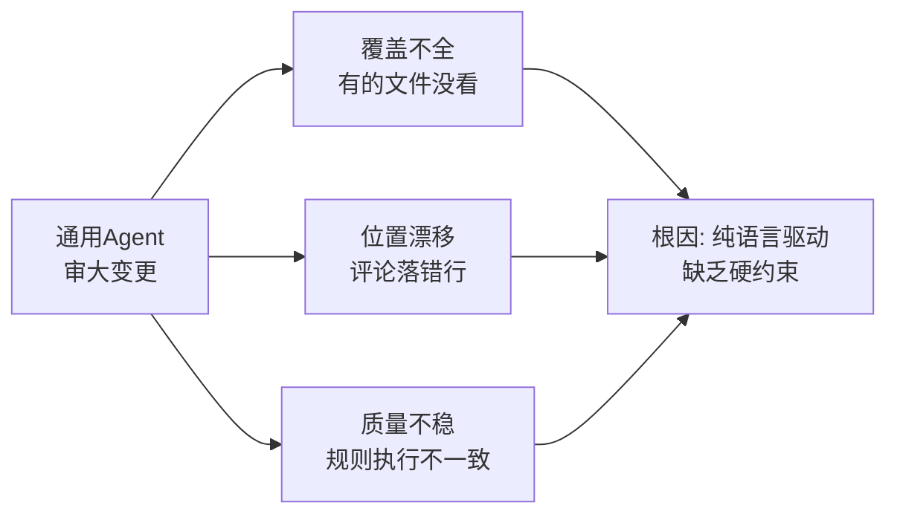

「必须审完哪些文件」「评论落哪一行」「用哪套检查清单」——都是**可以写成程序的约束问题**，不需要开放式推理。

## 架构：扁平并行，不是主从树形

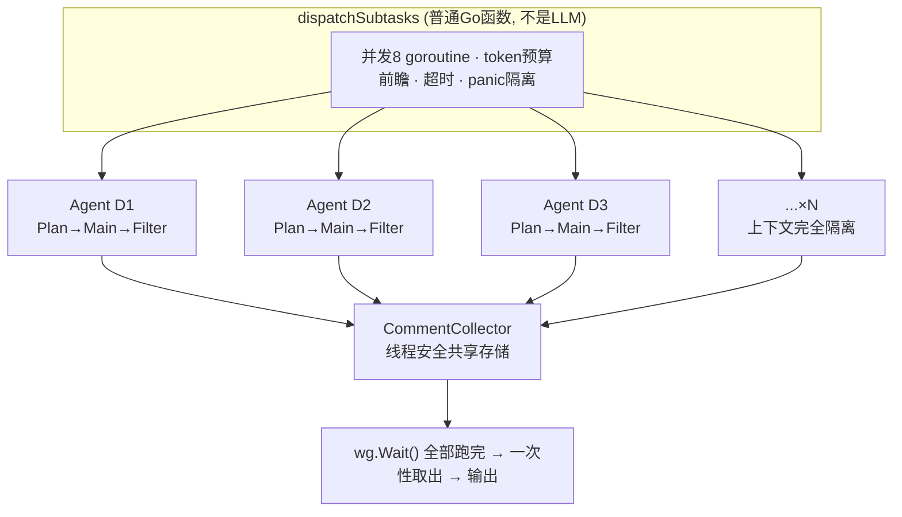

**没有「主 Agent 汇总子结果再综合判断」的环节**——评论直接落共享 Collector。这是省 9 倍 token 的关键：没有「子结果回传主 Agent」这个最烧钱的环节。

## 一条 comment 的完整生命周期

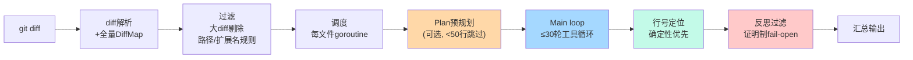

## 规则系统：两级结构

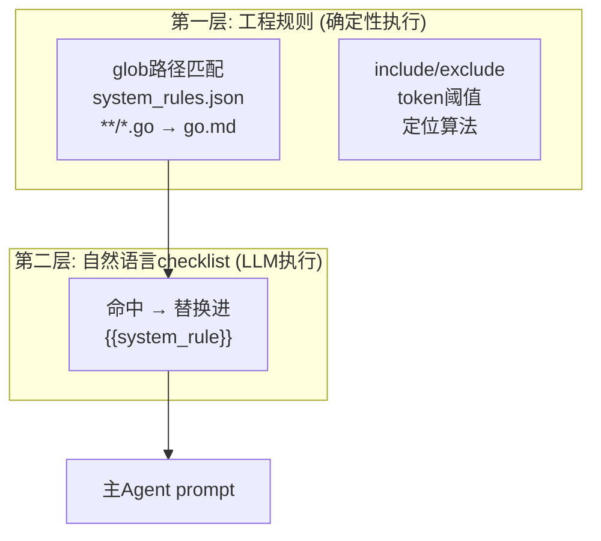

规则优先级：`--rule` > 仓库 `.opencodereview/rule.json` > 用户全局 > 内置系统；用户规则默认**替换**系统规则。

**Go 规则示例**：
- 声称竞态/输入可控/资源归属前，**先用工具查调用点**（Favor precision over recall）
- 不重复 go vet / Staticcheck / race detector 能发现的问题
- 版本差异都考虑：`time.After` 在 Go 1.23+ 不单独算泄漏

## Plan：固定框架 + 现场内容

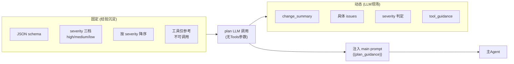

关键点：
- **骨架是经验，内容是现场**——流程模板固化，具体分析模型生成
- plan 失败**不阻塞**：`planResult=""` 继续跑 main
- 空 plan 时 `stripEmptyPlanBlock` 先剥掉整段（防字面量泄漏——历史 bug 修复）

## Main loop：30 轮封顶的工具循环

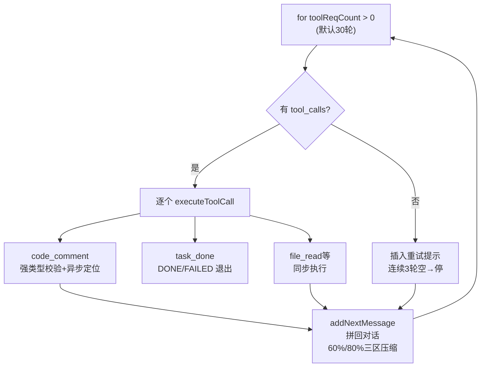

**主 Agent prompt = 确定性代码填充 7 个占位符**：

| 占位符 | 来源 |
|--------|------|
| `{{current_system_date_time}}` | 当前时间 |
| `{{current_file_path}}` | 当前文件 |
| `{{system_rule}}` | glob 匹配出的语言规则 |
| `{{change_files}}` | 其他变更文件列表（带状态前缀） |
| `{{diff}}` | 该文件 unified diff |
| `{{requirement_background}}` | 需求背景（--background 等） |
| `{{plan_guidance}}` | plan 的 JSON 计划 |

**防坑设计**：
- prompt 组装后 token > 80% max_tokens → **直接拒绝不发**
- 工具注册表 `Freeze()`：并发前冻结，防运行中改工具
- 主 Agent「不越界」：其他文件的问题只能帮助理解，不能评论
- 每轮重发完整对话 → 命中 provider prompt cache
- `code_comment` 的 path **强制覆盖**为真实路径（模型幻觉免疫）

## 行号定位：三级策略，LLM 只兜底

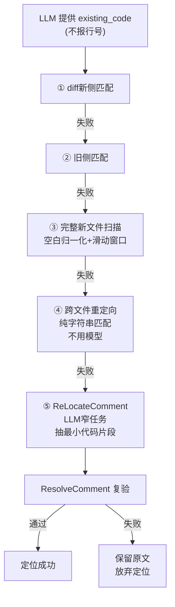

## REVIEW_FILTER：证明制过滤

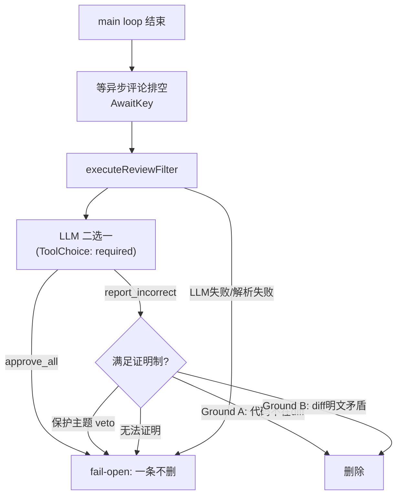

- **删除仅两条理由**：Ground A（代码不在 diff）/ Ground B（diff 明文矛盾，须直接读出，不允许推理链）
- **保护主题 veto**：内存安全、并发、链接一致性、行为变更、未使用参数 → 禁止删除
- **玄机**：工具参数 `analysis` 排在 `comment_ids` 前——Go 按字母序序列化，逼模型先推理再提交 id（顺序反了模型会先选 id 再编理由）
- 一切失败 → **fail-open**（宁可多留噪声，绝不误删真问题）

## 工具集：6 个只读工具

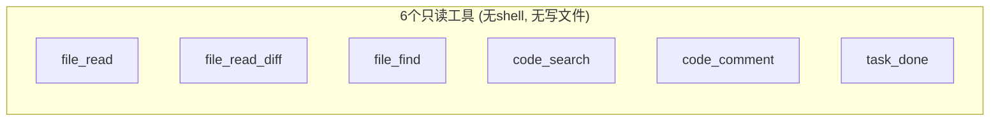

从大规模生产数据（调用频率分布、重复率、新工具影响）蒸馏出的场景专属工具集。

## 数据边界 & 适用场景

**部署前四问**：endpoint 在哪？provider 是否保留请求？谁能看会话记录？MCP 是否转发第三方？

| 适合 | 不适合 |
|------|--------|
| 已有稳定 Git 流程 | 作为合并前的最终裁判 |
| 愿意维护项目规则 | 替代测试/静态分析/安全扫描 |
| CI 里过滤高置信问题 | 替代人工架构审查 |
| 大改动逐文件并发 | — |

> **定位**：高精度的「第二双眼睛」，不是「最终裁判」。

**上线前**：`ocr review --preview` 看覆盖 → 写项目规则 `ocr rules check` → 历史 PR 盲测算 Precision/Recall。

## 一句话总结

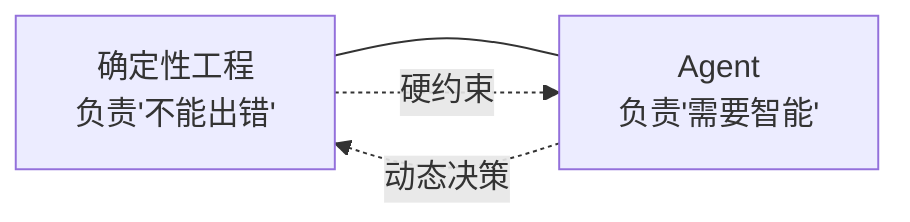

**让模型做它擅长的判断题，让代码做它该做的约束——这就是 OCR 的全部秘密。**
