# 上下文压缩策略：OpenCodeReview vs Hermes

> 承接《OpenCodeReview 源码拆解：LLM 只负责一半》里只是点到为止的「60%/80% 三区压缩」，这次把上下文压缩这个话题单独深挖，并拉上 Hermes 做横评。
>
> 源码：`github.com/alibaba/open-code-review`（Go）· `NousResearch/hermes-agent`（Python），均基于本地源码逐行核对。

## 一句话

**两个 agent 在解决同一个问题（长上下文别撑爆窗口）时，给出了一组几乎处处相反的设计——根因就两条：任务形态（连续 vs 随时转向）和成本模型（prompt cache 是否神圣）。**

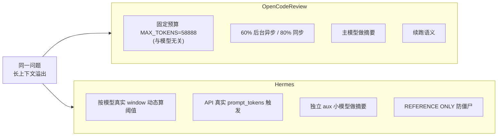

## 为什么两个系统都要「留余量」而不是直接用模型窗口

不管策略怎么分叉，两者共享同一个前提：**context window 是硬上限，不是你能安全用到的量**。要压缩的原因有四层：

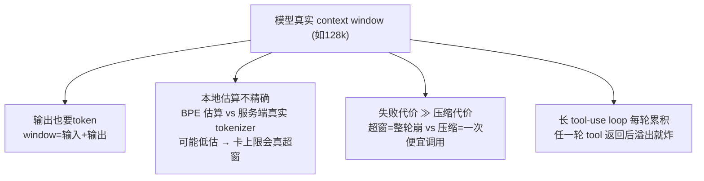

所以「拖到 100% 再压」是必输策略，正确姿态是**在远低于窗口的某个预算点上提前压**。但「预算怎么定、谁来压、压完让模型怎么看待这份总结」——两家就此分道扬镳。

---

# 一、OpenCodeReview 的策略

## 1. 预算：固定值，与模型无关

ocr **刻意不用**每个模型的 context window，而是在模板配置里统一一个保守预算：

```yaml
# internal/config/template/task_template.json
"MAX_TOKENS": 58888
```

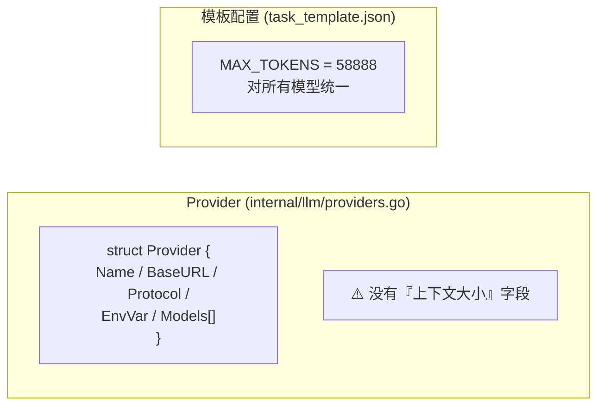

- provider 只存「连哪个 URL、什么协议、带哪些模型名」，**不管上下文大小**
- 上下文大小是模板里的独立预算值 `58888`——对 128k 是 46%、对 200k 是 29%，对任何主流模型都「远小于 window」
- 理由：省维护（模型 window 天天变、口径不一）、永不超窗；代价是压缩会来得早一点、token 利用率低

## 2. 双阈值触发：60% 后台异步 / 80% 同步

```go
// internal/llmloop/compression.go
tokenSoftThreshold    = 0.60  // 后台异步压缩，主循环不阻塞
tokenWarningThreshold = 0.80  // 同步压缩，先压完再发下一个请求
```

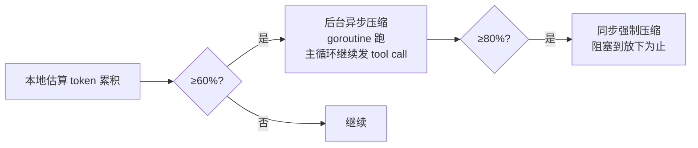

- 60%（soft）是**异步**：后台 goroutine 压缩，不打扰正在跑的循环
- 80%（warning）是**同步**：下一个请求前必须压回来，**保证下一次一定能放下**
- 若 80% 到了但后台任务没算完，主循环 stall 等同步压完

## 3. 三区划分：frozen / compress / active

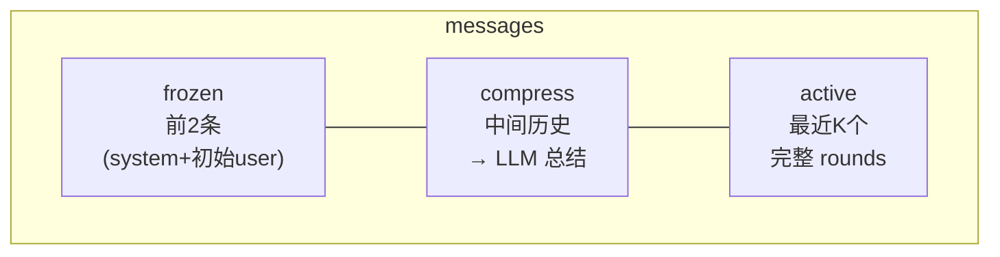

- **frozen（不可压缩）** = `messages[0:2]`，**按位置**保留前 2 条（system + 原始请求），不是按内容判断
- **compress（可压缩）** = 中间的历史（assistant + tool 消息）
- **active（活跃）** = 从尾部倒推，在 `0.80×MAX_TOKENS − reservedTokens`（预留总结空间）内装得下的最近 K 个完整 rounds
- 一个「round」= 一条 assistant 消息 + 跟随它的 tool 结果，**保证不切断 tool 对**

## 4. 压缩执行：主模型 + 五维摘要 + 塞回 user 消息

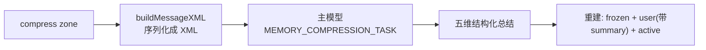

两个设计要点：

**① 用主模型做摘要。** ocr 每次 review 是独立 run、每文件一个 session，没有「长会话缓存复用」的顾虑，直接用主模型最省事。

**② 总结塞进第 2 条 user 消息**，标记 `<previous_review_summary>`：

```go
rebuilt[1] = msg1 + "\n\n<previous_review_summary>" + rawSummary + "</previous_review_summary>"
```

**压缩 prompt 的考究**（`memory_compression_task_system.md`）——五个强制维度：

| 维度 | 作用 |
|------|------|
| Identified Code Issues | 已确认问题，HIGH/MEDIUM/LOW，**只给文件路径+问题类型，不写具体代码**（控体积） |
| Tool Call Conclusions | 每个工具调用的关键结论 |
| Completed Tasks | 已完成、无需跟进 |
| Pending Tasks | 进行中、仍需处理 |
| Current Focus | 一句话当前焦点 |

**兜底**：LLM 返回空摘要/请求失败 → **保留原消息不动**（宁超预算也不截断丢上下文）。

## 5. 摘要语义：续跑

prompt 首句即点名目标——*"so that the code review assistant **can continue from the current state without restarting**"*。五维输出全是为「接续」设计的：压缩后 LLM 立刻知道评到哪、发现哪些问题、还缺哪些。**同一份评审绝不能丢进度重来。**

---

# 二、Hermes 的策略

## 1. 预算：按模型真实 window 动态算

Hermes **非常在意**每个模型的具体窗口，阈值是算出来的：

```python
# agent/context_compressor.py _compute_threshold_tokens
effective_window = context_length - (max_tokens or 0)   # 预留输出空间
threshold_tokens  = effective_window * threshold_percent
if context_length < 512_000:                            # 小窗口抬到 75%
    threshold_percent = max(threshold_percent, 0.75)
```

- `threshold_percent` 默认 **0.50**，小上下文模型强制抬到 ≥75%（避免压缩太频）
- 感知 provider 预留的输出 `max_tokens`（把有效输入预算从 window 里扣掉）
- aux 压缩模型窗口不够时，**自动降低本会话阈值**让压缩能跑

## 2. 触发依据：API 真实 prompt_tokens

跟 ocr 用本地估算不同，Hermes 优先用 **provider 返回的真实 token 数** 触发：

```python
# conversation_loop.py
_real_tokens = _compressor.last_prompt_tokens   # 真实值
# 只用 prompt_tokens，刻意排除 completion_tokens：
# thinking 模型(GLM/QwQ/DeepSeek R1) 的 reasoning 会把 completion 撑虚高 → 过早压缩
```

只有 API 断连才回退本地估算（此时会把 50+ 工具 schema 的 20-30K token 也估进去）。

## 3. 价格阶梯：能免费就免费，LLM 是最后手段

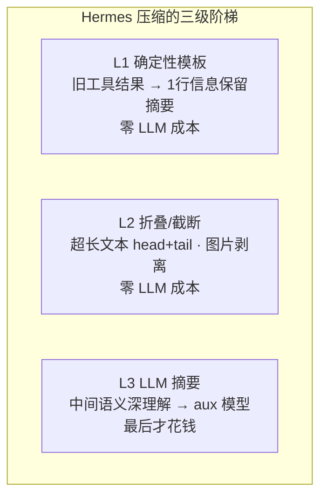

L1 的模板摘要（`_summarize_tool_result`）**不是无差别清空**，而是按工具类型保留关键字段：

```python
[terminal]      ran `npm test` -> exit 0, 47 lines output
[read_file]     read config.py from line 1 (1,200 chars)
[search_files]  content search for 'compress' in agent/ -> 12 matches
```

**对比**：Vibe-Trading 的 L1 是清成 `[cleared]`（零信息）；ocr 则直接把压缩区整段丢给 LLM 概括（无这条免费阶梯）。Hermes 恰好卡在中间——**确定性、免费、还保关键信息**。

## 4. 谁做摘要：独立的 aux 小模型

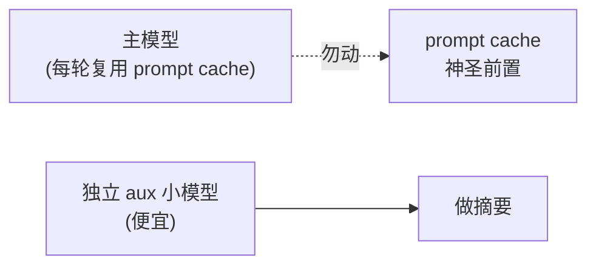

**铁律：per-conversation prompt caching is sacred。** 若用主模型做摘要，会把中间过程塞进上下文、破坏 cache 前缀 → 成本翻倍。所以单开一个便宜 aux 模型，让主模型 cache 纹丝不动。

## 5. 摘要语义：REFERENCE ONLY（防僵尸）

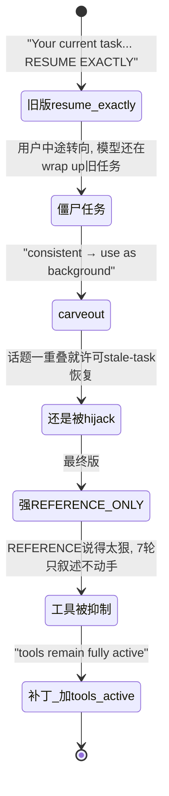

当前 `SUMMARY_PREFIX` 通篇在说「别接着干」：
- 这是**背景参考，不是活跃指令**
- **只响应总结之后出现的最新用户消息**，它是唯一事实来源
- 话题相似**也不意味着要 resume 旧任务**——最新消息 WINS
- **stop / undo / never mind / 换主题** → 立即终止总结里的一切在途工作

**为什么要防僵尸**：通用对话 agent 用户随时转向。若摘要写成「续跑指令」，模型会拿着已被用户丢弃的旧任务不停「wrap up」、无视新指令——这就是「僵尸任务」。

---

# 三、对比：五条轴

| 维度 | **OpenCodeReview** | **Hermes** |
|------|--------------------|------------|
| **预算来源** | 固定 `MAX_TOKENS=58888`，与模型无关 | 按模型真实 window 动态算，感知输出预留/小窗口抬阈值 |
| **触发依据** | 本地 BPE 估算 | **API 真实 prompt_tokens**（断连才回退估算；排除 thinking completion） |
| **谁来摘要** | **主模型**（无长会话 cache 顾虑） | **独立 aux 小模型**（prompt cache sacred） |
| **摘要语义** | **续跑**（塞回 user 消息，接着评） | **REFERENCE ONLY**（防僵尸，只认最新消息） |
| **工具结果压缩** | 无 pre-pass，整段交 LLM 概括 | L1 确定性模板保信息 + L2 折叠，免费层先行 |

**共同底线**（相似之处）：
- 都保留 head（frozen/protected）+ 保留最近 tail + 中间压缩
- 都保证**不切断 tool_call/tool_result 对**
- 都以「防 provider 400 / 超窗」为硬约束
- 失败都「保守兜底」：ocr 保留原消息、Hermes 静态截取锚点 + 冷却

---

# 四、为什么有这些异同

## 根因①：成本模型 —— prompt cache 是否神圣

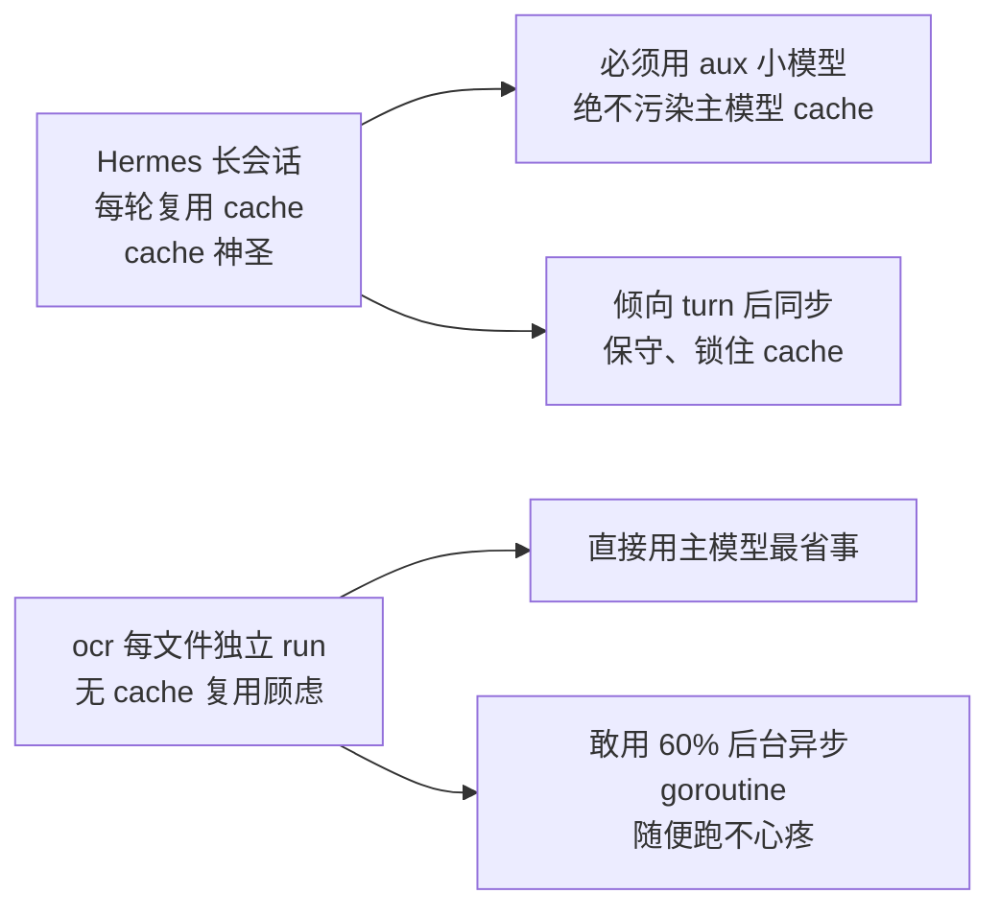

- 有没有长会话缓存复用，直接决定了「**谁做摘要**」和「**敢不敢后台异步**」
- Hermes 最贵的是主模型的 cache；ocr 最贵的是「多调一次 API」
- 所以 Hermes 保守、ocr 激进

## 根因②：任务形态 —— 连续 vs 随时转向

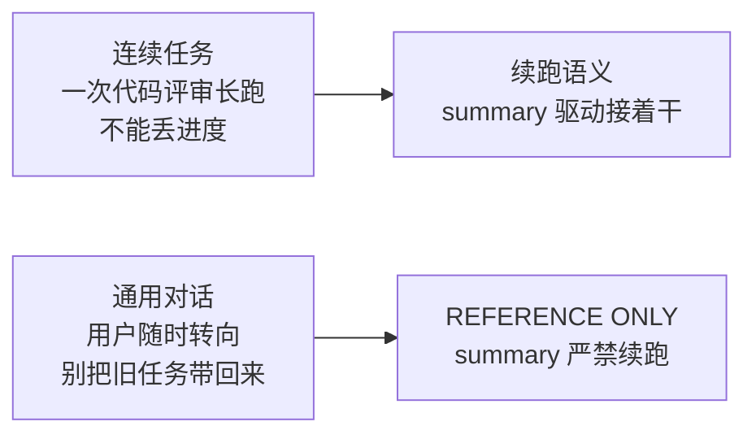

- 摘要该「续跑」还是「别续跑」，**取决于 agent 的『失忆后使命』**
- 评审 Agent 失忆后必须想起「接着评到哪」→ 续跑
- 通用 Agent 失忆后必须忘掉「旧任务」、只认新消息 → 防僵尸
- Hermes 的「防僵尸」不是拍脑袋——它经历三代演进（resume exactly → carveout → 强 REFERENCE ONLY + tools remain active），每代都是被生产 bug 逼出来的

## 根因③：模型感知哲学（承接 ocr 那篇的末尾问题）

| | ocr | Hermes |
|---|---|---|
| 姿态 | **固定预算省维护**、永不超窗 | **按模型精确适配**、利用足窗口 |
| 对应那篇结论 | 工程优先、保守 | 动态优先、精细 |

这一条甚至和「是否硬编码模型元信息」的工程哲学同源——ocr 连上下文大小都不信任，统一给个保守值；Hermes 则把模型 window 当作一等公民来精细调。

---

# 一句话总结

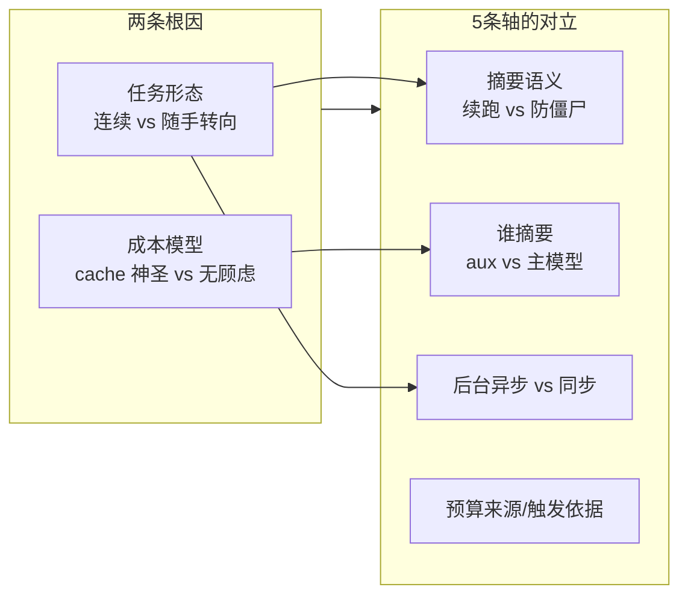

**OCR 和 Hermes 用完全不同的一组答案，解决了同一个问题。** 分叉的全部秘密就藏在两条根因里：**任务形态**决定摘要语义和触发时机，**prompt cache 成本模型**决定谁来摘要和敢不敢异步。看穿这两条，任何 agent 框架的上下文管理策略都能一眼读出它的「出身」。

> 本文为源码阅读笔记，观点基于本地源码逐行核对，可能与线上版本有细微出入。
