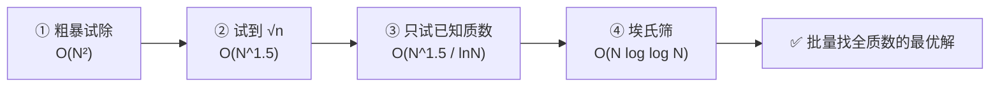

## 问题

> 输出 1~100 中相差为 2 的质数对。

相差为 2 的质数对叫**孪生质数对**，答案是 8 对：

```
(3,5) (5,7) (11,13) (17,19) (29,31) (41,43) (59,61) (71,73)
```

题目不难，但一句追问就暴露深度：**到一万呢？一百万呢？** 今天就顺着这道题，把「判断/筛选质数」的优化路径完整走一遍。

## 四级跳跃总览



判断质数只有一个核心问题：**n 有没有非平凡因子（不是 1 和它自己）**。所有优化的差异，全在**把因子搜索范围缩到多小**。

## ① 最粗暴的试除

```python
def is_prime_naive(n):
    if n < 2:
        return False
    for d in range(2, n):      # 2 到 n-1 全试
        if n % d == 0:
            return False
    return True
```

- 判断一个 n：从 2 试到 n-1，**O(n)**
- 找 N 以内全部质数：**O(N²)**
- 每个数都要试到自己，重复劳动严重

## ② 关键剪枝：只需试到 √n

**为什么到 √n 就够？因为因子成对出现。**

> 若 n = a × b（a ≤ b），则必有 a ≤ √n。  
> 反证：若 a > √n 且 b ≥ a，则 a×b > √n × √n = n，矛盾。

**数值实例：**

| n | √n | 需要试的 | 结果 |
|---|---|---|---|
| 97 | ≈9.8 | 2,3,5,7 | 除不尽 → ✅ 质数（不用试到 96！） |
| 91 | ≈9.5 | 试到 7 | 7 \| 91 → ❌ 合数（91=7×13） |

```python
def is_prime_opt(n):
    if n < 2:
        return False
    if n % 2 == 0:          # 偶数只有 2 是质数
        return n == 2
    d = 3
    while d * d <= n:       # 关键：只到 √n
        if n % d == 0:
            return False
        d += 2              # 关键：跳过偶数
    return True
```

- 判断单个 n：从 O(n) 降到 **O(√n)**，这是**量级**提升，不是常数
- 找 N 以内全部质数：**O(N^1.5)**

## ③ 再剪枝：只试「已知质数」

粗暴/上一版在试 d 时，**连合数也拿来除**——纯浪费。

> 用 4 试 n？可 4=2×2：**如果 2 除不尽 n，4 一定除不尽 n**；如果 2 除得尽，d=2 那步早 return 了，轮不到 4。所以 4、6、8、9 这些合数除数全是废操作。

**数值实例**：判断 `n=97`（√97≈9.8）

- 全数试：试 93 个（2~96）
- 只试质数：试 `2,3,5,7` **仅 4 个** ✅ 省掉 89 次无用取余

```python
def sieve_by_primes(N):
    primes = []
    for n in range(2, N + 1):
        is_prime = True
        for p in primes:
            if p * p > n:        # 超过 √n 不再试
                break
            if n % p == 0:
                is_prime = False
                break
        if is_prime:
            primes.append(n)
    return primes
```

- 复杂度 **O(N^1.5 / lnN)** —— 比上一版多除了个 `lnN`（质数密度 ≈ 1/ln n）
- ⚠️ 诚实说明：**量级还是 N^1.5**，只是常数更小。它是通往筛法的「中间站」，但在批量找全场景还不是终点。

## ④ 埃氏筛：思维反转，批量最优

前三版都是「**点查**」：每个 n 都问一次「你是不是质数」。埃氏筛反过来「**划倍数**」：

> 从 2 开始，把每个质数的所有倍数**划掉**。**没被划过的自动就是质数**，不用逐个数问。

**用手推 N=30：**

| p | 动作 | 划掉的倍数（从 p² 开始） |
|---|---|---|
| 2 ✅ | 划 2 的倍数 | 4 6 8 10 12 14 16 18 20 22 24 26 28 30 |
| 3 ✅ | 划 3 的倍数 | 9 12 15 18 21 24 27 30 |
| 4 ❌ | 已被 2 划 | 跳过 |
| 5 ✅ | 划 5 的倍数 | 25 30 |
| 6 ❌ | 已被划 | 跳过 |
| 7 | 7²=49>30 | **停** |

剩下没被划的：`2 3 5 7 11 13 17 19 23 29` ← 正好是 30 以内全部质数 ✅

**两个「为什么」：**

| 问题 | 答案 | 数值 |
|---|---|---|
| 为什么只划到 √N 停？ | 任何合数的最小质因子 ≤ √N，找出 ≤√N 的质数去划就覆盖了所有合数 | 30=2×15，最小因子 2≤√30 |
| 为什么从 p² 划，非 2p？ | `2p,3p,...,(p-1)p` 的最小质因子 < p，早被更小的质数划过了 | 3×7=21 被 3 划，5×7=35 被 5 划，所以 7 从 7²=49 开始 |

```python
from math import isqrt

def sieve(N):
    is_p = [True] * (N + 1)
    is_p[0] = is_p[1] = False
    for p in range(2, isqrt(N) + 1):      # 只推到 √N
        if is_p[p]:                       # p 没被划 → 质数
            for m in range(p * p, N + 1, p):  # 从 p² 划它的倍数
                is_p[m] = False
    return [i for i in range(2, N + 1) if is_p[i]]
```

- 每个合数 m 被自己的**最小质因子划一次**，总操作 ≈ N log log N
- **折回原题**：埃氏筛筛出质数后，扫一遍相邻项、差 2 的就是孪生对。1 万以内质数 **1229 个**，孪生对 **205 对**。

## 实测耗时对比（真实运行）

| N | 粗暴试除 | 只试已知质数 | 埃氏筛 |
|---|---|---|---|
| 1 万 | 0.320s | 0.0033s | 0.0009s |
| 10 万 | ⚠️ 不可行 | 0.054s | 0.011s |
| 100 万 | ⚠️ 不可行 | 1.01s | **0.16s** |

> O(N²) 的粗暴法到 10 万级几乎跑不完（约分钟级），只放 1 万。三种方法结果一致（1 万以内都是 1229 个质数）✅

## 总结

| 场景 | 方案 | 复杂度 |
|---|---|---|
| 批量找 1~N 全部质数 | **埃氏筛** | O(N log log N) |
| 判断单个不太大的数 | 试除到 √n | O(√n) |
| 教学/找因子 | 试除法 | — |

**一句话记住**：批量找全质数用筛法（划倍数）；试除法是解题起点，而所有优化本质是同一件事——**缩小因子搜索空间**（试到 √n、只试质数），到最后干脆不试了，改成**划倍数**。

（Miller-Rabin 这类检测器是另一条线，用来判断超大单个数字，本篇不展开。）