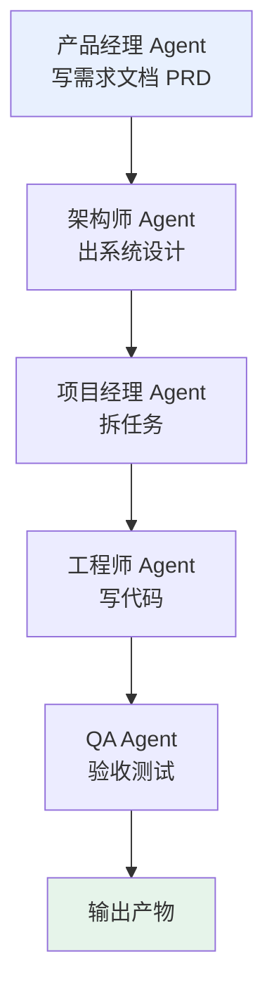
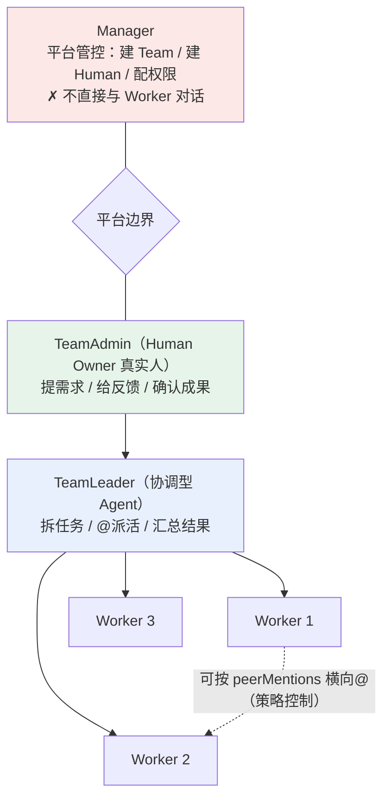
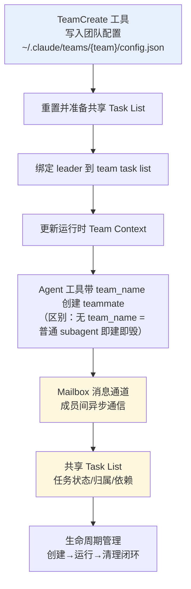

> **主引用**：《从 ReAct 到 Agent Teams：一个工程师视角的 Agent 协作机制思考》（蒋泽林，阿里云云原生，2026-09-06）[微信]
> **跨厂佐证**：《Claude Code Agent Teams：多 Agent 协作的生命周期与实现机制》（CandyTong，腾讯云开发者社区，2026-05-20）[腾讯-Claude]；《工单闭环从半天到 6 分钟：我们把 AI Agent 编进了组织架构》（承吉，阿里云开发者社区，2026-06-18）[阿里云]；《Agent 设计模式全景图——从 ReAct 到 Multi-Agent 的完整知识体系》（烟雨平生，腾讯云开发者社区）[腾讯-模式]；AgentTeams 官方仓库 [GitHub]

## 缘起：为什么会有这篇文章

最近读了一篇微信长文，讲 Agent 团队（Agent Teams）：作者做了两个月 Agent 开发后，把"多 Agent 该怎么像一个真团队一样协作"从学术论文到工业实现盘了一遍 [微信]。读完后跟人聊了一轮，有一个判断被反复确认：**多 Agent 协作的现有形式远不止一种，选错了形式，Agent 之间通信得再勤也没用。**

写这篇的目的，就是把当前能查到的、可落地的 Agent 联合形式整理成一份手册：每种形式是什么、怎么用、利弊、代表实现、什么时候选它。所有说法都标了来源——[微信] 指上面那篇主引用的微信文章，[腾讯-Claude]、[阿里云]、[腾讯-模式] 指跨厂佐证，[整理] 指本文在整理讨论时补充的推理，不冒充原文。

## 一句话记忆版

> **多 Agent 协作形式由"信息依赖的拓扑"决定：树状依赖用主从编排，链式依赖用流水线，层级依赖用分层管理，网状循环依赖用平级团队，自由连接用群聊社会。堆 Agent 数量不产生价值，价值来自协作机制本身。**

## 地基：为什么单个 Agent 能干活（30 秒版）

要理解多 Agent，先知道单 Agent 的底座 [微信]：

- **ReAct 循环**：`Thought → Action → Observation`，思考下一步、执行动作、观察环境返回、再思考。人完成任务也是这个模式：推理、行动、根据结果调整。
- **Observation 是反馈锚点**：API 返回、命令输出、文件内容把推理锚定在事实上，抑制幻觉和错误累积——这是 ReAct 相比纯 Chain-of-Thought 的核心优势。
- **上下文即记忆**：大模型本身无状态，参数跑完一字节不变；Agent 不会自动变强，它只在"你为它建了外部记忆的那部分"变强。RAG、记忆压缩、Skill 注入都是替模型做这件事：把经验存起来、需要时塞回 context。[微信]
- **工程团队的着力点是"行动 + 观察"**：模型思考能力由基座决定（算法团队的事）；工具质量和反馈结构化程度才是工程团队能发力的地方。"详细错误描述 + 修复建议 >> 错误码"。[微信]

## 核心：五种组织形式——从信息依赖拓扑看

组织形式不该按"哪个框架有个什么功能"来记，而该按**信息依赖长什么样**来分。依赖决定通信，通信决定架构 [整理]：

| 依赖形态 | 组织形式 | 代表实现 | 典型场景 |
|---|---|---|---|
| 树状单向（子任务互相独立） | **主从编排** | LangGraph Supervisor、Claude Code subagent、各类 delegate | 并行抓数、批量处理、独立子任务 |
| 线性链式（上一步的输出是下一步输入） | **流水线** | MetaGPT、CrewAI Process | 需求→设计→编码→测试 |
| 层级递归（上层编排、下层执行、跨层隔离） | **分层管理** | AgentTeams (Manager→TeamLeader→Workers) | 企业级多 Agent 平台、人机协同 |
| 网状循环（互为输入输出、需要迭代反馈） | **平级团队** | Claude Code Agent Teams、A2A 协议 | 写代码↔review↔改需求 |
| 自由连接（中心广播 + 成员互选） | **群聊/社会** | AutoGen GroupChat、CrewAI Crew、Blackboard | 头脑风暴、多角色讨论、动态分工 |

下面逐个展开。每种给"定义 / 怎么用 / 利 / 弊 / 代表实现 / 何时选"。

---

### 形式一：主从编排（Orchestrator-Worker）

**定义**：一个总 Agent（Orchestrator / Supervisor / Leader）做规划，把任务拆成子任务派给多个 sub-agent；sub-agent 之间互相隔离，只跟主 Agent 汇报结果。

**怎么用**：主 Agent 负责理解目标、拆分、派活、验收汇总；子 Agent 各自拿到"完整可孤立定义"的任务，做完把结果交回。子 Agent 之间不需要通信——因为它们的信息依赖是树状的：A 的活不依赖 B 的活 [整理]。

**利**：
- 简单可靠：通信面小，上下文省——子 Agent 只带任务 + 工具，context 干净 [整理]
- 每个子任务可独立重试、独立验收
- 主 Agent 全局视角，容易兜底

**弊**：
- **隐藏假设**：任务必须能被孤立地定义清楚。子 Agent 执行中一旦发现"需要上游信息"，它没法问，只能猜（幻觉）或失败返回 [整理]
- 反馈延迟：主 Agent 到最后才知道结果，中途的偏差要等汇总才暴露 [微信]
- Leader 是黑盒切分器时，容易"只管拆、不管方向"——作者称之为"任务分发器"，不是真正的 Leader [微信]

**代表实现**：LangGraph 的 Supervisor 风格编排（中心节点调度工作节点；LangGraph 本身是"构建自定义多 Agent 系统的底层基础设施" [腾讯-模式]）；Claude Code 的普通 subagent（`Agent` 工具，任务结束即销毁）[腾讯-Claude]；几乎所有 Agent CLI/框架的"委派子任务"能力（包括我用的 delegate_task 模式）[整理]。

**何时选**：子任务之间确实没有信息交集、或交集是单向线性的场景。**这是默认就该先用的形式**——"不要为了 Team 而 Team"，没有协作需求时用协作就是浪费 [整理]（作者同样提醒：没有协作机制的多 Agent 往往不如单 Agent [微信]）。

---

### 形式二：流水线（Pipeline / SOP）——深挖：MetaGPT

**定义**：按人类团队的标准作业流程（SOP）把多个 Agent 串成固定顺序的角色链，上游 Agent 产出结构化文档，交给下游 Agent 继续加工。**上一步的输出 = 下一步的输入，链式依赖。**

**怎么用（以 MetaGPT 为例）**：MetaGPT 把软件公司的分工直接编码进系统 [微信][腾讯-模式]：



关键设计：Agent 之间传递的是**结构化文档**（PRD、设计文档、任务单），不是自由聊天。作者认为这条的洞察朴素但关键——在容易层层跑偏的多 Agent 场景里，**用标准化流程约束交互，比让 Agent 自由对话更能抑制错误传播** [微信]。

**利**：
- 稳定、可预期：每个环节有明确输入输出，错误传播被文档边界截断 [微信]
- 容易理解、容易审计：看文档流转就知道进度
- 每个角色可以单独优化、换模型

**弊**：
- **写死、不灵活**：SOP 手工设计，角色之间单向传文档，缺少回头协商、动态调整的空间 [微信]
- 遇到"中间方案要改"会很痛苦——回头协商的成本高
- 角色之间能力不匹配时，瓶颈明显（比如架构师设计错了，后面全白干）

**补充的折中**：Agent-Oriented Planning（ICLR 2025）不预设固定 SOP，而是让一个 Meta-Agent 当"系统大脑"，按可解性、完备性、无冗余三条原则**动态拆解**任务，再用一个 Reward Model 给分配质量打分、不合格触发重规划；关键是把"初始分解"当成可以推翻重来的中间结果，而不是一锤定音的终稿 [微信]。合起来看：**既要流程约束保证不跑偏（MetaGPT），又要动态纠偏保证分得准（Agent-Oriented Planning）** [微信]。

**何时选**：任务本身有天然的阶段划分、每个阶段产物相对稳定（软件研发、内容生产、合规流程）。想要确定性 > 灵活性的时候 [整理]。

---

### 形式三：分层管理（Hierarchical）——深挖：AgentTeams

**定义**：把"平台管控"和"业务协作"显式分层，用 Kubernetes 风格的声明式 CRD 定义组织：Manager 管平台，TeamLeader 带 Workers，Human 是真实用户。**层级递归，跨层隔离。**

**怎么用（以阿里 AgentTeams / HiClaw 为例）**：AgentTeams 把自己定位成"协作编排治理平面"，不替代 Agent 运行时，专注让多个 Agent 像一个组织一样运转 [阿里云][GitHub]：



几个设计要点（都来自官方介绍 [阿里云][GitHub]）：
- **四类 CRD**：`Manager`（平台管控者）、`Team`（一个 TeamAdmin + 一个 TeamLeader + 若干 Worker）、`Worker`（最小执行单元：容器 + Matrix 账号 + 存储 + 网关令牌）、`Human`（真实用户，三层权限 L1/L2/L3）。
- **Manager 不是老板**：它管平台不管业务；真正"老板"是 Team 里的 TeamAdmin（真人），业务链路收敛为 `TeamAdmin → TeamLeader → Workers`。
- **凭证收敛**：Worker 只拿可吊销的消费令牌，真正的 LLM/MCP Key 由 Higress AI Gateway 统一托管——"Worker 即使被攻击，攻击者也拿不到真实凭证" [GitHub]。
- **通信底座是 Matrix**：Agent 和人共用同一套 IM 协议，人类可以用 Element Web 等客户端随时旁听、介入；通信"可见、可干预、无隐藏调用" [GitHub]。
- **多运行时共存**：OpenClaw / QwenPaw / Hermes 可以在同一个 Matrix Room 里协作，同一个 Team 里异构运行时没问题 [GitHub]。

**利**：
- 工程完成度最高的多 Agent 平台形态之一：凭据安全、通信基础设施、共享存储、可观测性、人在环、多运行时兼容都解决了 [微信]
- 组织边界清晰：谁能 @ 谁、谁能调哪个 LLM、谁能用哪个 MCP，都是**策略**不是约定 [阿里云]
- K8s 用户上手快：声明式 CRD + controller reconcile，和写 Deployment 一个心智模型 [阿里云]

**弊**：
- **有通信通道，没有协作语义**：作者一针见血——它本质还是"把每个 Agent 拉进同一个群"；没有方案共同讨论、没有 OKR 协商、没有分歧仲裁、没有集体复盘、没有基于历史的团队演化 [微信]
- 结构偏重：需要一个控制面集群 + 多个组件，小团队用不上 [整理]
- Manager-Workers 是"下一个要突破的现状"，不是终点 [微信]

**何时选**：企业要跑"多 Agent 像一个部门一样运转"、需要权限治理/审计/人在环的场景；或者你本来就在 K8s 上构建平台、想把 Agent 也纳入同一套声明式治理 [整理]。

---

### 形式四：平级团队（Team / Flat / P2P）——深挖：Claude Code Agent Teams

**定义**：多个 Agent 作为**长期存在的平级成员**（teammate），共享任务状态，通过消息通道异步通信，有一个 leader 但成员之间可以直接对话。**网状循环依赖，互相通信。**

**怎么用（以 Claude Code Agent Teams 为例）**：这套机制不是"同时启动几个模型"，而是贯穿多 Agent 协作完整生命周期的机制 [腾讯-Claude]：



- **teammate vs 普通 subagent**：teammate 在同一个进程内**长期运行**、独立上下文隔离；subagent 任务结束立即销毁。前者让多个 Agent 能"像团队一样持续协作" [腾讯-Claude]。
- **核心组件**：Team（协作边界/成员归属）、Teammate（长期成员）、Task List（共享任务表：状态、归属、依赖）、Mailbox（成员间异步消息通道）、生命周期管理 [腾讯-Claude]。
- **规则细节**：一个 leader 只能管理一个 team；teammate 不能创建团队；没有 team_name 时创建的是普通 subagent [腾讯-Claude]。

**利**：
- **成员可以横向说话**：这正是当前主流 Leader-Worker 架构最缺的——Worker 之间完全隔离、缺少 peer-to-peer 横向信息流 [微信]。Claude Code Agent Teams 用 Mailbox 把这条补上了。
- 异步、非阻塞：成员之间通过消息信箱协作，不强制同步等待 [腾讯-Claude]
- 生命周期完整：团队容器从创建到清理有明确闭环，不会到处漏进程 [腾讯-Claude]

**弊**：
- 同进程内长期运行,横向通信如果失控会指数级膨胀 context——作者提醒需要"通信预算"等约束 [微信]
- 依然是相对新的机制，生态和插件少 [整理]
- 消息语义仍是"能说话"，还没解决"该说什么、怎么达成共识、说完怎么沉淀" [微信]

**作者指出的通信模式参考**（这是平级团队最值得设计的部分 [微信]）：
- **主动广播**：有阶段性成果或共同风险，主动 push 给相关方
- **被动查询**：需要另一个 Worker 的中间结果或专业判断，pull 式请求
- **求助升级**：卡住先横向找同伴，同伴解决不了再向 Leader 升级（"先找同事再找领导"）
- 工程底座已成熟：A2A 协议、ANP 协议、Matrix 都提供 Agent-to-Agent 通信；缺的是上层设计——全连接会指数爆炸，需要"熟人网络"（历史合作过的优先触发通信）、"技能索引"（按能力域路由）、"通信预算" [微信]

**何时选**：任务中"你的输出是我的输入"且需要多轮迭代反馈（写代码 ↔ review ↔ 改需求）；需要成员间持续共享中间状态 [整理]。

---

### 形式五：群聊 / 社会（Society / Group Chat）

**定义**：多个 Agent 被放进一个共享空间（群聊或黑板），可以自由发言、互相响应，"谁参与哪件事"由对话动态决定，甚至可以有"社会议价"（一个 Agent 提出任务，其他 Agent 竞标或认领）。**自由连接，中心广播 + 成员互选。**

**怎么用**：
- 一种常见实现是**群聊式**：多个 Agent 在同一个共享对话里轮流发言、互相响应，由主持者（或终止条件）控制收敛——AutoGen 的 GroupChat 就属于这类（其中也能配 Planner 角色先分解再分配给 Worker [腾讯-模式]）；适合辩论、头脑风暴、多角色讨论 [整理]
- **CrewAI Crew**：以"角色 + 目标"组织成员，按顺序或层级流程协作（CrewAI 常被作为 Multi-Agent 模式的典型实现 [腾讯-模式]）；任务按流程动态分派 [整理]

**利**：
- 灵活、动态：不需要预先画死拓扑，适合任务边界模糊的场景
- 涌现能力：多个视角互相碰撞，能发现单一 Agent 想不到的方案 [整理]
- 实现门槛低：很多框架自带群聊模式

**弊**：
- **无界通信 = context 爆炸**：全连接自由发言在 Agent 数量增加时指数级膨胀 context [微信]
- 收敛难：没有明确主持人/仲裁时可能聊偏、聊死循环
- 结果质量不可控：谁最终负责"定稿"要额外设计 [整理]

**何时选**：任务本身是"讨论型"的（方案评审、头脑风暴、辩论）；或任务边界不清需要动态分工。**生产环境要慎重，给群聊加个主持人或黑板边界** [整理]。

---

### 补充形态：动态装配（Agent-Oriented Planning）

不属于固定拓扑，而是"装配方式"：一个 Meta-Agent 实时拆解、打分、重规划，把每次任务装成一张动态的工作流 [微信]。适用于任务形态多变、每次都不同的大规模场景。已在"流水线"一节展开，这里不重复。

## 两个证据：给"堆 Agent"泼冷水

无论选哪种形式，先记住这两条来自论文的实证（都引自微信文章 [微信]）：

1. **Meta-Team（arXiv 2605.29790）**：初始手工设计的多 Agent 系统，在 9 个测试里 **6 个反而不如单个 Agent**——没有好的协作机制，多 Agent 不是加法而是减法；而加上三层协作演化（Agent 层审视自身、交互层回顾协作史、团队层修订规则）后，平均比不演化的系统高出 6.6%。
2. **EvoChamber（arXiv 2605.11136）**：消融实验显示，去掉协作进化机制后，**20 个 Agent 的团队和 1 个 Agent 表现完全没差别**——多 Agent 的价值 100% 来自协作机制本身，堆 Agent 数量不产生任何价值。

> 每次想"多开几个 Agent 并行"之前，先问一句：**我给它配了协作机制吗？** 没有的话，那 19 个 Agent 只是白白烧 token。

## 从主从到协同：切换的判断依据

结合上面五种形式，给一个可操作的决策思路 [整理]：

```
问自己：任务里的"信息依赖"长什么样？
├─ 子任务之间无交集 / 单向线性 → 主从编排（默认，最简单）
├─ 有明显的阶段链，上一步产物 = 下一步输入 → 流水线（MetaGPT 式）
├─ 需要权限治理/人在环/企业级编排 → 分层管理（AgentTeams 式）
├─ 互为输入输出、需要多轮迭代反馈 → 平级团队（Claude Code Agent Teams 式）
└─ 讨论型 / 边界模糊 / 需要动态度量 → 群聊社会（AutoGen GroupChat 式）
```

再补两条成本提醒 [整理]：
- **主从模式最省 context**：子 Agent 只带任务 + 工具。切换到协同模式后，每个 Agent 都要容纳"他人的中间产出"，context 开销显著上升——所以协同不是无条件开横向通道，而是**按需开、限量开**（熟人网络、通信预算）。
- **"最后传结果"在主从成立、在协同不成立**：协同场景里反馈必须前置，否则错到最后才发现，返工成本全量 [整理]。

## 补充：真正的 Team 还差什么（给想更进一步的人）

如果你选了平级团队或分层管理，微信文章第 7 节给出了"真正的 Agent Team 机制"七件套 [微信]，整理成一份安装清单：

| # | 机制 | 一句话 | 解决什么 |
|---|---|---|---|
| 7.1 | 重构 Leader | Leadership 不是分发器，是资深专家+管理者，能兜底、能审查变更 | 全局视角缺失 |
| 7.2 | 启发式管理 | 鼓励式引导会激活模型正向对齐分布，命令式只逼出 60% 能力 | 激励失效 |
| 7.3 | 讨论→共识→执行 | 执行约束前置到规划期，三阶段协议（提案/反馈/共识） | 返工 |
| 7.4 | Worker 横向通信 | 广播 / 查询 / 求助升级三种模式 + 通信预算 | 信息孤岛 |
| 7.5 | 协商式 OKR | 量化验收标准 + 多 Agent 共同制定（执行者才知道 KR 可行性） | 进度失明 |
| 7.6 | JD + Mission | 岗位驱动能力 + 团队宗旨锚定取舍 | 无方向自洽 |
| 7.7 | 集体复盘 | 方法论/协作模式/反模式 → 团队知识库（个人经验 ≠ 团队资产） | 团队不成长 |

这套机制可以类比成一份"四层抽屉"的上下文管理模型（整理时补的视角）[整理]：工牌层（JD+Mission，装一次不换）→ 契约层（方案+OKR，每轮任务刷新）→ 工作台层（横向消息+指令，实时进出）→ 档案层（复盘资产，任务后归档下轮取）。**团队机制 = 决定每份上下文该进哪层抽屉、谁签发、何时换。**

## 参考来源

**正文标注说明**：`[微信]`= 主引用微信文章；`[腾讯-Claude]`/`[阿里云]`/`[腾讯-模式]`/`[GitHub]` = 跨厂佐证；`[整理]` = 本文整理时的推理补充，不冒充原文。

1. **[微信]** 《从 ReAct 到 Agent Teams：一个工程师视角的 Agent 协作机制思考》，蒋泽林，阿里云云原生，2026-09-06。原文：https://mp.weixin.qq.com/s/lWpo6q_VEPe_7cjtaGrhdA（本文引用全文转载版：https://www.aixq.cc/67862.html）
2. **[阿里云]** 《工单闭环从半天到 6 分钟：我们把 AI Agent 编进了组织架构》，承吉，阿里云开发者社区，2026-06-18。https://developer.aliyun.com/article/1742358
3. **[腾讯-Claude]** 《Claude Code Agent Teams：多 Agent 协作的生命周期与实现机制》，CandyTong，腾讯云开发者社区，2026-05-20。https://developer.cloud.tencent.com/article/2671463
4. **[腾讯-模式]** 《Agent 设计模式全景图——从 ReAct 到 Multi-Agent 的完整知识体系》，烟雨平生，腾讯云开发者社区。https://developer.cloud.tencent.com/article/2666482
5. **[GitHub]** AgentTeams（原 HiClaw）官方仓库：https://github.com/agentscope-ai/AgentTeams
6. 文内引用的学术论文（出处均在 [微信] 中）：
   - ReAct: Synergizing Reasoning and Acting in Language Models（Yao et al., 2022）
   - MetaGPT（ICLR 2024）
   - Agent-Oriented Planning in MAS（ICLR 2025, arXiv 2410.02189）
   - OKR-Agent（arXiv 2311.16542）
   - Experiential Co-Learning（ACL 2024）
   - Meta-Team / Evolve as a Team（arXiv 2605.29790）
   - EvoChamber（arXiv 2605.11136）
   - Multi-Agent Collaboration Mechanisms: A Survey of LLMs（arXiv 2501.06322）
   - A Communication-Centric Survey of LLM-Based MAS（arXiv 2502.14321）