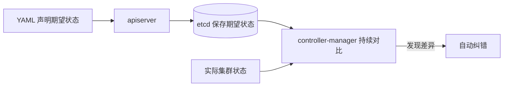
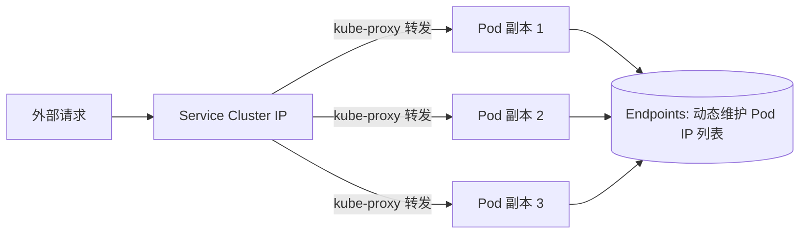

如果你准备系统学 Kubernetes，第一道坎往往不是命令，而是**第一章的概念名词表**。《Kubernetes权威指南（第4版）》第一章 1.4 节有 3 万多字，把 Pod、Label、Service、Deployment、StatefulSet 全部过了一遍——看起来每个词都认识，串起来却很难，因为它们不是孤立的名词，而是一套「分层控制」设计。

这篇文章是我读完第一章后按自己的理解重新组织的一份笔记，把 8 个核心概念用**一条主线**串起来。如果你也刚学 K8s，希望对你有用。

---

## 主线：一切从「声明式期望状态」开始

在记任何名词之前，先记住下面这句话——它是整个 Kubernetes 的设计原点：

> **Kubernetes 是一个高度自动化的资源控制系统：它跟踪对比 etcd 里保存的「期望状态」和当前环境中的「实际状态」，发现差异就自动纠错。**

你写 YAML 时，不是在写「怎么做」，而是在声明「我要什么」。剩下的（怎么达到、怎么维持）由控制器负责。

这也是为什么 K8s 被称为「声明式」而非「命令式」——你告诉它目的地，它自己开车。

---

## 概念 1：控制面四件套（Master 组件）

控制面是整个集群的大脑，由 4 个进程组成：

| 组件 | 职责 | 一句话理解 |
|------|------|-----------|
| **kube-apiserver** | 所有资源增删改查的**唯一入口**，HTTP REST 接口 | 前台柜台，所有人办事都从它这过 |
| **kube-controller-manager** | 所有资源对象的自动化控制中心 | 「大总管」，盯着差异、不停纠错 |
| **kube-scheduler** | 决定 Pod 调度到哪个 Node | 派活的人 |
| **etcd** | 保存集群全部状态（期望 + 实际） | 唯一真相库 |

注意：**kubelet 不在控制面里**。它跑在每个工作节点（Node）上，负责 Pod 对应容器的创建、启停——它是「执行的手」，不是「思考的大脑」。

> 高可用部署建议用 3 台控制面服务器（etcd 集群），这是生产集群的起步配置。

## 概念 2：Pod 与 Pause 根容器

Pod 是 Kubernetes 的**最小调度单位**。一个 Pod 里面可以有一个或多个业务容器，但它们不是独立的——每个 Pod 里都有一个特殊的「根容器」**Pause**：

- Pause 容器持有 Pod 的 **IP 和挂载的 Volume**
- 其他业务容器**共享** Pause 的网络栈和 Volume

好处很实际：同 Pod 的容器之间通过 localhost 就能通信，文件也能共享，无需额外的服务发现。

> 在 Kubernetes 里通常以千分之一的 CPU 配额为最小单位，用 **m** 表示（500m = 半个核）。

## 概念 3：Label / Selector —— 全系统的「解耦胶水」

这是第一章里最容易被低估、但实际最重要的机制。

- **Label**：给任意资源对象（Node、Pod、Service、RC…）贴上 key/value 标签
- **Label Selector**：按标签**查询和筛选**资源对象
- 支持 `matchLabels`（精确匹配）和 `matchExpressions`（表达式匹配），同时设置时是 **AND** 关系

为什么说它是胶水？因为 **Deployment 靠它找到自己的 Pod，Service 也靠它找到后端 Pod**——它们之间没有任何硬编码的从属关系，全靠标签选择器松耦合对接。这也意味着你给 Pod 打的 Label 和 Selector 必须对得上，否则「找不到后端」是排查 Service 故障的第一站。

## 概念 4：Deployment —— 无状态服务的标配

如果把 Pod 比作「进程」，Deployment 就是「进程管理器」。它管着一组**同模板**的 Pod 副本：

- 内部用 **ReplicaSet** 维护副本数量（挂了的自动重启，这就是可用性）
- 支持**滚动升级**（Rolling Update）：分批替换，服务不中断
- 相比前辈 RC（ReplicationController），最大的升级是**随时能看到部署进度**

> 一个常见的混淆点：Deployment 并不「控制」configmap、secret、Volume 这些本事——它们都是**独立的资源对象**，在 Pod 模板里被引用。Deployment 的核心职责只有一条：**管副本、管升级**。

配合 **HPA（Horizontal Pod Autoscaling）**，K8s 还能根据负载自动增减副本：以 Pod 的 CPU 利用率（当前使用量 ÷ Pod Request 值）为指标，通常取 1 分钟内的平均值，负载高了加副本、低了减副本。

## 概念 5：Service + kube-proxy —— 不变的入口

Pod 是会死的，IP 是会变的。那外部怎么稳定地访问一组 Pod？答案是 **Service**。

关键角色有三个：

1. **Cluster IP**：Service 创建时被分配的唯一虚拟 IP，整个生命周期内不变
2. **Endpoints**：Service 通过 Label Selector 选中的后端 Pod IP 列表，Pod 变化时**动态刷新**
3. **kube-proxy**：跑在每个 Node 上的智能软件负载均衡器，把发往 Cluster IP 的请求转发到某个后端 Pod，并做负载均衡与会话保持

### 为什么 Cluster IP 能一直不变？

这是第一章最值得想清楚的一个「为什么」：

**Cluster IP 不是真实的 IP，它是虚拟 IP（VIP）**——它不挂在任何网卡上，只是 etcd 里的一条数据 + kube-proxy 规则里的一条匹配条件。真正的流量路径是：请求到达 Cluster IP → kube-proxy 的规则把它 DNAT 转发给 Endpoints 列表里的某个活着的 Pod。

- Pod IP 属于「实际资源」：Pod 死了 IP 就消失，重建换新 IP
- Cluster IP 属于「逻辑资源」：它属于 Service 这个对象，Pod 死活与它无关

所以「不变」不是运气，是设计：**入口永远稳定，底下的 Pod 随便换**。

### 从集群外访问

- **NodePort**：在每个 Node 上为 Service 开一个 TCP 监听端口，外部用 `任意 Node IP + NodePort 端口` 访问
- **LoadBalancer**：云上（如 GCE）把 Service 的 type 改成 LoadBalancer，云厂商自动创建负载均衡器——本质是在 NodePort 外面再套一层云的 LB

## 概念 6：StatefulSet —— 有状态服务的三件套

无状态服务（Deployment）的问题很好解：挂了重启，反正没有「记忆」。但数据库、消息队列这类**有状态服务**不行——节点需要稳定的身份、顺序的启停、不丢的数据。这就是 **StatefulSet**。

第一章告诉你它的三个特征，合起来才叫「有状态」：

| 特征 | 解决的问题 | 依赖 |
|------|-----------|------|
| 每个 Pod 有**稳定且唯一的网络标识** | 集群内成员能点名找到彼此（如主库找从库） | **Headless Service** |
| **受控启停顺序**：操作第 n 个 Pod 时，前 n-1 个已就绪 | 数据库能按预案顺序启动/下线 | 控制器保证 |
| 数据用**持久化存储卷**，删 Pod 不删数据 | 数据不能跟着 Pod 死 | **PV / PVC** |

### 为什么必须配 Headless Service？

普通 Service 的 DNS 解析只返回一个 **Cluster IP**（像个总机），客户端打进去由 kube-proxy 随机分配后端。

**Headless Service 没有 Cluster IP**——DNS 解析直接返回该 Service 对应的**全部 Pod IP 列表（Endpoint）**，客户端直连。每个 Pod 还会有自己的专属域名（`pod-0.svc.ns`），直接解析到自己的 IP。

数据库集群需要的是**指名道姓**地访问每个节点，而不是打总机。所以 StatefulSet 必须声明它属于哪个 Headless Service。

### 为什么必须配 PV？

**Pod 是可丢弃的，数据不是。** 如果数据存在 Pod 里，Pod 一死数据就没了。PV（PersistentVolume）是**独立于 Pod 之外定义的网络存储**，Pod 重建后把 PV 挂回去，数据原封不动。

> 删除 Pod 时默认不会删除与 StatefulSet 相关的存储卷——这是为了保证数据安全。

## 概念 7：存储体系 —— Volume → PV/PVC

存储概念是第一章最容易囫囵带过的部分，拆开是三层：

- **Volume**：Pod 中能被多个容器访问的**共享目录**——生命周期跟 Pod 走，Pod 没了它就没了
- **PV（PersistentVolume）**：集群中的一块**网络存储**，独立于任何 Node 和 Pod 定义，所有 Node 都能访问——生命周期跟集群走
- **PVC（PersistentVolumeClaim）**：用户对 PV 的「申请单」，Pod 通过 PVC 消费 PV，两者解耦

一句话：**Volume 是「Pod 内部的临时共享盘」，PV 是「集群级的持久化存储」**。

## 概念 8：收尾的三个小概念

- **Job**：批处理任务。它控制的 Pod 副本是**短暂运行**的，每个容器只运行一次就跑完结束（像一组签名的 Docker 容器），适合一次性计算/迁移任务
- **Namespace**：资源隔离，常用于实现**多租户**的隔离
- **Annotation（注解）**：与 Label 类似也是 key/value，但**有本质区别**——Label 有严格命名规则、用于 Selector 筛选；Annotation 不受规则约束、存的是元数据，**不能用于筛选**

> Label 是「用来找对象的标签」，Annotation 是「贴在对象上的便签」。

---

## 一句话记忆版

- **K8s = 期望状态 vs 实际状态，差在哪就修哪**
- **控制面 4 件套**：apiserver（入口）/ controller-manager（大总管）/ scheduler（派活）/ etcd（真相库）；kubelet 在 Node 上干活
- **Pod 是最小调度单位**，Pause 根容器持 IP 和 Volume
- **Label/Selector 是全局胶水**，Service 和 Deployment 都靠它找 Pod
- **Deployment 管无状态**：副本 + 滚动升级 + 进度可见；HPA 按 CPU 使用量/Request 自动扩缩
- **Service 的 Cluster IP 是虚拟 IP，所以不变**；真干活的是 kube-proxy + 动态刷新的 Endpoints
- **StatefulSet 三件套**：Headless（稳定身份）+ PV（数据不丢）+ 顺序启停
- **Volume 跟 Pod 走，PV 跟集群走**

学到这里，第一章的大局就立住了。后面各章（Pod 详解、Service 进阶、集群安装）都是在往这 8 个骨架上填肉。