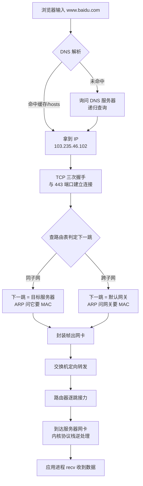
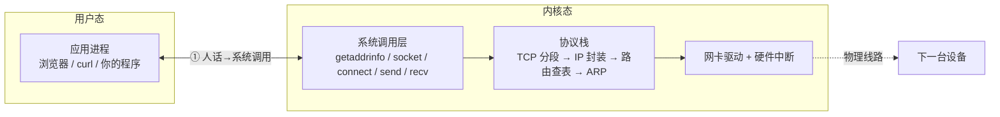
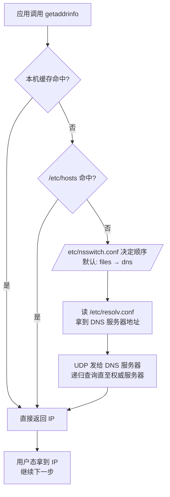
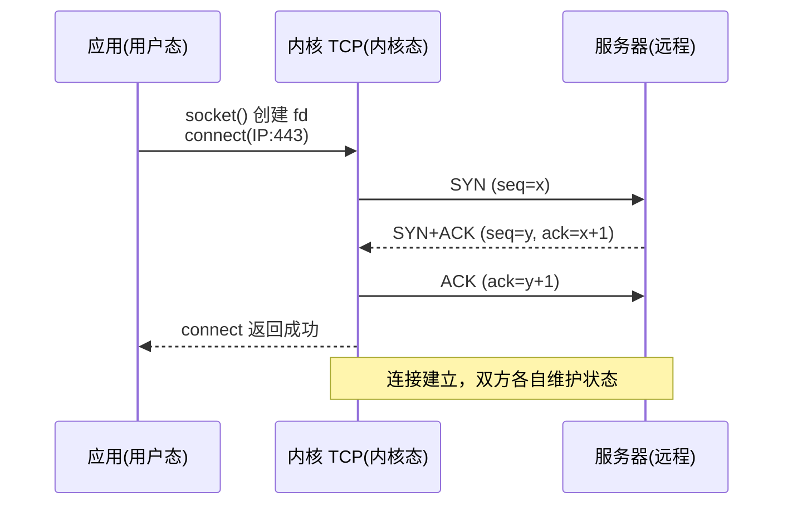
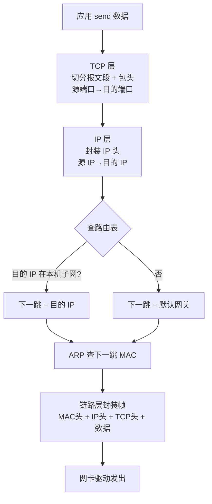
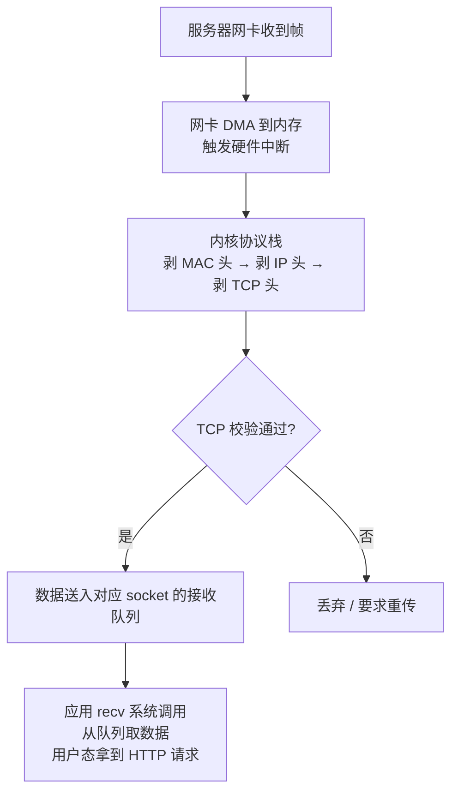
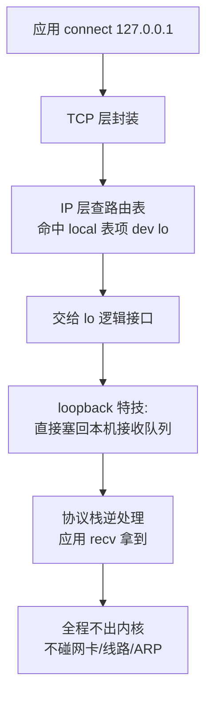

> 一句话：**在浏览器敲下网址后，你的数据要穿过「用户态 → 内核态 → 物理网络 → 对方内核态 → 对方用户态」五道门**。本文把每一道门拆开看。

## 全景：一条数据的完整旅程



| 阶段 | 走哪 | 主角 |
|---|---|---|
| ① 本机出发 | 用户态 ↔ 内核态 | 系统调用 + 协议栈 |
| ② 传输途中 | 物理网络 | 交换机 / 路由器 |
| ③ 到达服务器 | 内核态 → 用户态 | 网卡中断 + socket 队列 |

下面**重点拆①**，这是数据离你机器前经历的全部。

---

## 一、本机出发：用户态 ↔ 内核态 的三次穿越

### 地图：谁是用户态，谁是内核态



**本质**：你的程序跑在用户态，**碰不到网卡、看不到协议栈**——它想联网，必须通过系统调用把请求交给内核，内核干完活再把结果交还给你。数据在你这台机器上，**用户态→内核态→用户态 一共穿越三次**：

1. **getaddrinfo()**：问 DNS，「baidu.com 的 IP 是多少？」
2. **socket() + connect()**：建连接，「我要连这个 IP 的 443 端口」
3. **send() / recv()**：发数据、收数据

---

### 穿越 ①：DNS 解析 —— getaddrinfo()

你访问的是域名，网络只认 IP。查 IP 的顺序：



| 配置 | 作用 | 排障命令 |
|---|---|---|
| `/etc/hosts` | 手动指定 域名→IP，**优先级最高** | `cat /etc/hosts` |
| `/etc/nsswitch.conf` | 决定查询顺序（files 先还是 dns 先） | `grep ^hosts /etc/nsswitch.conf` |
| `/etc/resolv.conf` | 指定 DNS 服务器地址 | `cat /etc/resolv.conf` |
| — | 实际解析结果 | `getent hosts baidu.com` / `dig` |

> ⚠️ 你 ECS 上的 `/etc/resolv.conf` 指向 `127.0.0.53`——这是 systemd-resolved 的本地转发器，它再替你去上游递归。看到 `127.0.0.x` 别慌，是本地 DNS stub。

---

### 穿越 ②：建立连接 —— socket() + connect()

拿到 IP 后，程序创建 socket（内核返回一个文件描述符 fd），然后 connect()。**三次握手全程在内核完成**，应用只看到「连接成功/失败」：



关键点：**fd 是用户态唯一拿到的"会话凭证"**。之后 send/recv 都凭这个 fd 告诉内核「我要跟哪个连接说话」——这就是之前学的 TCP「端口」在编程层的体现。

---

### 穿越 ③：发送数据 —— send() → 协议栈

数据进入内核后，被**层层加工**：



这三层头部，就是之前学的四层模型：

```
┌────────────────────────────────────────────┐
│ 帧头: 源MAC → 下一跳MAC    ← 每跳换         │
│ IP头: 源IP → 目的IP        ← 全程不变       │
│ TCP头: 源端口 → 目的端口    ← 决定交给谁     │
│ 数据: HTTP 请求体          ← 业务内容       │
└────────────────────────────────────────────┘
```

**路由决策**是这步的核心，判定依据是 CIDR 最长前缀匹配：

| 目的 IP | 路由表匹配 | 下一跳 | ARP 问谁 | 帧的目的 MAC |
|---|---|---|---|---|
| 同子网（如 172.19.50.5） | 直连路由（无 via） | 目标自己 | 目标服务器 | 目标 MAC |
| 跨子网/公网 | 默认路由（via 网关） | 网关 | 网关 | 网关 MAC |

**排障命令**：`ip route get <IP>` 立刻告诉你「下一跳是谁」——这是定位「为什么连不上」的第一手信息。

---

## 二、传输途中：离开网卡之后

包从小网卡出去，接下来每一步都是「换 MAC、看 IP」的接力：


| 设备 | 层 | 干的事 |
|---|---|---|
| 交换机 | 二层 | 只认 MAC，端口间**定向分拣**（不干扰其他机器） |
| 路由器 | 三层 | 认 IP，查路由表决定**下一跳**，逐跳接力 |
| 集线器（已淘汰） | 二层共享 | 人人收到，共享带宽 |

**两个贯穿全程的铁律**：
- **IP 不变**：终点站，从你到服务器永远写的是 103.235.46.102
- **MAC 每跳换**：车票，每一段链路都要换成下一站的 MAC

---

## 三、到达服务器：逆过程

对方机器收到包后，**完全对称地逆处理**：



> 注意：服务器进程**不是**被中断唤醒后直接拿数据——内核把数据放上 socket 队列，应用**主动 recv 取走**。这就是「内核态 → 用户态」的第四次穿越（在对方机器上）。

---

## 四、特例：环回地址（不出物理网络）

如果目标是 `127.0.0.1`，旅程**大幅缩短**——内核内部直接折返：



用途与安全：
- 本地测试、本机进程间通信、协议栈自检
- **`bind 127.0.0.1` = 只本机能访问；`bind 0.0.0.0` = 所有接口可访问（暴露风险）**
- 实测：ping 127.0.0.1 ≈ 0.05ms，ping 公网 ≈ 0.9ms——差 20 倍就是「少了物理世界那一截」

---

## 附录：全链路配置与命令索引

排障时按需取用：

| 环节 | 配置文件 | 命令 |
|---|---|---|
| DNS | `/etc/hosts`、`/etc/nsswitch.conf`、`/etc/resolv.conf` | `getent hosts`、`dig`、`nslookup` |
| 连接 | `/proc/sys/net/ipv4/*`（如 tcp_syncookies） | `ss -lntp`（看绑定地址）、`strace -e trace=network` |
| 路由 | 内核路由表 | `ip route`、`ip route get <IP>` |
| ARP | 内核 ARP 表 | `ip neigh`、`arp -a` |
| 网卡 | netplan / NetworkManager | `ip addr`、`ethtool` |
| 抓包 | — | `tcpdump -i eth0`、`traceroute` |

---

## 一句话记忆版

> **IP 是终点站（全程不变），MAC 是车票（每跳作废）**；DNS 把网名翻成终点站，路由表决定下一站，ARP 把下一站翻成车票，交换机负责把车票送到对应车厢。
> 而这一切的起点和终点，都是**用户态应用叫一声系统调用、内核埋头干完活、再把结果交给应用**。