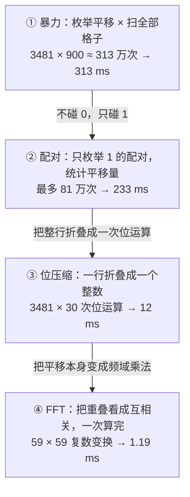

LeetCode 835「图像重叠」（[原题链接](https://leetcode.cn/problems/image-overlap/)）是道看着简单、动手就卡住的题。题面每个字都认识：两个 n×n 的 0/1 矩阵，把其中一个上下左右随便平移，问最多能重叠多少个 1。但真写起来就懵——矩阵怎么"平移"？越界的格子怎么算？别人那四层循环凭什么是对的？

我后来想明白，卡住的根源不在代码，在**视角**：脑子里一直在"搬矩阵"，而应该搬的是**坐标**。

这篇把这道题从暴力到 FFT 的四级解法完整串一遍，每一级都附上真实跑出来的耗时，方便你判断"哪一级值得学、哪一级只是开眼界"。

---

## 一句话本质

> **别搬矩阵，搬坐标**：平移 = 给所有 1 的坐标加同一个向量；重叠数 = 动点打靶的命中数。


把两张图看成两个点集，一切就清楚了：

```text
img1 的 1：A = {(0,0), (0,1), (1,1), (2,1)}     ← 会动的一组点
img2 的 1：B = {(1,1), (1,2), (2,2)}           ← 静止的靶子

平移 (dx, dy) 的数学含义：(i, j) → (i + dx, j + dy)
重叠数 = A 平移后，恰好落在 B 上的点的个数
```

上图里 img1 平移到 (下 1, 右 1) 后三个 1 全部压中，第 4 个 1 被推出边界清除 —— 这就是答案 3 的由来。

后面所有解法，都只是"怎么枚举"的差别。

---

## 阶梯总览



---

## ① 暴力：枚举平移量，逐格数

```python
def largestOverlap(img1, img2):
    n = len(img1)
    best = 0
    for dx in range(-(n - 1), n):        # 枚举所有可能的平移量
        for dy in range(-(n - 1), n):
            cnt = 0
            for i in range(n):           # 逐格检查有没有压中
                for j in range(n):
                    if img1[i][j]:
                        x, y = i + dx, j + dy
                        if 0 <= x < n and 0 <= y < n and img2[x][y]:
                            cnt += 1
            best = max(best, cnt)        # 取所有平移里的最大值
    return best
```

三个必须想清楚的细节：

| 细节 | 解释 |
|---|---|
| 平移量为什么只枚举 `[-(n-1), n-1]` | 超出这个范围，两个 n×n 方块一格都搭不上，重叠数恒为 0，永远不可能是答案 |
| 越界的 1 怎么办 | 题目规定被清除，所以落点 `(i+dx, j+dy)` 必须在界内才计数 |
| 为什么要取 max | 每个平移给出一个重叠数，答案是所有平移里的最大者 |

**实测：把范围乱扩会怎样？** 拿 n=30 的 50% 随机矩阵试：

| dx/dy 枚举范围 | 平移数 | 结果 | 耗时 |
|---|---|---|---|
| [-29, 29] | 3,481 | 235 | 239 ms |
| [-100, 100] | 40,401 | 235 | 2.3 s |
| [-1000, 1000] | 4,004,001 | 235 | 240 s |

**结果纹丝不动。** 多出来的平移全是无效平移（重叠数 0），只会烧时间。这就是搜索空间的第一课：枚举范围只需覆盖"可能出现非零答案"的部分。

那暴力慢在哪？不是慢了在枚举平移 —— 平移只有 3481 种，不多；慢在**每个平移都要回头扫 900 个格子**。真正该优化的是"扫描"这件事本身。

> **一句话总结**：暴力的问题是 O(平移数 × 格子数)，而格子里的 0 全都是白扫的。

---

## ② 配对：换一个枚举对象

与其问"平移 (dx,dy) 后重叠几个"，不如反着问：

> **img1 的某个 1 想压中 img2 的某个 1，它需要平移多少？**

关键观察：如果点 `a` 要压中点 `b`，那么平移量**被唯一确定**——就是 `b - a`。没有任何别的选择。

于是可以枚举所有"配对"，统计每个平移量被要求的次数：

```python
from collections import Counter

def largestOverlap(img1, img2):
    n = len(img1)
    A = [(i, j) for i in range(n) for j in range(n) if img1[i][j]]
    B = [(i, j) for i in range(n) for j in range(n) if img2[i][j]]
    cnt = Counter()
    for ax, ay in A:
        for bx, by in B:
            cnt[(bx - ax, by - ay)] += 1     # 想让 a 压中 b，平移量只能是 b - a
    return max(cnt.values()) if cnt else 0
```

用示例 1 走一遍，配对过程是这样的：

| img1 的点 | img2 的点 | 要求平移量 |
|---|---|---|
| (0,0) | (1,1) | (1,1) |
| (0,0) | (1,2) | (1,2) |
| (0,0) | (2,2) | (2,2) |
| (0,1) | (1,1) | (1,0) |
| (0,1) | (1,2) | (1,1) |
| (0,1) | (2,2) | (2,1) |
| (1,1) | (1,1) | (0,0) |
| (1,1) | (1,2) | (0,1) |
| (1,1) | (2,2) | (1,1) |
| (2,1) | (1,1) | (-1,0) |
| (2,1) | (1,2) | (-1,1) |
| (2,1) | (2,2) | (0,1) |

统计下来 `count[(1,1)] = 3`（三对配对的平移量撞在 (1,1) 上），正好就是答案 3 —— 也正好对应上图里那三个绿色重叠格。

**为什么 count 就等于重叠数？** 这里是精确相等，不是差不多：

- 暴力视角：平移 (1,1) 下"重叠了 3 格"，靠扫格子数出来
- 配对视角：有 3 对 (a, b) 要求平移量 (1,1)

每压中一格，就恰好对应一对 (a,b) 要求这个平移量；每一对 (a,b)，也恰好对应一格重叠。两边互相转换、不多不少，所以 `count[shift]` 就是该平移下的重叠数，取最大即答案。

顺带白赚一个性质：**配对解法不需要任何越界判断**。因为 a、b 的坐标都在 `[0, n-1]` 内，坐标差天然落在有效平移范围里，暴力里那堆"无效平移"根本不会出现。

> **一句话总结**：把枚举对象从"所有平移"换成"所有 1 的配对"，用哈希表把配对按平移量归类——搜索空间不降级，但每条记录的代价从一个循环降成一次减法。

---

## ③ 位压缩：一行折叠成一个整数

配对解法已经是"只碰 1"了，还能更快吗？能。回头看暴力的内层循环：**一行之间是互相独立的**，第 i 行的 1 只会和 img2 第 i+dx 行的 1 相撞。

而 `n ≤ 30`，意味着**一行最多 30 个格子，能完整塞进一个整数**。把第 j 列的比特位存进 bit j，那么：

| 操作 | 位运算表达 |
|---|---|
| 整行右移 dy 列 | `row << dy`（列号增大 = 位数增大） |
| 移出边界的部分被清除 | `& mask`，mask = `(1<<n) - 1` |
| 左移 dy 列 | `row >> (-dy)`，低位自然丢弃 |
| 数这一行压中几格 | `(row1 & row2).bit_count()` |

```python
def largestOverlap_bit(img1, img2):
    n = len(img1)
    mask = (1 << n) - 1
    # 每行压成 n 位整数：bit j 代表第 j 列
    rows1 = [sum(v << j for j, v in enumerate(row)) for row in img1]
    rows2 = [sum(v << j for j, v in enumerate(row)) for row in img2]

    best = 0
    for dx in range(-(n - 1), n):
        for dy in range(-(n - 1), n):
            cnt = 0
            for i in range(n):                 # 行之间独立，逐行累加
                x = i + dx
                if 0 <= x < n:                 # 行方向越界 → 整行被清除
                    row = rows1[i]
                    row = (row << dy) & mask if dy >= 0 else row >> (-dy)
                    cnt += (row & rows2[x]).bit_count()   # 按位与后数 1
            best = max(best, cnt)
    return best
```

三个坑：

| 坑 | 说明 |
|---|---|
| 移位方向 | 列号变大对应整数左移（bit j → 列 j），搞反就全错 |
| 高位必须抹掉 | 正方向移位要 `& mask`，否则移出去的 1 会留在高位上"幽灵重叠" |
| Python 版本 | `int.bit_count()` 需要 3.10+，更早版本用 `bin(x).count('1')` |

复杂度上，外层还是 (2n-1)² 种平移，但每种平移只需 n 次机器字级操作 —— 从 O(n⁴) 掉到了 **O(n³)**。

Python 实测比暴力快 **26 倍**（313 ms → 12 ms）：因为原本内层那 30 次 Python 循环，被压缩成了**一次 C 层整数运算 + popcount**。

> **一句话总结**：位压缩是"常数级降维"——不改变枚举对象，只是把一整行折叠成一次运算，量级从 O(n⁴) 掉到 O(n³)。

---

## ④ FFT：把平移变成频域乘法

再看一眼暴力的核心式子：

```text
overlap(dx, dy) = Σᵢ Σⱼ a[i][j] · b[i+dx][j+dy]
```

把所有平移算完，本质是在算"两幅图在每一个相对位移下的逐点乘积和"。这个形状在信号处理里有名字：**互相关（cross-correlation）**。

而相关定理告诉我们：**时域的相关 = 频域的共轭相乘**。所以不必逐个平移去数，一次 FFT 就能把所有平移的重叠数一次性算出来：

```python
import numpy as np

def largestOverlap_fft(img1, img2):
    n = len(img1)
    M = 2 * n - 1                                   # 补零到 2n-1，防环绕
    a = np.zeros((M, M)); b = np.zeros((M, M))
    a[:n, :n] = img1
    b[:n, :n] = img2
    C = np.fft.ifft2(np.fft.fft2(a) * np.conj(np.fft.fft2(b))).real
    # 有效平移量索引：负平移排在数组尾部，正平移排在头部
    idx = np.concatenate([np.arange(M - n + 1, M), np.arange(n)])
    return int(round(C[np.ix_(idx, idx)].max()))
```

三个坑，每个都能让结果悄悄出错：

| 坑 | 说明 |
|---|---|
| 必须补零到 ≥ 2n-1 | FFT 算的是循环卷积，画布不够大时"从左边移出去的 1 会从右边绕回来"，凭空多出重叠 |
| 负平移的索引映射 | 结果数组里下标 M-1 代表平移 -1、下标 0 代表平移 0，要拼两段索引才能取全 [-(n-1), n-1] |
| 浮点误差 | 结果理论上是整数，实际会有 1e-12 级抖动，取 max 前要 round |

复杂度 **O(n² log n)**。n=30 时不过是两次 59×59 的复数变换，**1.19 ms** 跑完，比暴力快 260 倍。

> **一句话总结**：FFT 是唯一的"量级级降维"——把"逐个平移枚举"变成"数学上一次性求出所有平移的结果"。

---

## 实测对比与选型

环境：Python 3.11 + numpy 2.4，n=30，三类矩阵各跑多轮取平均。

| 解法 | 枚举对象 | 时间复杂度 | 全 1（最坏） | 50% 随机 | 稀疏（仅 30 个 1） |
|---|---|---|---|---|---|
| 暴力扫格 | 平移 × 格子 | O(n⁴) | 313 ms | 238 ms | 116 ms |
| 配对哈希 | 1 的配对 | O(A·B) | 233 ms | 57 ms | 0.4 ms |
| 位压缩 | 平移 × 行 | O(n³) | 12 ms | 12 ms | 11 ms |
| FFT 互相关 | 全体平移一次算 | O(n² log n) | 1.19 ms | 1.13 ms | 1.12 ms |

四种实现两两对拍过 500 组随机小矩阵（n = 1..8），结果全部一致——性能对比是可信的。

注意表格里一个反直觉的点：**最坏情况（全 1）下配对哈希只比暴力快 4 倍**，因为此时 |A| = |B| = 900，配对数 81 万，和暴力的 313 万同一个量级。配对解法的威力在**稀疏**时才会爆发（0.4 ms），而真实的图像矩阵恰恰是稀疏的。

**怎么选？**

| 场景 | 推荐 | 理由 |
|---|---|---|
| 面试手写 | 配对哈希 | 十来行、思路漂亮、绝大多数输入够快 |
| 直接提交 LeetCode | 暴力或配对 | n ≤ 30，313 ms 完全够用，别过度设计 |
| 图大且稀疏 | 配对哈希 | 复杂度跟着 1 的个数走，几乎不受 n 影响 |
| 图大且稠密 | FFT | 唯一能在量级上取胜的解法 |
| 追求极致常数 | 位压缩 | 一行一个整数，n ≤ 64 时收益最大 |

---

## 一句话记住

> **平移 = 全体坐标加同一个向量；两个 1 想对上，平移量被唯一钉死为它们的坐标差；数每个平移被"要求"的次数，最多者即答案。**
>
> 暴力数格子，配对数配对，位压缩折叠整行，FFT 一次算全体。
