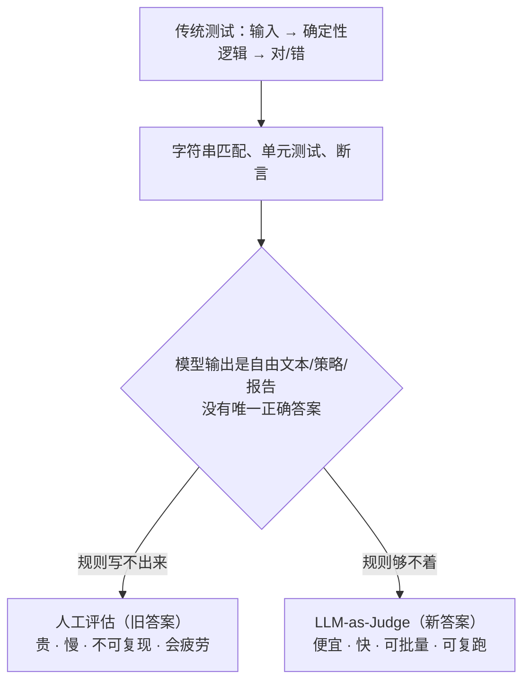
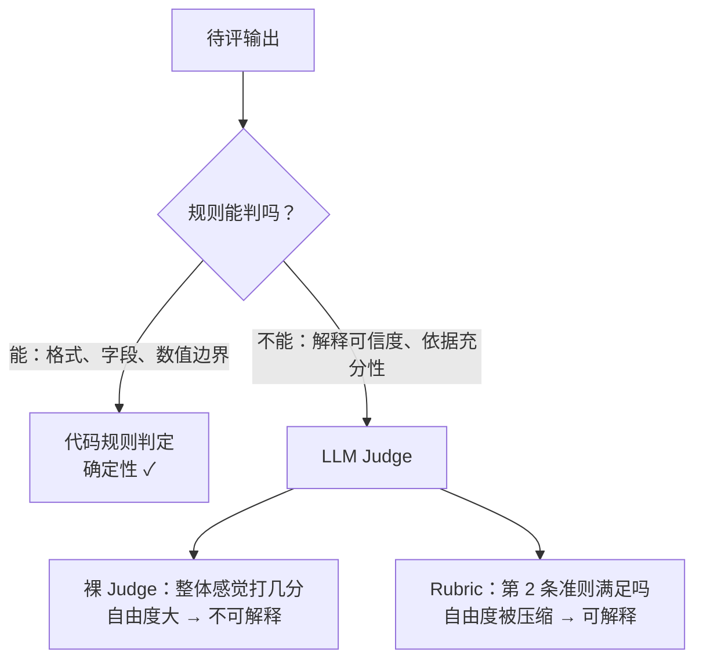
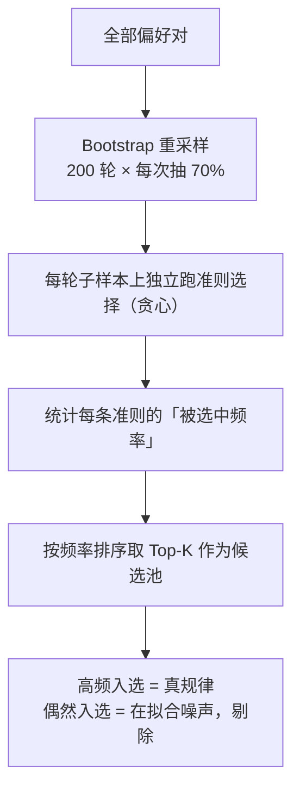
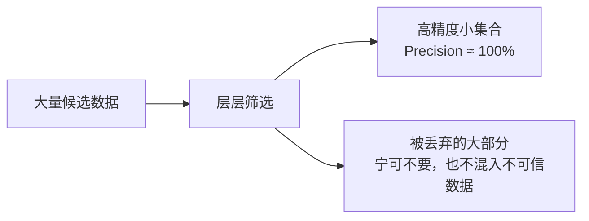
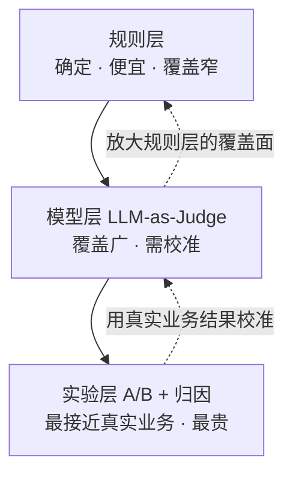
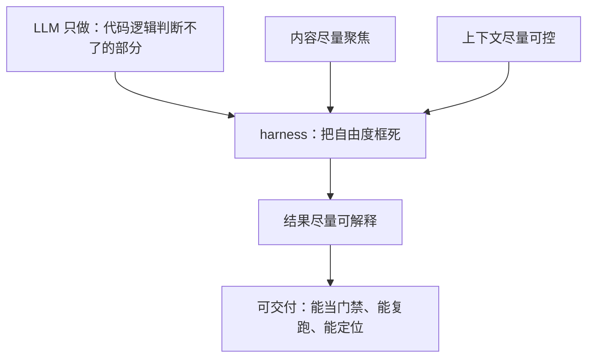

用 LLM 给 LLM 的输出打分，是现在最流行也最危险的评估方式：便宜、快、能批量，但**也可能一致地给出错误结论**。

这篇文章源于大淘宝技术的一次分享——《让Agent可评、可控、可迭代：业务效果导向的评测体系与场景实践》。他们评的不是聊天助手，而是**策略效果类 Agent**（输出补贴率、投放预算、素材优化方案这类直接动业务指标的决策）。这类 Agent 的评测难点把 LLM-as-Judge 的软肋暴露得特别清楚。

下面按「是什么 → 为什么会错 → 怎么修 → 怎么组织成体系」讲一遍。

---

## 一、LLM-as-Judge 是什么

**一句话：让一个大模型当裁判，给另一个模型的输出打分。**

它出现的原因很直接——传统测试手段在这里失灵了：



它有两种基本形态：

| 形态 | 做法 | 可靠性 |
|------|------|--------|
| 直接打分 | 「这个回答打几分？」 | 较差——绝对分数没有标尺 |
| 成对比较 | 「A 和 B 哪个更好？」 | 较好——比较比绝对打分容易 |

### 关键认知：它是「代理指标」

**LLM-as-Judge 测的是"看起来好不好"，不是"业务上有没有用"。**

这个 gap 是所有问题的总根源。策略类 Agent 尤其明显：


离线判断合理，线上效果仍可能失准——**「离线合理」≠「业务有效」**。所以 Judge 的打分必须被实验层校准，不能自己说了算。

---

## 二、裸 Judge 的三个系统性陷阱

「系统性」是关键词：不是偶发错误，而是会**稳定地骗你**。

### 陷阱 1：位置偏差（Position Bias）

同一对回答，**交换顺序**后重新评判：

```
评判 (A, B) ：A 更好
评判 (B, A) ：B 更好      ← 同一个模型，同一对内容
```

大淘宝团队实测：一致性从 **96% 掉到 50%**——一半的样本，结论能被"谁排在前面"决定。

根因是模型对"先看到的"有偏好（类似人类的首因效应）。**成对比较这种题型本身就给了位置发挥作用的空间。**

### 陷阱 2：选择过拟合（Selection Overfitting）

从一堆候选准则里挑出一套评分规则，在当前样本上表现很好，换一批数据就崩。

根因：在有限样本上反复"挑"，等于**反复看同一批数据做决策，噪声被当成了信号**。样本越小越严重。

### 陷阱 3：一致性 ≠ 正确性

三个模型打分高度一致——但它们可能**一致地错**（都偏爱长回答、都被漂亮格式骗过、都漏掉事实错误）。

根因：Judge 的偏好与人类/业务判断不一致；同源模型还会有共同的偏差。

> **裸 Judge 的致命之处不是它会错，而是它的错你看不见、说不出、修不了。**

---

## 三、Rubric：把「感觉题」变成「判定题」

**一句话：把模糊的「好」，拆成一组具体、可判定的准则。**

先看差别：

**❌ 裸 Judge**
```
问："这个策略解释得好不好？打 1-5 分"
Judge 心里：嗯……感觉还行？3 分吧
```

**✅ Rubric 化**

| 准则 | 判定标准 | 类型 |
|------|---------|------|
| 依据可追溯 | 每个结论都能指向输入里的具体数据 | 必要条件 |
| 约束遵守 | 补贴率不超过预算上限 | 一票否决 |
| 逻辑自洽 | 前提→推理→结论无跳步 | 计分项 |
| 可执行性 | 给出具体动作，而非泛泛而谈 | 计分项 |

关键点：**每条准则都是一道判断题（满足/不满足），不是感觉题。**

### 一个容易搞错的地方

Rubric **不是**把 LLM 换成代码规则。如果规则能判，就不需要 Judge 了（那是规则层的事）。

Rubric 的判据**依然由 LLM 来判**，变的是**问法**：



### Rubric 如何针对性治这三个病

| 陷阱 | 根因 | Rubric 的解法 |
|------|------|--------------|
| **位置偏差** | 比较题给了"位置"发挥空间 | **把比较题变成判断题**：不问「A 和 B 谁好」，而问「这份输出是否满足准则 X」——判断题没有 AB 顺序，位置偏差失去作用点 |
| **选择过拟合** | 在有限样本上挑准则，噪声被当信号 | **稳定性筛选**：多次重采样，只保留"换个样本还在"的准则；再配合**交叉验证 + 贪心组合**验证整体 |
| **一致性 ≠ 正确性** | 偏好与人类/业务判断不一致 | **换锚点**：不拿"模型之间是否一致"当标准，而拿**人工/业务专家判断**当锚，再往上拿**真实业务结果**当最终锚 |

**一句话记住**：Rubric 把「主观打分」变成「逐条判定」——判定题天生位置无关、可被筛选、错在哪一目了然。

---

## 四、把 Rubric 做可靠：三层筛选机制

光有准则还不够，**准则本身也要被验证**。大淘宝的实现是一套三层机制，每一层解决一个不同的"不信"：

| 层 | 解决的问题 | 手段 |
|----|-----------|------|
| 第一层 | 准则方向对不对、判断稳不稳、结论能不能泛化 | 双侧验证 / 位置交换一致性 / 稳定性筛选 + 交叉验证贪心 |
| 第二层 | 结论在没见过的数据上是否可信 | 独立样本验证 |
| 第三层 | 最终产出能否当"金标准" | 多轮独立评估一致且方向正确才纳入 Golden Set |

### 稳定性筛选：200 次 Bootstrap



### 交叉验证贪心：防止"既选又评"的乐观偏差

```
从空集开始
  ├─ 尝试加入一条剩余准则
  ├─ 在【验证集】上评估准确率变化
  ├─ 有提升 → 保留；无提升 → 跳过
  └─ 重复，直到无法继续加入
```

只在验证集上评估，保证每条规则都在**没见过的数据**上被检验过。

### 目标：高精度优于高覆盖



**宁可覆盖低，也不让不可信数据污染结论。** 这个原则后面还会再出现一次。

### 与传统 Reward Model 的取舍

| 维度 | 传统 Reward Model | Rubric 化评估 |
|------|------------------|--------------|
| 可解释性 | 一个分数 | 每条准则可直接对照 |
| 数据需求 | 大量偏好标注 | 小样本 + 统计纪律 |
| 迭代速度 | 需重训 | 改准则即可 |
| 调试能力 | 黑箱 | 定位到具体准则 |
| 增量更新 | 重训 | 追加准则 |

---

## 五、往上再看一层：评测体系的骨架

单个评估器可靠了，还要回答三个更大的问题。大淘宝的答案是「五层、四步、三阶段」：

| 框架 | 回答什么 |
|------|---------|
| **五层** | 评**什么**（评测对象分层） |
| **四步** | 评完**怎么办**（质量归因闭环） |
| **三阶段** | 怎么**上线**（上线治理） |

### 五层评测对象

| 层 | 评什么 | 判据 |
|---|--------|------|
| L1 Prompt 约束 | 规则遵循、格式、安全边界 | 硬规则 |
| L2 知识与经验 | 历史策略理解、经验复用 | 规则 + Judge |
| L3 任务执行 | 工具调用、参数正确性、链路完整 | 规则为主 |
| L4 业务效果 | 与 ROI/GMV/损益的匹配度 | Judge + 实验 + 归因 |
| L5 自动化 Benchmark | 长期回归、跨版本对比 | 基准集 |

⚠️ **级联风险**：L1~L3 不干净，L4 的"业务效果"判断会被污染——**下层白评**。

### 评测方法三层，且互相校准



**不是替代关系，而是：实验层校准模型层，模型层放大规则层。**

### 四步归因 & 三阶段治理

- **四步**：分层诊断 → 根因定位 → 路由优化 → 回归验证
- **三阶段**：准入（质量门禁）→ 灰度（小流量验真实效果）→ 监控（持续观测 + 可回滚）

---

## 六、同一方法论的延伸：在噪声中判断「收敛」

文章最后把这个方法论用到了另一个场景——**判断某个商品的营销策略是否已经"收敛"**（稳定跑出可信的正向结果，可以固定下来，不必继续迭代）。

它要回答的问题和评测完全同构：**「这个结论是真实的，还是数据噪声造成的假象？」**

难点：

1. **单日数据不可信**：策略没变，今天涨 20%、明天跌 15%——这是随机波动
2. **样本量差异极大**：头部商品日成交巨大，长尾商品一周才 2 单——少了 1 单就是 50% 跌幅，统计上毫无意义

解法是四层漏斗：

```
全量商品
   │ Layer 1 量级过滤（低成交量/零销/数据缺失）     ➜ 滤掉约九成
   ▼
有效商品
   │ Layer 2 时间一致性（连续多天方向一致）         ➜ 再滤掉约八成
   ▼
稳定商品
   │ Layer 3 稳定性评分（贝叶斯收缩 + 趋势 + 综合）  ➜ 取头部少量
   ▼
高分商品
   │ Layer 4 组合口径验证（贪心选择 + 组合逐日验证）
   ▼
clean_set（最终收敛集合）
```

两个设计特别值得学：

- **贝叶斯收缩**：数据天数越少，评分越保守、越向行业平均靠拢——不会因为"恰好少数几天表现好"就给高分
- **组合才可信**：单个商品的结论可能是噪声，把多个商品组合起来看，**个体噪声在组合层面相互抵消**（原文直接类比投资组合分散风险）；从贡献最高的商品开始逐个加入，每加一个就验证组合后**每一天**的指标是否仍全部达标，不达标就跳过

看出来了吗——**稳定筛选 → 贪心组合 → 高精度优于高覆盖**，和 Rubric 那套是同一个骨架。

---

## 七、范式收束：harness 决定可交付性

把上面所有东西抽掉领域细节，剩下一条通用范式：



LLM 的能力上限由模型决定，但**能力的可交付性由 harness 决定**：

| harness 做什么 | 换来什么 |
|---------------|---------|
| 压缩自由裁量区间（聚焦） | 输出空间收敛，结果可比 |
| 让失败可见（准则/留痕） | 可解释、可定位到具体改哪里 |
| 固定输入与判据（上下文可控） | 可复跑，接近"幂等" |

注意措辞：**是"接近"幂等，不是真幂等**。LLM 是概率系统，同判据下仍有波动。但差别在于——

```
裸 Judge：不知道它稳不稳（黑箱）
Rubric：能说出"这条准则位置一致性 96%、那条只有 50%" → 把不稳的剔掉
```

工程目标不是幂等，而是「**噪声可量化 + 误差可接受**」。

### 这一层还有个更狠的推论

既然评估器也是一个 LLM 系统，那么——**评估器也需要自己的 harness，也需要被评估**。

> 一个未经校准的 Judge 带来的虚假信心，比没有 Judge 更危险。

每个关键评估器都要验证：与人工/业务专家判断的一致性、位置偏见、稳定性、泛化能力、bad case 覆盖情况。

---

## 一句话记忆版

- **LLM-as-Judge 是代理指标**：测"看起来好不好"，不等于"业务有没有用"，必须被实验校准
- **三个系统性陷阱**：位置偏差（换顺序结论就翻）、选择过拟合（换数据就崩）、一致性≠正确性（一起错）
- **Rubric 的本质是换问法**：从"整体感觉打几分"变成"逐条准则是否满足"——**判据依然是 LLM 判，不是退回代码规则**
- **治三病**：判断题消位置偏差、Bootstrap+交叉验证消过拟合、人工与业务锚消"一起错"
- **高精度优于高覆盖**：宁可覆盖低，也不让不可信数据污染结论
- **评测体系骨架**：五层（评什么）+ 四步（评完怎么办）+ 三阶段（怎么上线）
- **方法三层互相校准**：实验层校准模型层，模型层放大规则层
- **harness 决定可交付性**：LLM 的能力上限靠模型，可交付性靠脚手架
- **评估器本身也要被评估**——这是踩过最深的坑

## 参考与延伸

- 主来源：[让Agent可评、可控、可迭代：业务效果导向的评测体系与场景实践](https://mp.weixin.qq.com/s/gOCMe2lrO8PFGfZoKhUmfA)（大淘宝技术，2026-09-18）
- 跨厂佐证（以下为二手解读，原文请自行核对）：
  - [Anthropic《Demystifying evals for AI agents》的多篇解读](https://zhuanlan.zhihu.com/p/2013285813824300130)——pass@k / pass^k 衡量非确定性、三类评分器（代码/模型/人工）
  - [字节跳动 Data Agent 的三层评测框架](https://cloud.tencent.com/developer/article/2604289)——技术选型 / 研发迭代 / 端到端；机评在事实性错误上召回率 88%、准确性 86%
  - [Microsoft Learn：四阶段迭代评测框架](https://learn.microsoft.com/en-us/agents/agent-evaluation/evaluation-iterative-framework)——核心/变体/架构/边界四类评测用例
